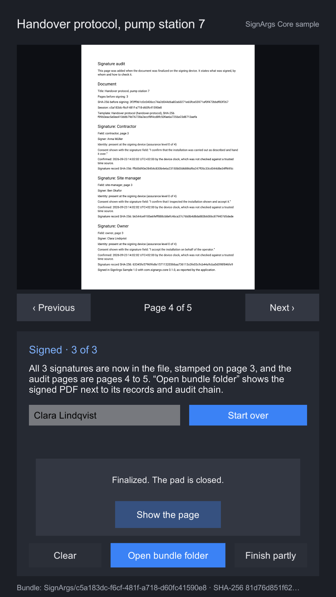
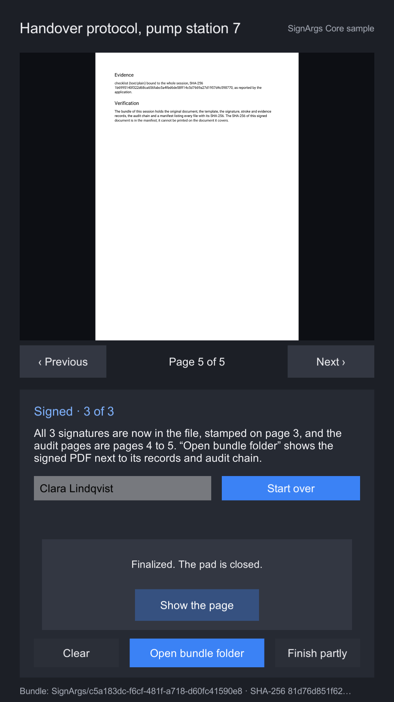

# The audit page and fonts

Finalizing appends a page to the document, written for the person who reads the PDF, not for a
program. It says what was signed, by whom, when by the device's clock, and how to check it, so a
signed document that is printed or emailed still carries its own explanation.

| First audit page | Second audit page |
|---|---|
|  |  |

The **Sign a document** sample after three signatures: the audit section starts on page 4 and runs
onto page 5.

## What it says

| Section | Contents |
|---|---|
| Signature audit | That the page was added when the document was finalized on the signing device. |
| Document | The title, the page count and SHA-256 before signing, the session id, and the template's name, id and SHA-256. For a partial version, that it is partial. |
| Signature, per field | The field's label, id and page; the signer's name; how they were identified, in words and as "assurance level n of 4"; the consent sentence; the confirmation time "by the device clock, which was not checked against a trusted time source"; and the signature record's SHA-256. |
| Not signed, per open field | The field and page, and that nothing was stamped in it. |
| After the signatures | One sentence naming the application and version and the SignArgs package and version, "as reported by the application". |
| Evidence | Each item's kind, media type, what it is bound to and its SHA-256, "as reported by the application". |
| Verification | What the bundle holds, and that the signed document's own SHA-256 is in the manifest, because it cannot be printed on the document it covers. |

The page is A4 with 56-point margins, 10-point body text and 14-point headings, and grows onto more
pages when a session has many signatures.

## What can be printed

Everything printed comes from you: the title, the template's name, field labels and consent
sentences, signer names, evidence kinds and media types, and your application's identifier and
version. All of it has to pass two checks:

1. **The font draws every character.** The package ships Roboto Regular, which covers Latin, Latin
   Extended, Greek and Cyrillic: 2,768 code points.
2. **The script can be laid out without shaping.** A PDF text object draws glyphs one after another,
   without joining or reordering. Only these are laid out: Latin, Greek, Cyrillic, Armenian,
   Georgian, general punctuation, currency and letterlike symbols, CJK punctuation, kana, bopomofo,
   Han, Hangul and fullwidth forms. Everything else, including right-to-left and Indic scripts, Thai,
   combining marks, emoji and any character above U+FFFF, is refused whatever the font covers,
   because it would come out wrong, which is worse than a refusal.

Text that fails either check is refused, never transliterated and never replaced with a box.
Starting a session checks the texts it already knows; adding a signer checks their name; adding
evidence checks its kind and media type. Check names as they are typed:

```csharp
bool ok = AuditText.IsPrintable(nameInput.text, finalizer.AuditFont);

try { AuditText.Check("signer name", nameInput.text, finalizer.AuditFont); }
catch (AuditTextException e) { Debug.Log($"{e.Problem} at {e.Position} in {e.What}"); }
```

`AuditTextException.Problem` says what failed: `Empty` (no text at all), `NotInFont` or
`NotLaidOut`. Every printed text must be non-empty.

## Your own font

To sign for people whose names Roboto does not draw, such as Chinese or Japanese names, set
**Audit font** on the `LocalFinalizer` to your own font:

1. Use a static TrueType font (`.ttf`). Variable fonts, CFF-flavoured OpenType (`.otf`) and font
   collections (`.ttc`) are refused with `PdfFontException`.
2. Rename it to end in `.ttf.bytes`, so Unity imports it as a `TextAsset`.
3. Drag it into **Audit font**. `finalizer.AuditFont` then returns it, and every check above uses it.

Check that its licence allows embedding in documents.

Status: the font checks and the embedding are covered by the shared tests. A supplied CJK font, and
a Greek or Cyrillic name through the sample, have not yet been run on a device.

## Size

The whole font file is embedded in every document it writes. Roboto (306 KB) adds about 200 KB,
compressed, to each signed PDF. A font covering CJK is many megabytes: subset it to the characters
you need before you use it, or every signed document carries all of it.
