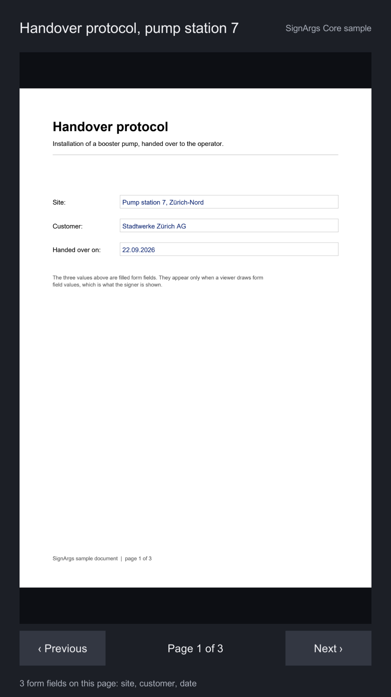

# Show a PDF

The ten-second check that the PDF engine works on your target: a three-page handover protocol with
filled form fields, drawn on a `RawImage` and paged with two buttons. The footer lists the form
fields each page declares.



## What you see

- Page 1 of 3 appears within a moment of pressing Play, with the form's values drawn in.
- **‹ Previous** and **Next ›** turn the pages; the label between them says which page is on screen.
- The footer names the page's form fields, or says there are none. Page 3 holds the signature boxes.

## What is in the scene

| Object | Components | What it does |
|---|---|---|
| `Canvas` | `Canvas`, `CanvasScaler`, `GraphicRaycaster` | Screen-space canvas for everything below. |
| `Document` | `Image` | The grey well the page sits in. |
| `Document/Page` | `RawImage`, `AspectRatioFitter` (fit in parent) | The page. `PdfView` writes its texture and aspect ratio. |
| `Previous`, `Next` | `Button` | Wired to `PdfView.PreviousPage` and `PdfView.NextPage`. |
| `Page Label`, `Footer` | `Text` | Written by the sample script. |
| `SignArgs` | `PdfWorker`, `PdfView`, `ShowDocumentSample` | The worker thread, the view (**dpi** 150) and the sample script. |

`ShowDocumentSample` is sixty lines. It opens the document, listens to `PageShown` to update the
label, and asks `GetFormFieldsAsync` for the page's fields:

```csharp
previousButton.onClick.AddListener(view.PreviousPage);
nextButton.onClick.AddListener(view.NextPage);
view.PageShown += OnPageShown;
await view.OpenAsync(document.bytes);

private async Task DescribeFieldsAsync(int pageIndex)
{
    var fields = await view.GetFormFieldsAsync(pageIndex);
    // fields[i].Name, .Kind, .PageIndex, .Area (in points), .IsReadOnly
}
```

## Reuse it

Copy the `Document` object and the `SignArgs` object into your own canvas and you have a viewer.
To show your own PDF, rename it to end in `.pdf.bytes`, drop it into the project and drag it onto the
sample script's **Document** field, or pass any `byte[]` to `PdfView.OpenAsync`.

See [Showing documents](../guides/showing-documents.md) for everything `PdfView` does.
