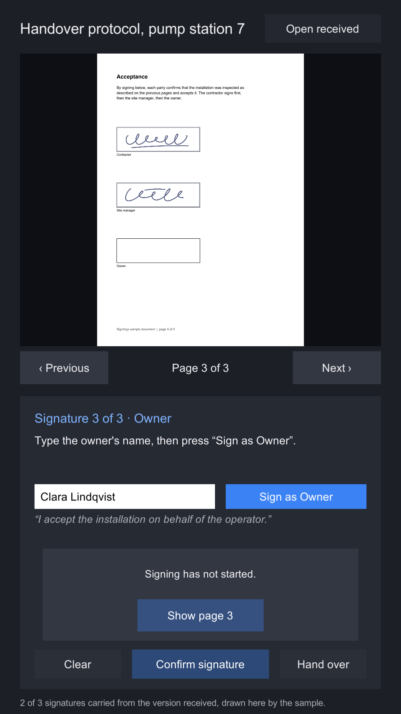
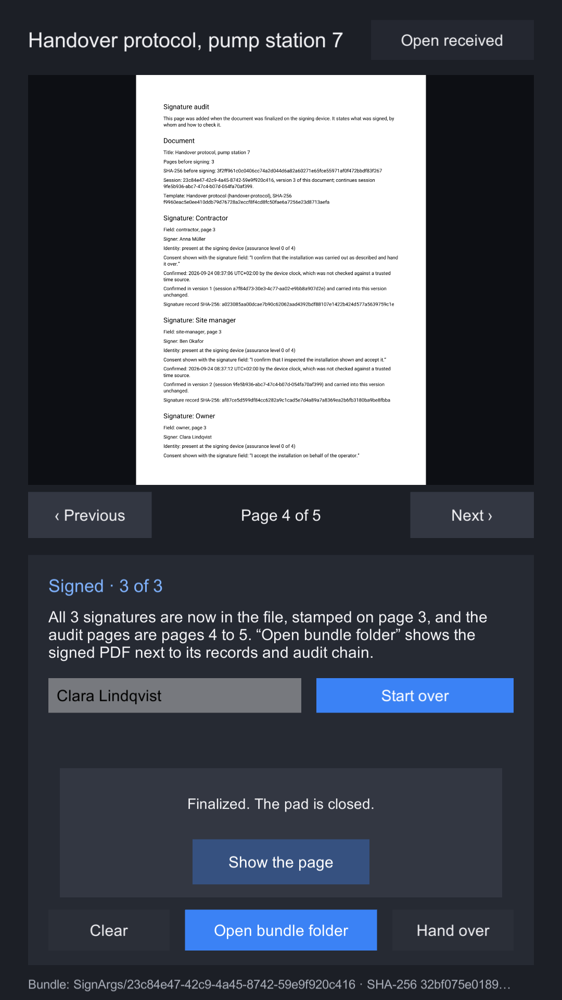

# Sign a document

Three people sign a handover protocol in turn on one device: the contractor, the site manager and the
owner. A template places their fields on page 3 in that order, each signer sees their own consent
sentence, and the signature pad unlocks only while page 3 is on screen, because a signature is bound
to the pages rendered and shown. Finalizing stamps the three signatures, appends an audit page and writes the
bundle under `Application.persistentDataPath/SignArgs`.

The scene is guided: the line at the top of the card always says what to do next.


## Walk through it

1. Press Play. The protocol opens on page 1. The step line reads **Signature 1 of 3 · Contractor**.
2. Type a name in the **Name** field (the sample suggests one) and press **Sign as Contractor**. The
   session starts here: the template is checked, the checklist evidence is bound, and the contractor
   is added as the first signer.
3. The pad is locked and says why. Page through to page 3 with **Next ›**, or press **Show page 3**.
   The pad unlocks and the contractor's box on the page is outlined.
4. Read the consent sentence under the name, sign inside the white box, and press
   **Confirm signature**. The signature is drawn over its box by the sample; it is stamped into the
   file only when signing finishes.
5. Repeat for the site manager and the owner. After the third confirmation the document is finalized
   and reopened from the signed file on page 3; the audit pages follow it, pages 4 and 5 for three
   signers.

| Step 3: the pad is locked | Step 4: signing | Step 5: signed |
|---|---|---|
|  |  |  |

**Start over** begins a new session on the original document.

## Hand it over to another device

**Hand over**, available between two signers, finalizes with the signatures taken so far: the manifest
marks the version partial and the audit page names the fields left open. It also writes the bundle and
the identity records of every signer this device knows into one file,
`Application.persistentDataPath/SignArgs Outbox/<session id>.signargs`.

On the next device, copy that file into `Application.persistentDataPath/SignArgs Inbox/` and press
**Open received**. The sample receives the newest file there, verifies it, continues it as a new session
and draws the carried signatures over their boxes; the step line picks up at the next open field. Sign
the rest, or hand it over again. The last document stamps every signature, and its audit page lists every
version and says in which one each carried signature was confirmed.

| Received on the second device | The audit page of version 3 |
|---|---|
|  |  |

The sample sends names with the file so that every audit page can print them; your application
decides whether to. On Android, move a file in with:

```
adb shell mkdir -p "'/sdcard/Android/data/<your.bundle.id>/files/SignArgs Inbox'"
adb push <session id>.signargs "/sdcard/Android/data/<your.bundle.id>/files/SignArgs Inbox/"
```

Continuing the same received file on a second device forks that version: both bundles verify, and only
`BundleVerifier.Compare` on both shows the fork. See [Finalizing](../guides/finalizing.md#continue-on-another-device).

## Look at the result

In the editor and on desktop players, **Open bundle folder** opens the folder. On Android,
`Application.persistentDataPath` is the app's folder on shared storage; pull it:

```
adb shell ls /sdcard/Android/data/<your.bundle.id>/files/SignArgs
adb pull /sdcard/Android/data/<your.bundle.id>/files/SignArgs
```

`run-as` does not work here: it needs a debuggable build.

Each session is one folder named after its session id, and each signer has one identity file in
`identities/` beside those folders. The files are listed on [The signed bundle](../signed-bundle.md).

## What is in the scene

| Object | Components | What it does |
|---|---|---|
| `Canvas/Column/Document/Page` | `RawImage`, `AspectRatioFitter` | The page. A `Field` outline on it marks the box the current signer fills. |
| `Canvas/Column/Card` | `Image` | The signing card: step line, instruction, name field, consent sentence, pad and buttons. |
| `Card/Pad Area/Signature Pad` | `Image` (white), `AspectRatioFitter`, `SignaturePad` | The pad. Its aspect ratio matches the signature box on the page, so the ink is not squeezed when it is stamped. |
| `Signature Pad/Ink` | `StrokeGraphic` | Draws the ink. Raycast target off. |
| `Signature Pad/Lock` | `Image`, `Text`, `Button` | Covers the pad until the field's page is on screen, with a **Show page 3** button. |
| `SignArgs` | `PdfWorker`, `PdfView`, `LocalFinalizer`, `SignDocumentSample` | The worker thread, the view (**dpi** 150), the finalizer (**folder** `SignArgs`, **image pixels per point** 4) and the sample script. |

The sample script's **Document** is `handover-protocol.pdf.bytes`, its **Template** is
`handover-protocol.template.json.bytes`, and its **Title** is `Handover protocol, pump station 7`.

## The template

```json
{
  "schema": 1,
  "type": "template",
  "templateId": "handover-protocol",
  "name": "Handover protocol",
  "fields": [
    {
      "id": "contractor",
      "label": "Contractor",
      "pageIndex": 2,
      "area": { "x": 56000, "y": 560000, "width": 240000, "height": 70000 },
      "consentText": "I confirm that the installation was carried out as described and hand it over.",
      "minimumAssurance": 0,
      "order": 1
    },
    { "id": "site-manager", "label": "Site manager", "...": "order 2, 160 points lower" },
    { "id": "owner", "label": "Owner", "...": "order 3, 160 points lower again" }
  ]
}
```

Areas are in thousandths of a PDF point from the bottom-left corner: the contractor's box is 240 by
70 points, 56 points from the left edge. See [Templates and form fields](../guides/templates.md).

## How the script drives it

`SignDocumentSample` is split in three files: `SignDocumentSample.cs` is the signing flow,
`SignDocumentSample.Handover.cs` hands a version over and continues a received one, and
`SignDocumentSample.Interface.cs` updates the card's texts and buttons, draws the taken signatures
over the page and opens the bundle folder. The flow is the
[quick start](../quick-start.md) with three signers:

```csharp
_session = await finalizer.StartAsync(document.bytes, title, template.bytes);
_session.AddEvidence("checklist", "text/plain", Encoding.UTF8.GetBytes("Checks 1 to 5 on page 2 carried out."));

var signer = new SignerDetails("signer-" + _field.Id, signerName.text, string.Empty,
    AssuranceLevel.Presence, new[] { _field.Id });
await finalizer.AddSignerAsync(_session, signer);

// once the field's page is on screen and the signer has pressed Confirm
await finalizer.ConfirmAsync(_session, _field.Id, pad, view);

// after the last field, or when Hand over is pressed
var result = partial ? await finalizer.FinalizePartialAsync(_session) : await finalizer.FinalizeAsync(_session);
await view.OpenAsync(File.ReadAllBytes(result.DocumentPath));
```

The reference is taken from the field, not counted, so that a device continuing a received version
never reuses a reference an earlier version gave to someone else; the chain would refuse it without that
person's identity record. Handing over and continuing:

```csharp
var verification = await finalizer.VerifyAsync(result.Folder);
await finalizer.ExportAsync(verification.Bundle, _known, Path.Combine(Outbox, sessionId + ".signargs"));

// on the next device
var received = await finalizer.ReceiveAsync(newest);
_session = await finalizer.ContinueAsync(received.Verification.Bundle, title, received.Identities);
```

The pad stays disabled until `PageShown` reports the field's page; confirming would refuse a capture
whose shown pages do not include it anyway, but a pad that refuses after the signer has signed is a
worse experience than a locked one.

The script logs each step with its timing under `[Sample]` in the console, which is the quickest way
to see how long opening, confirming and finalizing take on your device.
