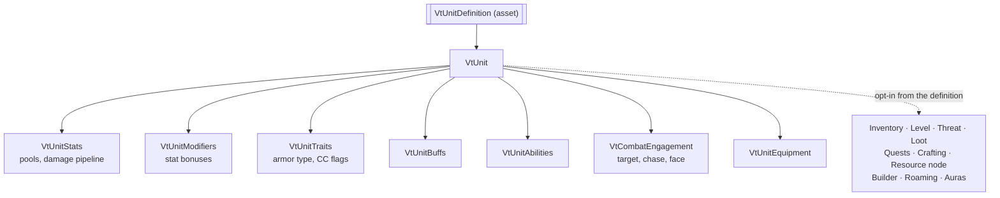
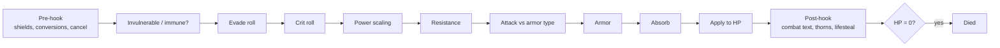

# Concepts

Six ideas explain almost everything in Vantage. Read this once; the module pages assume it.

## 1. Everything is a unit

Players, monsters, NPCs, trees, ore veins, walls and placed buildings are all the same thing: a GameObject with a `VtUnit` component and a unit definition asset. Adding `VtUnit` pulls in the components every unit needs. Optional systems attach themselves when you enable them on the definition.

Because a chest, a sapling or a wall is a unit, it can take damage, drop loot, hold an inventory or offer a quest with no extra code.

## 2. Definitions are data, components hold state

Definitions are ScriptableObject assets: what a unit *is*, what an ability *does*, what a recipe *needs*. They are shared. Runtime state, such as current HP, active buffs or cooldowns, lives on the components of each instance.

Two consequences:

- Authoring is an Inspector job. Most features need no code.
- Every definition has an `id` string. Assets are referenced by their Unity GUID in the Inspector; the `id` is what you use in save files and over the network.

## 3. Stats come from sources

A unit's stats are the sum of named sources. An equipped sword is a source, a buff is a source, the definition's innate bonuses are a source. Each source contributes flat and percent rows; the total is `(base + flat) × (1 + percent)`. Removing the source removes its rows. Nothing else has to be recalculated by you.

There are two kinds of stat:

- **Stats** the code reads: max HP, armor, crit chance, attack speed and so on. The package ships all of these.
- **Attributes** the code never reads by name: Strength, Dexterity, whatever your game calls them. An attribute formula asset turns attribute points into stats, so "+5 Strength" becomes "+5 physical power" without a line of C#.

## 4. Damage goes through one pipeline

Every hit, whether it is a sword swing, a fireball or a poison tick, calls the same `TakeDamage` and passes the same steps in the same order.

You extend the pipeline by subscribing to its hooks, not by editing it. A shield subscribes to the pre-hook and fills in `absorbed`; a proc subscribes to the post-hook and reads `appliedDamage`.

Death is a state. A dead unit refuses damage and refuses healing until you call `Revive`, so a heal-over-time never quietly resurrects a corpse.

## 5. Abilities are definitions plus effects

An ability definition holds the timing and targeting: range, cast time, cooldown, cost, global cooldown flags. What the ability *does* is a list of effect assets: damage, heal, apply buff, taunt, area damage, and any effect class you write. The basic attack is just an ability with `Can Auto Cast` on, so anything that improves abilities improves auto-attacks too.

Buffs are definitions as well: stat rows, trait overrides such as "cannot cast", and an optional tick that deals damage or heals through the pipeline. Auras are buffs applied to everything in a radius on a short cadence.

## 6. Time and authority are pluggable

Every simulation component exposes `Tick(float deltaTime)` and never reads the Unity clock itself. By default each component ticks from its own `Update`. Add a `VtTickDriver` to the scene and one loop advances everything in a fixed order, which also gives you a pause and slow-motion knob that does not freeze the UI. Tests and servers call `Tick` with whatever step they like.

Every state change first asks `VtAuthority` whether this process owns the truth for the unit. In single-player the answer is always yes. Networked, the server owns everything and a client only predicts its own movement and casts; anything else a client asks for, from accepting a quest to placing a wall, travels to the server as a command and comes back by replication. No gameplay code changes between the two. See [Multiplayer](multiplayer.md).

## Two assets the package reads at startup

- **VtCoreStats** maps the stats the code needs (armor, crit, resistances, pool max and regen stats) to assets. Ships in `Runtime/Resources`.
- **VtTuning** holds every global number: armor formula, evade cap, global cooldown, projectile lifetime, movement feel. Ships in `Runtime/Resources`.

Put a copy of either at `Assets/Resources/` with the same name and your copy wins, so package updates never overwrite your tuning.

Vantage never creates managers at runtime. If a scene needs a camera, an event system or a tick driver, you place it.
