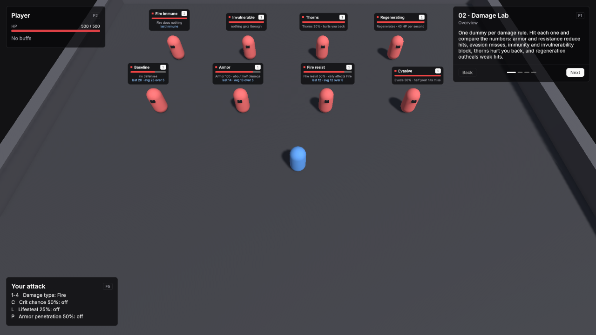

# 02 · Damage Lab

Eight training dummies, one per damage rule. Hit each one and compare the numbers. Keys change your own attack while you play.

Scene `Scenes/02_DamageLab`. Assets `Content/02_DamageLab` and `Content/Shared`.

## What it teaches

- Every defensive rule is one field on a unit definition: an innate modifier, an immunity or a pool's regeneration.
- Armor and resistance scale damage down, evasion drops whole hits, immunity and invulnerability block them, thorns reflect them.
- Damage type, crit chance, lifesteal and armor penetration on the attacker change the result, and True damage skips armor, resistance, evasion and crits.
- Each dummy's nameplate keeps the running result of the hits it took, so you can compare rules without leaving the game view.

## How the numbers work

| Rule | Effect with the demo's values |
|---|---|
| Armor | Damage is multiplied by 100 / (100 + armor). Armor 100 halves it. The 100 is **Armor K** on the tuning asset. |
| Fire resistance 0.5 | Fire damage is halved. Other types are unaffected. Resistance is capped by **Max Resistance** on the tuning asset. |
| Evade chance 0.5 | Half of your hits show Dodge and deal nothing. True damage and damage over time cannot be evaded. |
| Damage immunity Fire | Fire hits show Immune. |
| Invulnerable | Every hit shows Immune. |
| Thorns 0.3 | 30% of the damage the dummy takes is dealt back to you. By default only physical damage triggers thorns; see **Thorns Filter** on the tuning asset. |
| Regeneration 40 per second | Weak hits barely dent the health bar. |
| Crit chance 0.5 | Half your hits deal double damage. |
| Lifesteal 0.25 | You heal for a quarter of the damage you deal. |
| Armor penetration 0.5 | Half of the target's armor is ignored. |

## Assets

**LabPlayer**, a Unit Definition:

| Field | Value |
|---|---|
| Id | `unit.lab_player` |
| Display Name | Player |
| Faction | Player |
| Pools | One HP pool: Base Max 500, Starting Current 500, Regen Mode Out Of Combat Only, Base Regen Per Second 20 |
| Min Damage / Max Damage | 20 / 30 |
| Attack Range | 2.5 |
| Attack Interval | 0.8 |
| Move Speed | 6 |

Every dummy is a Unit Definition with Faction Enemy, one HP pool with Base Max and Starting Current 400, Min and Max Damage 0, Basic Attack empty and Move Speed 0. Each one adds a single rule:

| Asset | Id | Display Name | The rule |
|---|---|---|---|
| DummyBaseline | `unit.dummy_baseline` | Baseline | Nothing. |
| DummyArmor | `unit.dummy_armor` | Armor | Innate Modifiers: Armor, value 100. |
| DummyFireResist | `unit.dummy_fireresist` | Fire resist | Innate Modifiers: Resist Fire, value 0.5. |
| DummyEvasive | `unit.dummy_evasive` | Evasive | Innate Modifiers: Evade Chance, value 0.5. |
| DummyFireImmune | `unit.dummy_fireimmune` | Fire immune | Damage Immunities: Fire. |
| DummyInvulnerable | `unit.dummy_invulnerable` | Invulnerable | Nothing on the definition. The scene object has VtDemoInvulnerable. |
| DummyThorns | `unit.dummy_thorns` | Thorns | Innate Modifiers: Thorns, value 0.3. |
| DummyRegenerating | `unit.dummy_regenerating` | Regenerating | HP pool Regen Mode Passive, Base Regen Per Second 40. |

Modifier rows leave **Is Percentage** off: these stats are fractions or flat numbers.

## Scene

Ground 36 × 32.

| Object | Setup |
|---|---|
| Player | Player prefab at (0, 0, -4). Definition LabPlayer. VtDemoReviveAfterDeath 3 seconds, Return To Start on. **VtCombatDebugLogger** with only Log Damage on. |
| Front row, z = 1 | Unit prefabs turned 180 degrees at x -10, -4, 2 and 8: Baseline, Armor, Fire resist, Evasive. |
| Back row, z = 7 | Unit prefabs turned 180 degrees at x -10, -4, 2 and 8: Fire immune, Invulnerable, Thorns, Regenerating. |
| Every dummy | The matching definition, **VtNameplateInfo** with a Subtitle naming its rule such as "Armor 100 · about half damage", **VtDemoHitReadout**, VtDemoReviveAfterDeath 2 seconds with Return To Start off. |
| Main Camera | VtTopDownCamera, Default Height 16, so both rows and their nameplates fit on screen at the start. |
| Demo UI | Lesson card, two VtDemoUnitFrame at the top left for Player and Player's target, and **VtDemoDamageLabController** at the bottom left with Player set, Crit Chance 0.5, Lifesteal 0.25 and Armor Penetration 0.5. |

**VtDemoHitReadout** on a dummy listens to its `VtUnitStats` and keeps the last result, the number of hits that landed and their average. The nameplate shows it under the dummy's rule, as `last 24 · avg 23 over 5`. A hit that was evaded reads `dodged` and one that was blocked reads `immune`; neither changes the average. Reviving clears the line.

The controller changes the player at runtime in two ways. The damage type key applies a trait override on the Damage Type trait at priority 100, which the basic attack reads. The crit, lifesteal and armor penetration keys each add or remove a modifier source on the player.

## Build it yourself

1. Create LabPlayer and the eight dummy definitions with the values above, and the shared BasicAttack if you do not have it yet.
2. Build the Unit and Player prefabs as in [Build the prefabs](index.md#build-the-prefabs), and the scene as in [Build the shared layout](index.md#build-the-shared-layout) with a 36 × 32 Level.
3. Place the player and the dummies at the positions above and set the camera's Default Height to 16. Add VtDemoHitReadout to every dummy, and VtDemoInvulnerable to the Invulnerable dummy, or call `SetInvulnerable(true)` from your own script.
4. To change the attack while playing without the demo controller, edit LabPlayer's Damage Type, or add Crit Chance, Lifesteal or Armor Penetration rows to its Innate Modifiers.

## Try

| Key | Effect |
|---|---|
| 1, 2, 3, 4 | Damage type Physical, Fire, Cold, True |
| C | Crit chance 50% on or off |
| L | Lifesteal 25% on or off |
| P | Armor penetration 50% on or off |
| F10 | Hide every panel |
| R | Reset the scene |

- Hit a dummy a few times and read its nameplate: the last hit, the average and how many landed.
- Hit Fire immune with Fire, then with Physical.
- Hit Fire resist with Fire and with Cold and compare.
- Attack Thorns and watch your own health.
- Every hit is also printed to the Console by VtCombatDebugLogger if you want the full payload.

## In your own game

Put the same rows on your enemies' definitions, on items and on buffs. A buff that adds Armor is a defensive cooldown; a debuff with negative Resist Fire is a vulnerability.
