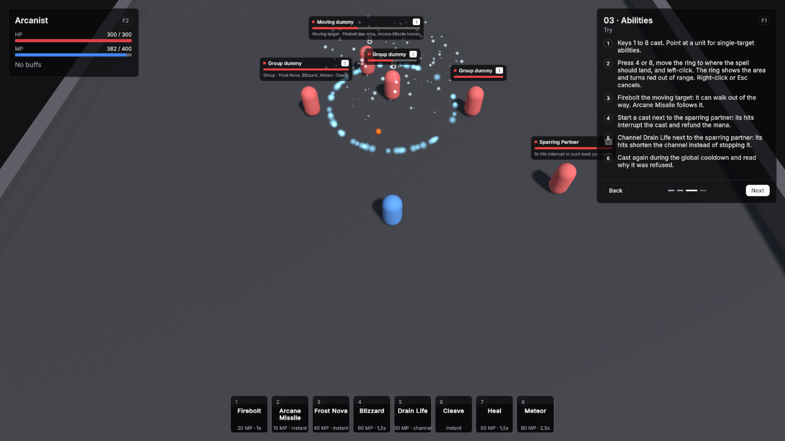

# 03 · Abilities

Eight abilities on one caster, each showing a different part of the ability system.

Scene `Scenes/03_Abilities`. Assets `Content/03_Abilities` and `Content/Shared`.

## What it teaches

- An ability is a definition that says when and at what it can be cast, plus effect assets that say what happens.
- Cast times, channels, cooldowns and the global cooldown are fields on the definition.
- Projectiles, splash, cones and falloff are fields on the effect.
- Taking damage interrupts a cast or channel and refunds its cost, unless the ability pushes back or ignores damage instead.
- Effects need no code: cues on the ability and its area effects play particle prefabs for cast starts, casts, impacts and areas.
- Ground abilities can be aimed first. A ring shows the area and turns red out of range; a click casts.

## Assets

Every ability uses Resource Kind MP, Triggers GCD on and Ignores GCD off. Damage Reaction is Interrupt on every ability except Drain Life. Every splash has Target Mask Everything and Friendly Fire off, so it only hits units of other factions.

| Key | Ability | Icon Id | Targeting Mode | Range | Resource Cost | Cast Time | Cooldown |
|---|---|---|---|---|---|---|---|
| 1 | Firebolt | `flame` | Single Target | 20 | 20 | 1 | 0 |
| 2 | Arcane Missile | `sparkles` | Single Target | 18 | 15 | 0 | 2 |
| 3 | Frost Nova | `snowflake` | Self | 0 | 40 | 0 | 8 |
| 4 | Blizzard | `wind` | Ground Point | 18 | 60 | 1.5 | 12 |
| 5 | Drain Life | `droplets` | Single Target | 12 | 30 | 0 | 6 |
| 6 | Cleave | `swords` | Single Target | 3 | 0 | 0 | 4 |
| 7 | Heal | `heart-pulse` | Self | 0 | 50 | 1.5 | 6 |
| 8 | Meteor | `orbit` | Ground Point | 20 | 80 | 2.5 | 15 |

Their ids are `ability.firebolt`, `ability.arcane_missile`, `ability.frost_nova`, `ability.blizzard`, `ability.drain_life`, `ability.cleave`, `ability.heal` and `ability.meteor`.

| Ability | Effects |
|---|---|
| Firebolt | **FireboltDamage**, a Damage effect: 35 to 45 Fire, Channel Magic, Projectile prefab FireProjectile at Speed 18. |
| Arcane Missile | **ArcaneMissileDamage**, a Damage effect: 16 to 22 Arcane, Channel Magic, Projectile prefab ArcaneProjectile at Speed 9, Arc Height 3, Homing on. |
| Frost Nova | **FrostNovaDamage**, an AoE Damage effect: 18 to 24 Cold, Channel Magic, Splash Radius 6. Then **FrostNovaChill**, an AoE Buff effect: Buff Chilled, Splash Radius 6. |
| Blizzard | **BlizzardArea**, a Persistent AoE Damage effect: 8 to 12 Cold, Channel Magic, Duration 6, Tick Interval 1, Splash Radius 4. |
| Drain Life | No Effects. Is Channeled on, Channel Duration 4, Channel Tick Interval 0.5, Tick Effects **DrainLifeTick**, a Damage effect: 7 to 9 Shadow, Channel Magic. Damage Reaction Pushback. |
| Cleave | **CleaveDamage**, a Damage effect: 25 to 30 Physical, Channel Melee, Splash Radius 3.5, Cone Angle 140. |
| Heal | **HealEffect**, a Heal effect: 70 to 90. |
| Meteor | **MeteorDamage**, an AoE Damage effect: 60 to 80 Fire, Channel Magic, Splash Radius 5, Falloff a straight line from 1 at the centre to 0.3 at the edge. |

**Chilled**, a Buff Definition: Id `buff.chilled`, Default Duration 4, Stacking Policy Refresh, Modifiers Move Speed -0.5 with Is Percentage on, CC Category Slow.

**Arcanist**, the player's Unit Definition:

| Field | Value |
|---|---|
| Id | `unit.arcanist` |
| Faction | Player |
| Pools | HP: Base Max 300, Starting Current 300, Regen Mode Out Of Combat Only, 5 per second. MP: Base Max 400, Starting Current 400, Regen Mode Passive, 20 per second. |
| Min Damage / Max Damage | 10 / 14 |
| Move Speed | 5.5 |
| Granted Abilities | The eight abilities in key order. |

The targets:

| Asset | Settings |
|---|---|
| DummyGroupDummy | Faction Enemy, HP 600, no basic attack, Move Speed 0. |
| DummyMovingDummy | Faction Enemy, HP 600, no basic attack, Move Speed 3. |
| SparringPartner | Id `unit.sparring_partner`, Faction Enemy, HP 800, Min / Max Damage 2 / 3, Attack Interval 1.2, Move Speed 4, Use Hostile AI on, Aggro Range 5. |

### Effects

Every effect prefab is in `Kit/Vfx`. The cues, by field:

| Asset | Field | Vfx Prefab | Vfx Seconds | Scale To Area |
|---|---|---|---|---|
| Firebolt | Cast Start Cue | FireSparks | 1.2 | off |
| Firebolt | Impact Cue | FireBurst | 1 | off |
| Arcane Missile | Cast Cue | ArcaneSparks | 1 | off |
| Arcane Missile | Impact Cue | ArcaneBurst | 1 | off |
| Frost Nova | Cast Cue | FrostSparks | 1 | off |
| Frost Nova | Impact Cue | FrostBurst | 1 | off |
| FrostNovaDamage | Area Cue | FrostRing | 1.2 | on |
| Blizzard | Cast Start Cue | FrostSparks | 1.6 | off |
| BlizzardArea | Area Cue | FrostRing | 1.2 | on |
| BlizzardArea | Pulse Cue | FrostPulse | 1 | on |
| BlizzardArea | Loop Cue | SnowFall | 0 | on |
| Drain Life | Cast Cue | ShadowSparks | 1.2 | off |
| Drain Life | Impact Cue | ShadowBurst | 0.8 | off |
| Cleave | Impact Cue | PhysicalBurst | 0.8 | off |
| Heal | Cast Start Cue | HolySparks | 1.6 | off |
| Heal | Cast Cue | HealGlow | 1.4 | off |
| Meteor | Cast Start Cue | FireSparks | 2.6 | off |
| Meteor | Impact Cue | FireBurst | 1 | off |
| MeteorDamage | Area Cue | MeteorImpact | 2 | on |
| DummyGroupDummy, DummyMovingDummy, SparringPartner | Death Cue | DeathPuff | 1.2 | off |

Unit cues play through the **VtUnitPresenter** on the Unit prefab. Area cues play at the centre of the area; the Loop Cue stays on Blizzard's area until it ends. Drain Life's impact plays on every channel tick, because the tick damage belongs to the ability.

## Scene

Ground 40 × 40.

| Object | Setup |
|---|---|
| Player | Player prefab at (0, 0, -2). Definition Arcanist. VtDemoReviveAfterDeath 3 seconds, Return To Start on. **VtAbilityHotkeys** with eight slots: abilities in the order above with Action left empty, so they cast on keys 1 to 8, and **Ground Targeting** set to Aim And Confirm. The prefab's **VtGroundTargetIndicator** draws the ring. |
| Group | Three Unit prefabs with DummyGroupDummy at (-5, 0, 6), (0, 0, 7.5) and (5, 0, 6). VtDemoReviveAfterDeath 3 seconds, Return To Start off. |
| Moving target | Unit prefab with DummyMovingDummy at (-6, 0, 10). **VtDemoPatrol** with Offset (12, 0, 0) and Wait Seconds 1. VtDemoReviveAfterDeath 3 seconds, Return To Start on. |
| Sparring partner | Unit prefab with SparringPartner at (9, 0, 0), outside its own Aggro Range of 5 so it waits for you. VtDemoReviveAfterDeath 3 seconds, Return To Start on. |
| Main Camera | VtTopDownCamera, Default Height 17, so every target and its nameplate is on screen at the start and none of them sits under the lesson card. |
| Demo UI | Lesson card, two **VtUnitFrame** with Unit Player and Region Top Left, one with Source Unit and one with Source Target Of Unit. **VtBuffBar** with Unit Player and Region Top Left. **VtResourceBar** with Unit Player, Bar Source Cast and Region Top Left. **VtActionBar** with Hotkeys set to the player's VtAbilityHotkeys, Region Bottom Center and Slot Size Large. |

## Build it yourself

1. Build the Unit, Player, FireProjectile and ArcaneProjectile prefabs as in [Build the prefabs](index.md#build-the-prefabs).
2. Create the eight effects, Chilled, and the eight abilities with **Create → Vantage → Abilities** and the values above. Drag each effect into its ability's Effects, or into Tick Effects for Drain Life.
3. Create Arcanist and list the abilities under Granted Abilities.
4. Create the three target definitions.
5. Build the scene as in [Build the shared layout](index.md#build-the-shared-layout) with a 40 × 40 Level.
6. Place the player, add eight slots to its VtAbilityHotkeys, drag the abilities in, and set **Ground Targeting** to Aim And Confirm. Check that the Player prefab has **VtGroundTargetIndicator**.
7. Place the group, the moving target with a patrol, and the sparring partner, and set the camera's Default Height to 17.
8. For the effects, make a particle prefab per row of the effects table, or use any effect prefabs you have, and fill the cue fields. Author area prefabs for a radius of 1 and tick **Scale To Area** on their cues.

## Try

- Keys 1 to 8 cast. Point at a unit for single-target abilities.
- Press 4 or 8, move the ring to where the spell should land, and left-click. The ring is the area and turns red out of range. Right-click or Esc cancels; pressing the key again casts.
- Firebolt the moving target: it can walk out of the way of a straight projectile. Arcane Missile follows it.
- Start a cast next to the sparring partner: its hits interrupt the cast and refund the mana.
- Channel Drain Life next to the sparring partner: its hits shorten the channel instead of stopping it.
- Cast again during the global cooldown and read the refusal.
- Frost Nova the moving target and watch it slow down.
- F10 hides every panel, R resets the scene.

## In your own game

A new behaviour is a new effect class, not a change to the ability system. See [Extending](../extending.md).
