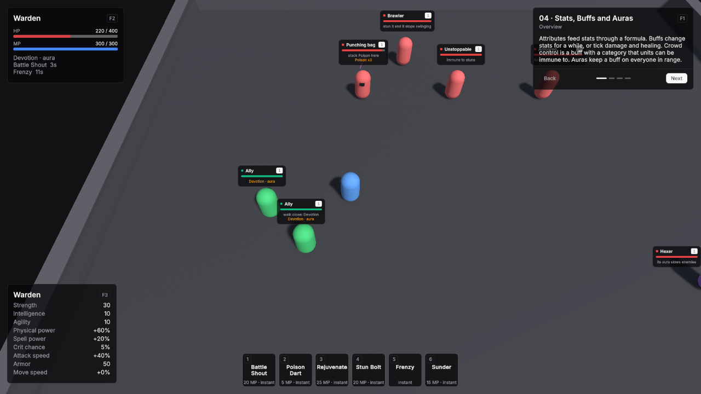

# 04 · Stats, Buffs and Auras

A Warden with six buff abilities, a set of targets that react differently, allies that share an aura and an enemy statue whose aura slows you.

Scene `Scenes/04_StatsBuffsAuras`. Assets `Content/04_StatsBuffsAuras` and `Content/Shared`.

## What it teaches

- Attributes feed stats through an Attribute Formula and a VtAttributeDerivedStatsBinding.
- A buff changes stats or attributes for a while, or ticks damage or healing. Its stacking policy decides what happens when it is applied again.
- Crowd control is a buff with a category and trait overrides. A unit immune to the category refuses it.
- An aura keeps a buff on every eligible unit within a radius.

## Assets

**Warden**, the player's Unit Definition:

| Field | Value |
|---|---|
| Id | `unit.warden` |
| Faction | Player |
| Pools | HP: Base Max 400, Starting Current 220, Regen Mode None. MP: Base Max 300, Starting Current 300, Regen Mode Passive, 20 per second. |
| Min Damage / Max Damage | 14 / 18 |
| Move Speed | 5.5 |
| Base Attributes | Strength 20, Intelligence 10, Agility 10 |
| Granted Abilities | The six abilities below in key order. |
| Passive Auras | DevotionAura |

The abilities, all with Resource Kind MP:

| Key | Ability | Targeting Mode | Range | Resource Cost | Cooldown | Triggers GCD | Effects |
|---|---|---|---|---|---|---|---|
| 1 | Battle Shout | Self | 0 | 20 | 10 | on | Apply Buff: Battle Shout |
| 2 | Poison Dart | Single Target | 15 | 5 | 0.5 | off | Apply Buff: Poison |
| 3 | Rejuvenate | Self | 0 | 25 | 3 | on | Apply Buff: Rejuvenation |
| 4 | Stun Bolt | Single Target | 15 | 20 | 5 | on | StunBoltDamage, a Damage effect of 8 to 12 Arcane with Channel Magic, then Apply Buff: Stunned |
| 5 | Frenzy | Self | 0 | 0 | 1 | off | Apply Buff: Frenzy |
| 6 | Sunder | Single Target | 3 | 15 | 2 | on | Apply Buff: Sundered |

None has a cast time. Their ids are `ability.battle_shout`, `ability.poison_dart`, `ability.rejuvenate`, `ability.stun_bolt`, `ability.frenzy` and `ability.sunder`.

The buffs:

| Buff | Id | Default Duration | Stacking Policy | What it does |
|---|---|---|---|---|
| Battle Shout | `buff.battle_shout` | 15 | Refresh | Attribute Grants: Strength 10. |
| Poison | `buff.poison` | 6 | Stack Independent | Tick Effect: 6 Poison damage, Channel Magic, every 1 second. |
| Rejuvenation | `buff.rejuvenation` | 8 | Refresh | Tick Effect: heals 12 every 1 second, Is Heal on. |
| Stunned | `buff.stunned` | 3 | Refresh | CC Category Stun. Trait Overrides at priority 100: Can Act, Can Move and Can Cast all false. |
| Frenzy | `buff.frenzy` | 5 | Stack Add Duration | Max Duration 20. Modifiers: Attack Speed 0.3, Is Percentage on. |
| Sundered | `buff.sundered` | 10 | Refresh | Modifiers: Armor -80. |
| Devotion | `buff.devotion` | 1 | Refresh | Modifiers: Armor 50. |
| Hex | `buff.hex` | 1 | Refresh | CC Category Slow. Modifiers: Move Speed -0.4 and Attack Speed -0.2, both with Is Percentage on. |

The auras:

| Aura | Id | Buff To Apply | Radius | Target Filter |
|---|---|---|---|---|
| DevotionAura | `aura.devotion` | Devotion | 8 | Allies |
| HexAura | `aura.hex` | Hex | 7 | Enemies |

The other units:

| Asset | Settings |
|---|---|
| DummyPunchingBag | Faction Enemy, HP 800, no basic attack, Move Speed 0. |
| DummyUnstoppable | As the punching bag, plus CC Immunities: Stun. |
| DummyArmored | As the punching bag, plus Innate Modifiers: Armor 120. |
| Brawler | Id `unit.brawler`, Faction Enemy, HP 700, Min / Max Damage 3 / 5, Move Speed 4, Use Hostile AI on, Aggro Range 4. |
| Ally | Id `unit.ally`, Faction Player, HP 200, Min / Max Damage 5 / 6, Move Speed 5. |
| DummyHexer | Faction Enemy, HP 1000, no basic attack, Move Speed 0, Passive Auras: HexAura. |

## Scene

Ground 40 × 40.

| Object | Setup |
|---|---|
| Player | Player prefab at (0, 0, 0). Definition Warden. **VtAttributeDerivedStatsBinding** with Formula `Content/Shared/AttributeFormula`. VtAbilityHotkeys with six slots and Action left empty, so they cast on keys 1 to 6. VtDemoReviveAfterDeath 3 seconds, Return To Start on. |
| Punching bag | Unit prefab at (-6, 0, 9). Revives after 2 seconds where it stands. |
| Unstoppable | Unit prefab at (0, 0, 9). Revives after 2 seconds where it stands. |
| Armored | Unit prefab at (6, 0, 9). Revives after 2 seconds where it stands. |
| Brawler | Unit prefab at (-3, 0, 12.5), outside its Aggro Range of 4. Revives after 3 seconds at its start. |
| Two allies | Unit prefabs with Ally at (-9, 0, -2) and (-11, 0, 0), just outside the Devotion aura's radius of 8. VtDemoFactionTint Override Color on, green. Revive after 3 seconds at their start. |
| Hexer | Unit prefab at (10, 0, -4), outside the Hex aura's radius of 7. **VtDemoInvulnerable**. VtDemoFactionTint Override Color on, purple. Revives after 2 seconds where it stands. |
| Main Camera | VtTopDownCamera, Default Height 16, so the dummies, the brawler, both allies and the Hexer are all on screen with their nameplates at the start. |
| Demo UI | Lesson card, two VtDemoUnitFrame at the top left, VtDemoHotbar, and **VtDemoStatSheet** titled Warden at the bottom left with rows Strength, Intelligence, Agility, Physical power, Spell power, Crit chance, Attack speed, Armor and Move speed. |

## Build it yourself

1. Build the Unit and Player prefabs as in [Build the prefabs](index.md#build-the-prefabs).
2. Create the attributes and the formula as in [Shared content](index.md#shared-content), or use the shared ones.
3. Create the buffs, then an Apply Buff effect for each ability, then the abilities.
4. Create both auras with **Create → Vantage → Auras → Aura Definition**.
5. Create Warden with its base attributes, abilities and Devotion aura, and the other definitions.
6. Build the scene as in [Build the shared layout](index.md#build-the-shared-layout) with a 40 × 40 Level.
7. Place the player, **Add Component → Vantage → Units → VtAttributeDerivedStatsBinding** with the formula, and fill six hotkey slots.
8. Place the other units at the positions above and set the camera's Default Height to 16.

## Try

- **1** Battle Shout: Strength rises by 10, and physical power follows by 20% in the stats card.
- **2** Poison Dart the punching bag several times: each dart adds its own Poison.
- **3** Rejuvenate heals you over time; you start at 220 health.
- **4** Stun Bolt the brawler and it stops swinging. Stun Bolt the unstoppable dummy: Immune.
- **5** Frenzy again and again: the duration grows up to 20 seconds.
- **6** Sunder the armored dummy and compare your hits before and after.
- Walk to the allies: Devotion shows on them. Walk past the Hexer and you slow down.
- A buff an aura keeps up reads "Devotion · aura" in the unit frame and on the nameplate, with no countdown, because the aura re-applies it every second.
- F10 hides every panel, R resets the scene.

## In your own game

Talents, set bonuses and equipment use the same modifier and attribute rows as these buffs, so a stat sheet like this one reads them all.
