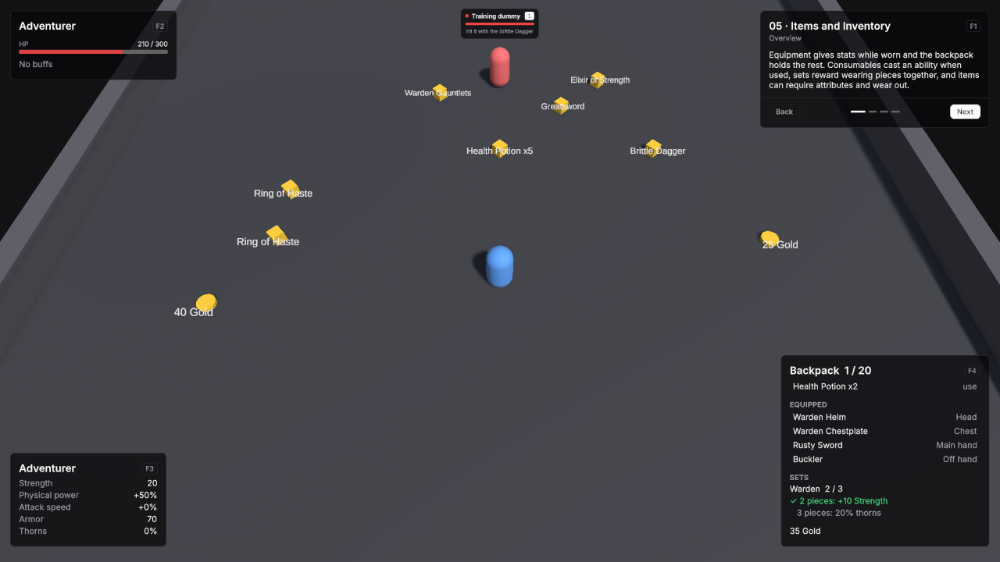

# 05 · Items and Inventory

An adventurer with a backpack, items and gold on the ground, and a training dummy to wear a weapon down on.

Scene `Scenes/05_ItemsInventory`. Assets `Content/05_ItemsInventory` and `Content/Shared`.

## What it teaches

- Equipment gives its stats while worn. The backpack holds the rest and grants nothing.
- Requirements, two-handed weapons, durability and set membership are fields on the item.
- A consumable is an item with a Use Ability.
- Items on the ground are VtWorldItem objects; anything else you click can implement IVtPickable.

## Assets

The items, all Item Definitions:

| Item | Id | Slot | Modifiers | Other fields |
|---|---|---|---|---|
| Rusty Sword | `item.rusty_sword` | Main Hand | Physical Power 0.1, Is Percentage on | |
| Buckler | `item.buckler` | Off Hand | Armor 25 | |
| Greatsword | `item.greatsword` | Main Hand | Physical Power 0.6, Is Percentage on | Requires Two Hands on. Requirements: Attribute Minimums Strength 25. |
| Brittle Dagger | `item.brittle_dagger` | Main Hand | Physical Power 0.25 and Attack Speed 0.3, both Is Percentage on | Max Durability 8, Auto Unequip On Break on. |
| Ring of Haste | `item.ring_of_haste` | Ring 1 | Attack Speed 0.1, Is Percentage on | |
| Warden Helm | `item.warden_helm` | Head | Armor 15 | Set WardenSet. |
| Warden Chestplate | `item.warden_chestplate` | Chest | Armor 30 | Set WardenSet. |
| Warden Gauntlets | `item.warden_gauntlets` | Hands | Armor 10 | Set WardenSet. |
| Health Potion | `item.health_potion` | None | | Is Stackable on, Max Stack Size 10, Use Ability Drink Health Potion, Consume On Use on. |
| Elixir of Strength | `item.elixir_of_strength` | None | | Is Stackable on, Max Stack Size 5, Use Ability Drink Elixir of Strength, Consume On Use on. |

**WardenSet**, an Item Set Definition: Id `set.warden`, Display Name Warden, Members the three Warden pieces.

| Tier | Required Pieces | Tooltip Name | Bonus |
|---|---|---|---|
| 1 | 2 | 2 pieces: +10 Strength | Attribute Grants: Strength 10 |
| 2 | 3 | 3 pieces: 20% thorns | Modifiers: Thorns 0.2 |

The consumables' abilities are Self-targeted, cost nothing and have Triggers GCD off:

| Ability | Id | Cooldown | Effects |
|---|---|---|---|
| Drink Health Potion | `ability.drink_health_potion` | 3 | **HealthPotionHeal**, a Heal effect of exactly 60. |
| Drink Elixir of Strength | `ability.drink_elixir_of_strength` | 1 | Apply Buff: **Elixir of Strength** (`buff.elixir_of_strength`), Default Duration 60, Refresh, Attribute Grants Strength 20. |

**Adventurer**, the player's Unit Definition:

| Field | Value |
|---|---|
| Id | `unit.adventurer` |
| Faction | Player |
| Pools | One HP pool: Base Max 300, Starting Current 150, Regen Mode None |
| Min Damage / Max Damage | 10 / 14 |
| Move Speed | 5.5 |
| Base Attributes | Strength 10 |
| Starting Inventory | Rusty Sword 1, Buckler 1, Health Potion 3 |

**DummyTrainingDummy**: Faction Enemy, HP 1500, no basic attack, Move Speed 0, Innate Modifiers Armor 30.

## Scene

Ground 36 × 36.

| Object | Setup |
|---|---|
| Player | Player prefab at (0, 0, -4). Definition Adventurer. VtDemoReviveAfterDeath 3 seconds. Added components: **VtUnitInventory** with Base Capacity 20, **VtUnitWallet**, **VtDemoStartingCurrency** with Currency Gold and Amount 10, **VtAttributeDerivedStatsBinding** with the shared formula, **VtDemoWearOnHit** with Slot Main Hand and Wear Per Hit 1. |
| Warden Helm | WorldItem prefab at (-7, 0, 3), Count 1. |
| Warden Chestplate | WorldItem prefab at (-5, 0, 5), Count 1. |
| Warden Gauntlets | WorldItem prefab at (-3, 0, 7), Count 1. |
| Greatsword | WorldItem prefab at (3, 0, 6), Count 1. |
| Elixir of Strength | WorldItem prefab at (5, 0, 8), Count 1. |
| Brittle Dagger | WorldItem prefab at (7, 0, 3), Count 1. |
| Ring of Haste, twice | WorldItem prefabs at (-9, 0, -2) and (-9, 0, 0.5), Count 1 each. |
| Health Potion | WorldItem prefab at (0, 0, 3), Count 5. |
| Gold | GoldPile prefabs: 25 at (9, 0, -4), 25 at (11, 0, -2), 40 at (-11, 0, -5). |
| Training dummy | Unit prefab at (0, 0, 8). Revives after 2 seconds where it stands. |
| Main Camera | VtTopDownCamera, Default Height 16, so the dummy, its nameplate and every item label are on screen at the start. |
| Demo UI | Lesson card, a VtDemoUnitFrame for Player at the top left, **VtDemoInventoryPanel** for Player at the bottom right, and VtDemoStatSheet titled Adventurer at the bottom left with rows Strength, Physical power, Attack speed, Armor and Thorns. |

The inventory panel only calls the public API: `TryEquip` and `TryRemoveItem` to equip from the backpack, `Unequip` and `TryAddItem` to take an item off, and `TryUseItem` for consumables. Whatever an equip displaces, such as the off-hand item when a two-handed weapon goes on, goes back into the backpack.

## Build it yourself

1. Build the Unit, Player, WorldItem and GoldPile prefabs as in [Build the prefabs](index.md#build-the-prefabs).
2. Create the items, the set, the two consumable abilities with their effects and buff, the Adventurer and the dummy definitions.
3. Build the scene as in [Build the shared layout](index.md#build-the-shared-layout) with a 36 × 36 Level.
4. Place the player and **Add Component →** **Vantage → Items → VtUnitInventory**, **Vantage → Currency → VtUnitWallet** and **Vantage → Units → VtAttributeDerivedStatsBinding**.
5. Place WorldItem prefabs and set Item and Count on each VtWorldItem.
6. Place the training dummy and set the camera's Default Height to 16.
7. For durability, write a short rule that calls `ApplyWear` when the player hits, as VtDemoWearOnHit does.

## Try

- Right-click items and gold on the ground to pick them up.
- Click backpack items to equip or use them, and equipped items to take them off.
- Wear two, then three Warden pieces and watch the set bonuses turn on.
- Try the Greatsword: it refuses below 25 Strength. Drink the Elixir of Strength and try again. It also clears the off hand.
- Equip the Brittle Dagger and hit the dummy eight times: it breaks and leaves the slot.
- Drink a Health Potion: you start at 150 health.
- F10 hides every panel, R resets the scene, which puts every item back on the ground.

## In your own game

Put gold straight into the wallet from loot tables with Currency Drops instead of gold piles, and give the backpack your own grid UI. See [Items](../modules/items.md), [Inventory](../modules/inventory.md) and [Currency](../modules/currency.md).
