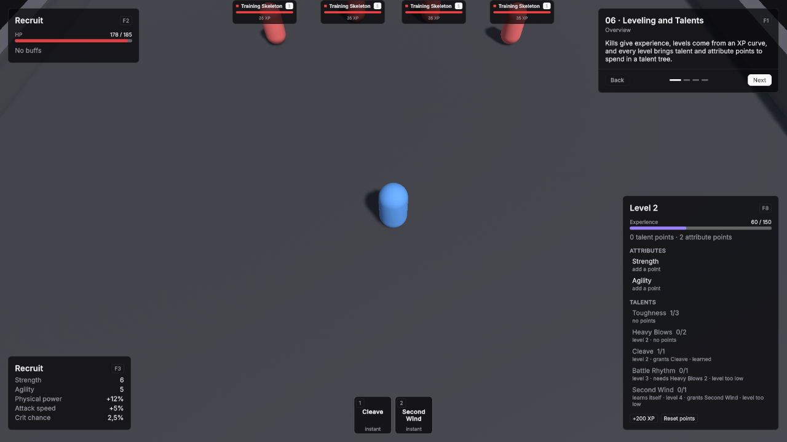

# 06 · Leveling and Talents

Kills give experience, levels come from an XP curve, and every level brings talent and attribute points to spend in a talent tree.

Scene `Scenes/06_LevelingTalents`. Assets `Content/06_LevelingTalents` and `Content/Shared`.

## What it teaches

- A unit levels when its definition has an XP curve. Monsters give experience through **XP Award**.
- A talent tree is one asset that lists talent assets. Each talent names its level, prerequisites, ranks, cost and what it grants.
- Talents grant stat modifiers or abilities, and an auto-learn talent learns itself when its level is reached.
- Attribute points are placed by the player and feed the derived stats.

## Assets

Unit definitions use the demo defaults unless listed: one HP pool without regeneration, Physical damage in Channel Melee, Attack Range 2, Attack Interval 1, Move Speed 5, and the shared BasicAttack.

**RecruitCurve**, an XP Curve: Id `xp.recruit`, Max Level 10, XP To Next Level 100, 150, 200, 260, 330, 410, 500, 600, 710.

| Ability | Settings |
|---|---|
| Cleave | Id `ability.recruit_cleave`, Icon Id `swords`, Targeting Mode Single Target, Range 3, Cooldown 4, no cost. Effect **CleaveDamage**, a Damage effect: 14 to 18 Physical, Channel Melee, Splash Radius 3. |
| Second Wind | Id `ability.second_wind`, Icon Id `wind`, Targeting Mode Self, Cooldown 20, Triggers GCD off. Effect **SecondWindHeal**, a Heal effect of 60. |

Talents, each with Point Cost 1:

| Talent | Id | Required Level | Max Rank | Grants |
|---|---|---|---|---|
| Toughness | `talent.toughness` | 1 | 3 | Modifiers Per Rank: MaxHp +25. |
| Heavy Blows | `talent.heavy_blows` | 2 | 2 | Modifiers Per Rank: Physical Power +10%. |
| Cleave | `talent.cleave` | 2 | 1 | Abilities: Cleave. |
| Battle Rhythm | `talent.battle_rhythm` | 3 | 1 | Prerequisites: Heavy Blows at rank 2. Modifiers Per Rank: Attack Speed +20%. |
| Second Wind | `talent.second_wind` | 4 | 1 | Auto Learn on, so it costs nothing. Abilities: Second Wind. |

**WarriorTree**, a Talent Tree: Id `tree.warrior`, Talents in the order above, Starting Talent Points 1, Talent Points Per Level 1, Starting Attribute Points 0, Attribute Points Per Level 2, Spendable Attributes Strength and Agility.

| Unit Definition | Settings |
|---|---|
| Recruit | Id `unit.recruit`, Faction Player, HP 160 with Regen Mode Out Of Combat Only at 4 per second, Min / Max Damage 8 / 12, XP Curve RecruitCurve, Starting Level 1, Talent Tree WarriorTree, Base Attributes Strength 5 and Agility 5, Attribute Growth Per Level Strength +1. |
| Training Skeleton | Id `unit.training_skeleton`, Faction Enemy, HP 60, Min / Max Damage 2 / 3, Attack Interval 1.5, Move Speed 3.5, Use Hostile AI on, Aggro Range 4, XP Award 35. |
| Veteran | Id `unit.veteran`, Faction Enemy, HP 260, Min / Max Damage 6 / 9, Move Speed 4, Use Hostile AI on, Aggro Range 4, XP Award 150. |

MaxHp is the pool stat in the package's `Runtime/CoreStats/Pools`. Strength and Agility are the shared attributes in `Content/Shared`, and the shared **AttributeFormula** turns Strength into Physical Power and Agility into Crit Chance and Attack Speed.

## Scene

Ground 36 × 36.

| Object | Setup |
|---|---|
| Player | Player prefab at (0, 0, -6). Definition Recruit. **VtAttributeDerivedStatsBinding** with Formula AttributeFormula. VtAbilityHotkeys slots: key 1 Cleave, key 2 Second Wind. VtDemoReviveAfterDeath 4 seconds, Return To Start on. |
| Training Skeletons | Four Unit prefabs with Training Skeleton at (-6, 0, 5), (-2, 0, 7), (2, 0, 7) and (6, 0, 5). **VtNameplateInfo** with Subtitle "35 XP". VtDemoReviveAfterDeath 4 seconds, Return To Start on. |
| Veteran | Unit prefab with Veteran at (0, 0, 13). VtNameplateInfo with Subtitle "150 XP". VtDemoReviveAfterDeath 8 seconds, Return To Start on. |
| Demo UI | Lesson card. Two **VtUnitFrame** with Unit set to the player and Region Top Left, one with Source Unit and one with Source Target Of Unit. **VtBuffBar** with Unit set to the player and Region Top Left. **VtResourceBar** with Unit set to the player, Bar Source Cast and Region Top Left. **VtResourceBar** with Unit set to the player, Bar Source Experience and Region Top Left. **VtStatList** titled Recruit with Region Bottom Left and rows Strength, Agility, Physical power, Attack speed and Crit chance. **VtTalentWindow** with Unit set to the player and **VtDemoWindowKey** with Window the talent window, Panel Name talents and Toggle Key F8. **VtActionBar** with the player's VtAbilityHotkeys, Region Bottom Center and Slot Size Large. |

## Build it yourself

1. Build the Unit and Player prefabs as in [Build the prefabs](index.md#build-the-prefabs).
2. **Create → Vantage → Leveling → XP Curve**, name it RecruitCurve, and fill in the values above.
3. Create the two abilities and their effects with **Create → Vantage → Abilities** and the values above.
4. **Create → Vantage → Progression → Talent** five times with the values above, then **Create → Vantage → Progression → Talent Tree** for WarriorTree.
5. Create the three unit definitions with **Create → Vantage → Units → Unit Definition**.
6. Build the scene as in [Build the shared layout](index.md#build-the-shared-layout) with a 36 × 36 Level.
7. Place the player, add a **VtAttributeDerivedStatsBinding** with the shared AttributeFormula, and put Cleave and Second Wind in its hotkey slots 1 and 2.
8. Place the four skeletons and the Veteran.

## Try

- Kill skeletons for experience. The Veteran is worth far more.
- Press F8 and spend talent points in the talent window. Toughness has three ranks; Battle Rhythm needs Heavy Blows at rank 2.
- Learn Cleave and press 1. Second Wind learns itself at level 4; press 2.
- Place attribute points in Strength or Agility and watch the stat sheet.
- Reset points gives every point back.

## In your own game

- Item requirements, recipes and quests read the same level. See [Leveling](../modules/leveling.md) and [Progression](../modules/progression.md).
