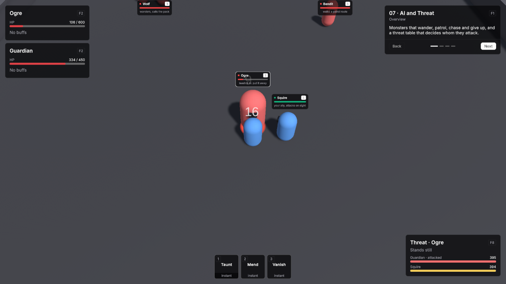

# 07 · AI and Threat

Monsters that wander, patrol, chase and give up, and a threat table that decides whom they attack.

Scene `Scenes/07_AiThreat`. Assets `Content/07_AiThreat` and `Content/Shared`.

## What it teaches

- Wandering, aggro and the leash are fields on the unit definition. A patrol is a route handed to a spawner.
- A pack calls for help: hitting one monster pulls its neighbours.
- A threat table decides the target. Taunts, heals and vanish change it through ordinary ability effects.
- A monster pulled past its leash runs home, invulnerable, and forgets its threat.

## Assets

Unit definitions use the demo defaults unless listed: one HP pool without regeneration, Physical damage in Channel Melee, Attack Range 2, Attack Interval 1, Move Speed 5, and the shared BasicAttack.

| Ability | Settings |
|---|---|
| Taunt | Id `ability.taunt`, Targeting Mode Single Target, Range 10, Cooldown 6, Triggers GCD off. Effect **TauntEffect**, a Taunt effect at its defaults. |
| Mend | Id `ability.mend`, Targeting Mode Self, Cooldown 3. Effect **MendHeal**, a Heal effect of 70. |
| Vanish | Id `ability.vanish`, Targeting Mode Self, Cooldown 15, Triggers GCD off. Effect **VanishEffect**, a Threat Shed effect with Radius 30. |

| Unit Definition | Settings |
|---|---|
| Guardian | Id `unit.guardian`, Faction Player, HP 450 with Regen Mode Out Of Combat Only at 5 per second, Min / Max Damage 10 / 14, Granted Abilities Taunt, Mend and Vanish. |
| Squire | Id `unit.squire`, Faction Player, HP 300, Min / Max Damage 7 / 9, Use Hostile AI on, Aggro Range 7. |
| Wolf | Id `unit.ai_wolf`, Faction Enemy, HP 110, Min / Max Damage 4 / 6, Use Hostile AI on, Use Threat Table on, Aggro Range 5, Roam Radius 5, Leash Radius 16, Roam Idle Min / Max Seconds 1.5 / 3.5. |
| Bandit | Id `unit.ai_bandit`, Faction Enemy, HP 150, Min / Max Damage 6 / 8, Use Hostile AI on, Use Threat Table on, Aggro Range 5, Roam Radius 0, Leash Radius 18, Roam Idle Min / Max Seconds 0.5 / 1, Respawn Time 10. |
| Ogre | Id `unit.ogre`, Faction Enemy, HP 600, Min / Max Damage 12 / 16, Attack Interval 1.6, Move Speed 4, Use Hostile AI on, Use Threat Table on, Aggro Range 4, Roam Radius 0, Leash Radius 9. |

**BanditUnit.prefab** is a prefab variant of Unit with Definition Bandit and **VtNameplateInfo** with Subtitle "walks a patrol route".

## Scene

Ground 40 × 40.

| Object | Setup |
|---|---|
| Player | Player prefab at (0, 0, -10). Definition Guardian. **VtThreatAutoSubscriber** added. VtAbilityHotkeys slots: key 1 Taunt, key 2 Mend, key 3 Vanish. VtDemoReviveAfterDeath 4 seconds, Return To Start on. |
| Squire | Unit prefab with Squire at (2.5, 0, -9). VtNameplateInfo with Subtitle "your ally, attacks on sight". VtDemoReviveAfterDeath 6 seconds. |
| Wolves | Three Unit prefabs with Wolf at (-11, 0, 6), (-13, 0, 9) and (-9, 0, 10). VtNameplateInfo with Subtitle "wanders, calls the pack". VtDemoReviveAfterDeath 8 seconds. |
| Patrol Route | Empty object with **VtPatrolRoute**, Loop on, and four children Waypoint 1 to 4 at (6, 0, 2), (14, 0, 2), (14, 0, 10) and (6, 0, 10). |
| Bandit Patrol | Empty object at (6, 0, 2) with **VtMobSpawner**: Prefab BanditUnit, Count 1, Spawn Radius 0, Reuse Instances off, Corpse Linger Seconds 0, Patrol Route set to Patrol Route. |
| Ogre | Unit prefab with Ogre at (0, 0, 15), scaled 1.4. VtNameplateInfo with Subtitle "leash 9 m: pull it away". VtDemoReviveAfterDeath 10 seconds. |
| Demo UI | Lesson card. Two VtDemoUnitFrame at the top left. **VtDemoThreatPanel** with Unit set to the player. **VtDemoHotbar** with the player's VtAbilityHotkeys. |

Every VtDemoReviveAfterDeath here has Return To Start on.

## Build it yourself

1. Build the Unit and Player prefabs as in [Build the prefabs](index.md#build-the-prefabs).
2. Create the three abilities with their effects, and the five unit definitions, with the values above.
3. Make the BanditUnit prefab variant: right-click Unit.prefab, **Create → Prefab Variant**, and set its Definition to Bandit.
4. Build the scene as in [Build the shared layout](index.md#build-the-shared-layout) with a 40 × 40 Level.
5. Place the player, add **VtThreatAutoSubscriber**, and fill its hotkey slots.
6. Place the Squire, the wolves and the Ogre.
7. Create the Patrol Route with **Vantage → AI → VtPatrolRoute** and four child waypoints, then the Bandit Patrol with **Vantage → Spawning → VtMobSpawner** pointing at BanditUnit and the route.

## Try

- Watch the wolves wander and the bandit walk its route.
- Hit one wolf and the rest of the pack comes to help.
- Let the Squire attack the Ogre, then press 1 to Taunt it: the threat panel puts you on top.
- Press 2 to heal while monsters fight you: healing adds threat.
- Pull the Ogre away from its spot: past its leash it runs home, invulnerable.
- Press 3 to Vanish: every monster nearby forgets you.

## In your own game

- See [AI roaming](../modules/ai-roaming.md) and [Threat](../modules/threat.md). A monster with abilities or phases uses [Encounters](../modules/encounters.md).
