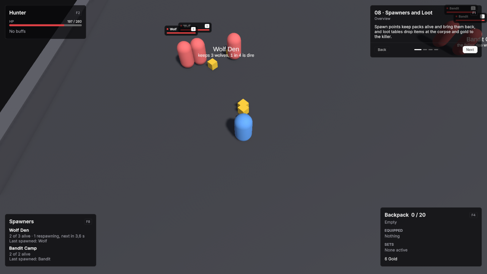

# 08 · Spawners and Loot

Spawn points keep packs alive and bring them back, and loot tables drop items at the corpse and gold to the killer.

Scene `Scenes/08_SpawnersLoot`. Assets `Content/08_SpawnersLoot` and `Content/Shared`.

## What it teaches

- A spawner keeps a count of units alive around a point, rolls weighted variants and respawns after the definition's Respawn Time.
- A spawner can revive corpses in place instead of creating new units.
- A loot table has guaranteed drops, a weighted pool rolled a number of times, an empty entry for a chance of nothing, and currency for the killer's wallet.

## Assets

Unit definitions use the demo defaults unless listed: one HP pool without regeneration, Physical damage in Channel Melee, Attack Range 2, Attack Interval 1, Move Speed 5, and the shared BasicAttack.

| Item | Settings |
|---|---|
| Wolf Pelt | Id `item.wolf_pelt`, Is Stackable on, Max Stack Size 20. |
| Wolf Fang | Id `item.wolf_fang`, Is Stackable on, Max Stack Size 20. |
| Minor Potion | Id `item.minor_potion`, Is Stackable on, Max Stack Size 10, Use Ability Drink Minor Potion, Consume On Use on. |
| Bandit Blade | Id `item.bandit_blade`, Slot Main Hand, Modifiers Physical Power +15%. |
| Leather Cap | Id `item.leather_cap`, Slot Head, Modifiers Armor +8. |

**Drink Minor Potion**, an ability: Id `ability.drink_minor_potion`, Icon Id `flask-round`, Targeting Mode Self, Cooldown 2, Triggers GCD off. Effect **MinorPotionHeal**, a Heal effect of 40.

| Loot Table | Settings |
|---|---|
| WolfLoot | Id `loot.wolf`. Guaranteed Drops: Wolf Pelt, count 1. Entries: Wolf Fang weight 3, count 1 to 2; no item, weight 6; Minor Potion weight 1, count 1. Rolls 1. Currency Drops: Gold 1 to 4. Default World Item Prefab WorldItem. |
| BanditLoot | Id `loot.bandit`. No guaranteed drops. Entries: Bandit Blade weight 1, Leather Cap weight 2, Minor Potion weight 3, no item weight 4, each count 1. Rolls 2. Currency Drops: Gold 6 to 12. Default World Item Prefab WorldItem. |

| Unit Definition | Settings |
|---|---|
| Wolf | Id `unit.wolf`, Faction Enemy, HP 60, Min / Max Damage 3 / 5, Use Hostile AI on, Aggro Range 6, Respawn Time 5, Loot Table WolfLoot. |
| Dire Wolf | Id `unit.dire_wolf`, Faction Enemy, HP 140, Min / Max Damage 6 / 9, Use Hostile AI on, Aggro Range 6, Respawn Time 5, Loot Table WolfLoot. |
| Bandit | Id `unit.bandit`, Faction Enemy, HP 110, Min / Max Damage 5 / 8, Use Hostile AI on, Aggro Range 6, Respawn Time 10, Loot Table BanditLoot. |
| Hunter | Id `unit.hunter`, Faction Player, HP 260 with Regen Mode Out Of Combat Only at 4 per second, Min / Max Damage 10 / 14. |

Gold is the shared currency in `Content/Shared`. **WolfUnit**, **DireWolfUnit** and **BanditUnit** are prefab variants of Unit with Definition Wolf, Dire Wolf and Bandit; DireWolfUnit is scaled 1.3.

## Scene

Ground 40 × 40.

| Object | Setup |
|---|---|
| Player | Player prefab at (0, 0, -8). Definition Hunter. **VtUnitInventory** with Base Capacity 20, and **VtUnitWallet**. VtDemoReviveAfterDeath 4 seconds, Return To Start on. |
| Wolf Den | Empty object at (-8, 0, 9) with **VtMobSpawner**: Prefab WolfUnit, Variants WolfUnit weight 3 and DireWolfUnit weight 1, Count 3, Spawn Radius 3, Reuse Instances off, Corpse Linger Seconds 3. A Label at (0, 2.4, 0) reads "Wolf Den" with "keeps 3 wolves, 1 in 4 is dire". |
| Bandit Camp | Empty object at (9, 0, 10) with **VtMobSpawner**: Prefab BanditUnit, Count 2, Spawn Radius 2, Reuse Instances on. A Label reads "Bandit Camp" with "the fallen rise where they fell". |
| Demo UI | Lesson card. Two **VtUnitFrame** with Unit set to the player and Region Top Left, one with Source Unit and one with Source Target Of Unit. **VtBuffBar** with Unit set to the player and Region Top Left. **VtResourceBar** with Unit set to the player, Bar Source Cast and Region Top Left. **VtInventoryWindow** with Unit set to the player, **VtCurrencyReadout** with Unit set to the player and Region Bottom Right, **VtDemoWindowKey** with Window the inventory window, Panel Name inventory and Toggle Key F4. **VtDemoSpawnerPanel** with Spawners Wolf Den and Bandit Camp. |

## Build it yourself

1. Build the Unit, Player and WorldItem prefabs as in [Build the prefabs](index.md#build-the-prefabs).
2. Create the items, the potion ability and effect, the two loot tables and the four unit definitions with the values above.
3. Make the three prefab variants of Unit and set their definitions.
4. Build the scene as in [Build the shared layout](index.md#build-the-shared-layout) with a 40 × 40 Level.
5. Place the player and add **VtUnitInventory** and **VtUnitWallet**.
6. Create Wolf Den and Bandit Camp with **Add Component → Vantage → Spawning → VtMobSpawner** and the values above.

## Try

- Kill a wolf: a pelt always drops, sometimes a fang or a potion, and the gold goes straight to your wallet.
- Watch the spawner panel count down the respawn.
- Keep hunting: about one wolf in four comes back as a Dire Wolf.
- Bandits roll their table twice and rise again where they fell.
- Right-click drops to pick them up, press F4 and equip the Bandit Blade from the bag.

## In your own game

- See [Spawning](../modules/spawning.md) and [Loot](../modules/loot.md). Change drops per kill in `VtLootDropper.OnRolled`.
