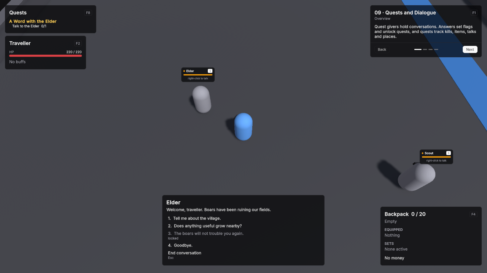

# 09 · Quests and Dialogue

Quest givers hold conversations. Answers set flags and unlock quests, and quests track kills, items, talks and places.

Scene `Scenes/09_QuestsDialogue`. Assets `Content/09_QuestsDialogue` and `Content/Shared`.

## What it teaches

- A quest giver without a dialogue asset still offers its quests after a greeting.
- A dialogue asset adds lines and answers; answers can need requirements, apply effects and jump to other lines, and quest answers are appended automatically.
- Quests are built from objective, reward and requirement assets: level, earlier quests, items and dialogue flags gate them.
- A quest can have a time limit or repeat after a cooldown.
- A minimap over a captured picture of the ground marks quest givers with something to offer or to take back, and points to the places and people active quests send you to.

## Assets

Unit definitions use the demo defaults unless listed: one HP pool without regeneration, Physical damage in Channel Melee, Attack Range 2, Attack Interval 1, Move Speed 5, and the shared BasicAttack.

| Asset | Settings |
|---|---|
| BoarTag | A Unit Tag Definition: Id `tag.boar`, Display Name Boar. |
| Silverleaf | An item: Id `item.silverleaf`, Is Stackable on, Max Stack Size 10. |
| Elder Token | An item: Id `item.elder_token`. |
| MainQuests, SideQuests | Quest Categories: Id `questcat.main`, Sort Weight 0, colour (1, 0.82, 0.35); Id `questcat.side`, Sort Weight 10, colour (0.55, 0.80, 1). |
| TravellerCurve | An XP Curve: Id `xp.traveller`, Max Level 5, XP To Next Level 100, 200, 300, 400. |

| Unit Definition | Settings |
|---|---|
| Traveller | Id `unit.traveller`, Faction Player, HP 220 with Regen Mode Out Of Combat Only at 4 per second, Min / Max Damage 10 / 14, Use Quest Log on, Use Dialogue on, XP Curve TravellerCurve. |
| Scout | Id `unit.scout`, Faction Neutral, HP 100, no Basic Attack, Move Speed 0, Aggro Range 0, Use Quest Giver on, Greeting "Keep your eyes on the ridge, traveller.", Offered Quests A Word with the Elder and Scout the Ridge. |
| Elder | Id `unit.elder`, Faction Neutral, HP 100, no Basic Attack, Move Speed 0, Aggro Range 0, Use Quest Giver on, Dialogue ElderTalk, Offered Quests Boar Trouble, Silverleaf and Boar Cull. |
| Boar | Id `unit.boar`, Faction Enemy, HP 60, Min / Max Damage 3 / 5, Move Speed 4, Use Hostile AI on, Aggro Range 5, XP Award 40, Tags BoarTag. |

Objectives, rewards, requirements and effects:

| Asset | Type | Settings |
|---|---|---|
| TalkToTheElder | Talk objective | Description "Talk to the Elder", Required Count 1, Target Definition Elder. |
| SlayBoars | Kill objective | Description "Slay boars", Required Count 3, Target Tag BoarTag. |
| GatherSilverleaf | Collect objective | Description "Gather Silverleaf", Required Count 4, Item Silverleaf. |
| ReachTheRidge | Reach Location objective | Description "Reach the ridge", Required Count 1, Location Id `ridge`, Arrive Radius 3. |
| CullBoars | Kill objective | Description "Cull boars", Required Count 2, Target Tag BoarTag. |
| Reward50Xp, Reward120Xp | XP rewards | 50 and 120 XP. |
| Reward25Gold, Reward10Gold | Currency rewards | Gold 25 and Gold 10. |
| RewardElderToken | Item reward | Elder Token, count 1. |
| AskedAboutHerbs | Dialogue Flag requirement | Flag `elder.herbs`. |
| HasElderToken | Item requirement | Elder Token, count 1. |
| WordWithElderComplete | Quest State requirement | A Word with the Elder in state Complete. |
| BoarTroubleTurnedIn | Quest State requirement | Boar Trouble in state Turned In. |
| TurnInWordWithElder | Quest dialogue effect | Quest A Word with the Elder, Action Turn In. |
| SetAskedAboutHerbs | Set Flag dialogue effect | Flag `elder.herbs`. |

| Quest | Settings |
|---|---|
| A Word with the Elder | Id `quest.word_with_elder`, Category Main, Objectives TalkToTheElder, Rewards Reward50Xp. |
| Boar Trouble | Id `quest.boar_trouble`, Category Main, Required Completed Quests A Word with the Elder, Objectives SlayBoars, Rewards Reward25Gold and Reward120Xp. |
| Silverleaf | Id `quest.silverleaf`, Category Side, Requirements AskedAboutHerbs, Objectives GatherSilverleaf, Rewards RewardElderToken and Reward50Xp. |
| Scout the Ridge | Id `quest.scout_the_ridge`, Category Side, Required Level 2, Time Limit Seconds 45, Objectives ReachTheRidge, Rewards Reward120Xp. |
| Boar Cull | Id `quest.boar_cull`, Category Side, Requirements HasElderToken, Repeatable on, Repeat Cooldown Seconds 30, Objectives CullBoars, Rewards Reward10Gold. |

Each quest's Description is shown in the quest log's asset. **ElderTalk**, a Dialogue Definition with Id `dialogue.elder`:

| Node | Text | Answers |
|---|---|---|
| start | "Welcome, traveller. Boars have been ruining our fields." Include Quest Answers on. | "The Scout sent me to you." → welcome, Requirements WordWithElderComplete, Effects TurnInWordWithElder. "Tell me about the village." → village. "Does anything useful grow nearby?" → herbs, Effects SetAskedAboutHerbs. "The boars will not trouble you again." → thanks, Requirements BoarTroubleTurnedIn, Show When Locked on. "Goodbye." ends. |
| welcome | "Good. We need every pair of hands. Ask me about the boars when you are ready." | None; Next Node Id start. |
| village | "We are farmers and hunters. The Scout on the hill watches the ridge for us." | None; Next Node Id start. |
| herbs | "Silverleaf grows by the stream to the east. Bring me four and I will make it worth your while." | None; Next Node Id start. |
| thanks | "Then you have earned our trust. Come back whenever the boars return." | None; Next Node Id start. |

## Scene

Ground 40 × 40.

| Object | Setup |
|---|---|
| Player | Player prefab at (0, 0, -8). Definition Traveller. **VtUnitInventory** with Base Capacity 20, and **VtUnitWallet**. VtDemoReviveAfterDeath 4 seconds, Return To Start on. |
| Scout | Unit prefab with Scout at (7, 0, -4). **VtNameplateInfo** with Subtitle "right-click to talk". |
| Elder | Unit prefab with Elder at (-4, 0, 1). VtNameplateInfo with Subtitle "right-click to talk". |
| Boars | Four Unit prefabs with Boar at (-11, 0, 11), (-7, 0, 13), (-12, 0, 15) and (-8, 0, 17). VtDemoReviveAfterDeath 5 seconds, Return To Start on. |
| Stream | A flat Cube at (14.5, 0.01, 8), Scale (2.5, 0.02, 22), with the `Water` material. |
| Silverleaf | Six WorldItem prefabs with Silverleaf, count 1, at (12.5, 0, 2), (16.5, 0, 5), (12.5, 0, 8), (16.5, 0, 10), (12.5, 0, 13) and (16.5, 0, 15). |
| The Ridge | Empty object at (-14, 0, -14) with **VtQuestLocationMarker**, Location Id `ridge`, Gizmo Radius 3; a dark Cylinder pole, a small gold Cube flag, and a Label "The Ridge" with "quest location". |
| Map Area | Empty object at (0, 0, 0) with **VtMapArea**, Size (40, 40), Display Name Millbrook, Image `MillbrookMap.png`, captured with **Capture Image** at the default Capture Resolution 1024 and Capture Without Units on. |
| Demo UI | Lesson card. One **VtUnitFrame** with Unit set to the player, Source Unit and Region Top Left. **VtBuffBar** with Unit set to the player and Region Top Left. **VtResourceBar** with Unit set to the player, Bar Source Cast and Region Top Left. **VtQuestLogWindow** with Unit set to the player and **VtDemoWindowKey** with Window the quest log, Panel Name quest log and Toggle Key F8. **VtQuestTracker** with Unit set to the player and Region Top Left. **VtInventoryWindow** with Unit set to the player, **VtCurrencyReadout** with Unit set to the player and Region Bottom Right, **VtDemoWindowKey** with Window the inventory window, Panel Name inventory and Toggle Key F4. **VtDialogueWindow** with Unit set to the player. **VtInteractionPrompt** with Player set to the player, Region Bottom Center and Key Text RMB. **VtMinimap** with Unit set to the player and Region Bottom Right, the other fields at their defaults. |

## Build it yourself

1. Build the Unit, Player and WorldItem prefabs as in [Build the prefabs](index.md#build-the-prefabs).
2. Create the tag, items, categories and curve, then the four unit definitions.
3. Create the objectives, rewards, requirements and dialogue effects under **Create → Vantage → Quests** and **Create → Vantage → Dialogue**.
4. Create the five quests with **Create → Vantage → Quests → Quest Definition**, then ElderTalk with **Create → Vantage → Dialogue → Dialogue Definition**. Fill Offered Quests and Dialogue on the Scout and the Elder.
5. Build the scene as in [Build the shared layout](index.md#build-the-shared-layout) with a 40 × 40 Level.
6. Place the player with **VtUnitInventory** and **VtUnitWallet**, the Scout, the Elder, the boars and the Silverleaf.
7. Create The Ridge with **Vantage → Quests → VtQuestLocationMarker** and Location Id `ridge`.
8. Create an empty object named Map Area at (0, 0, 0), add **Vantage → UI → VtMapArea** with Size (40, 40) and Display Name Millbrook, save the scene, and press **Capture Image**.
9. Add **VtMinimap** to the Demo UI with Unit set to the player and Region Bottom Right.

## Try

- Walk up to the Scout: the prompt at the bottom names it. Right-click, accept A Word with the Elder, then talk to the Elder. F8 opens the quest log; the tracker under the unit frame follows your active quests.
- Ask the Elder what grows nearby to unlock Silverleaf, then pick four by the stream.
- Boar Trouble needs the first quest turned in. Scout the Ridge needs level 2 and gives you 45 seconds.
- Boar Cull needs the Elder Token and comes back 30 seconds after you turn it in.
- Pick answers with the mouse or the number keys. Esc ends a conversation.
- Watch the minimap in the bottom right: a yellow mark over the Scout while it has a quest for you, a question mark once a quest waits to be handed in, a pin on the Elder while you have to talk to them, and a pin on the rim pointing to the ridge while Scout the Ridge runs. The buttons under it zoom.

## In your own game

- See [Quests](../modules/quests.md) and [Dialogue](../modules/dialogue.md). The Elder's "The Scout sent me to you." answer is the pattern for turning a quest in to someone other than its giver.
- See [Minimap](panels.md#minimap) for map areas, markers and the minimap's fields.
