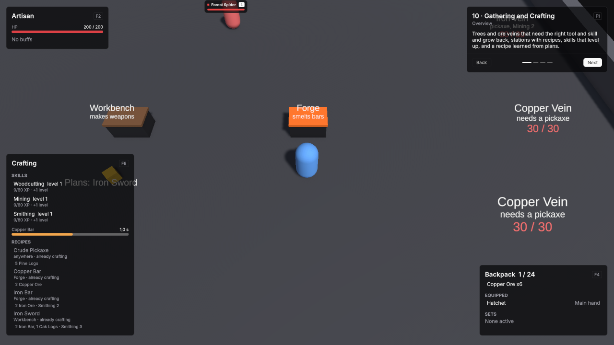

# 10 · Gathering and Crafting

Trees and ore veins that need the right tool and skill and grow back, stations with recipes, skills that level up, and a recipe learned from plans.

Scene `Scenes/10_GatheringCrafting`. Assets `Content/10_GatheringCrafting` and `Content/Shared`.

## What it teaches

- A resource node is a unit whose definition has a Resource Node definition. Every hit yields items into the backpack, and the node grows back.
- Nodes check the equipped tool's item tag and the attacker's crafting skill.
- Recipes name their inputs, station, skill gate and XP. Stations are units that open when you walk up to them.
- A recipe that is not learned by default is learned by using an item.

## Assets

Unit definitions use the demo defaults unless listed: one HP pool without regeneration, Physical damage in Channel Melee, Attack Range 2, Attack Interval 1, Move Speed 5, and the shared BasicAttack.

| Asset | Settings |
|---|---|
| AxeTag, PickaxeTag | Item Tag Definitions: Id `itemtag.axe`, Display Name Axe; Id `itemtag.pickaxe`, Display Name Pickaxe. |
| SkillCurve | An XP Curve: Id `xp.skill`, Max Level 5, XP To Next Level 60, 90, 130, 180. |
| Woodcutting, Mining, Smithing | Crafting Skills: Ids `skill.woodcutting`, `skill.mining`, `skill.smithing`, each with XP Curve SkillCurve and Max Level 5. |
| ForgeStation, WorkbenchStation | Recipe Stations: Id `station.forge`, Display Name Forge; Id `station.workbench`, Display Name Workbench. |
| Tools, Metalwork | Recipe Categories: Id `recipecat.tools`; Id `recipecat.metalwork`. |

| Item | Settings |
|---|---|
| Hatchet | Id `item.hatchet`, Slot Main Hand, Tags AxeTag. |
| Crude Pickaxe | Id `item.crude_pickaxe`, Slot Main Hand, Tags PickaxeTag. |
| Pine Logs, Oak Logs, Copper Ore, Iron Ore | Ids `item.pine_logs`, `item.oak_logs`, `item.copper_ore`, `item.iron_ore`. Is Stackable on, Max Stack Size 50. |
| Copper Bar, Iron Bar | Ids `item.copper_bar`, `item.iron_bar`. Is Stackable on, Max Stack Size 20. |
| Iron Sword | Id `item.iron_sword`, Slot Main Hand, Modifiers Physical Power +20%. |
| Plans: Iron Sword | Id `item.iron_sword_plans`, Use Ability Study Plans, Consume On Use on. |

**Study Plans**, an ability: Id `ability.study_iron_sword_plans`, Icon Id `scroll-text`, Targeting Mode Self, Cooldown 0.5, Triggers GCD off. Effect **LearnIronSword**, a Learn Recipe effect with Recipe IronSwordRecipe.

| Recipe | Settings |
|---|---|
| CrudePickaxeRecipe | Id `recipe.crude_pickaxe`, Category Tools, no Station, Inputs 5 Pine Logs, Output Crude Pickaxe 1, Craft Seconds 1.5, no skill, XP Grant 0, Learned By Default on. |
| CopperBarRecipe | Id `recipe.copper_bar`, Category Metalwork, Station ForgeStation, Inputs 2 Copper Ore, Output Copper Bar 1, Craft Seconds 2, Required Skill Smithing level 0, XP Grant 30, Learned By Default on. |
| IronBarRecipe | Id `recipe.iron_bar`, Category Metalwork, Station ForgeStation, Inputs 2 Iron Ore, Output Iron Bar 1, Craft Seconds 2.5, Required Skill Smithing level 2, XP Grant 40, Learned By Default on. |
| IronSwordRecipe | Id `recipe.iron_sword`, Category Metalwork, Station WorkbenchStation, Inputs 2 Iron Bar and 1 Oak Logs, Output Iron Sword 1, Craft Seconds 3, Required Skill Smithing level 3, XP Grant 60, Learned By Default off. |

Every Resource Node Definition has Rolls Per Hit 1 and Accepted Damage Types Physical:

| Resource Node | Settings |
|---|---|
| PineNode | Id `node.pine`. Harvest Entries Pine Logs weight 1, count 1 to 2. Required Item Tag AxeTag. Required Skill Woodcutting level 0, Xp Grant Per Hit 10. Respawn Seconds 15. Alive Visual PineTree, Depleted Visual Stump. |
| OakNode | Id `node.oak`. Harvest Entries Oak Logs, count 1. Required Item Tag AxeTag. Required Skill Woodcutting level 2, Xp Grant Per Hit 20. Respawn Seconds 20. Alive Visual OakTree, Depleted Visual Stump. |
| CopperNode | Id `node.copper`. Harvest Entries Copper Ore, count 1. Required Item Tag PickaxeTag. Required Skill Mining level 0, Xp Grant Per Hit 10. Respawn Seconds 15. Alive Visual CopperVein, Depleted Visual Rubble. |
| IronNode | Id `node.iron`. Harvest Entries Iron Ore, count 1. Required Item Tag PickaxeTag. Required Skill Mining level 2, Xp Grant Per Hit 20. Respawn Seconds 20. Alive Visual IronVein, Depleted Visual Rubble. |

The visuals in `Content/10_GatheringCrafting/Visuals` are primitives with the `Wood`, `PineLeaves`, `OakLeaves`, `Stone`, `Copper` and `Iron` materials.

| Unit Definition | Settings |
|---|---|
| Pine, Old Oak, Copper Vein, Iron Vein | Ids `unit.pine`, `unit.old_oak`, `unit.copper_vein`, `unit.iron_vein`. Faction Neutral, HP 30, no Basic Attack, Move Speed 0, Aggro Range 0, Resource Node PineNode, OakNode, CopperNode and IronNode. |
| Forge, Workbench | Ids `unit.forge`, `unit.workbench`. Faction Neutral, HP 100, no Basic Attack, Move Speed 0, Aggro Range 0, Use Crafting Station on, Station Type ForgeStation and WorkbenchStation. |
| Forest Spider | Id `unit.forest_spider`, Faction Enemy, HP 60, Min / Max Damage 3 / 5, Move Speed 4, Use Hostile AI on, Aggro Range 4. |
| Artisan | Id `unit.artisan`, Faction Player, HP 200 with Regen Mode Out Of Combat Only at 4 per second, Min / Max Damage 10 / 10, Use Crafter, Use Recipe Book and Use Crafting Skills on, Starting Equipment Hatchet. |

## Scene

Ground 44 × 44.

| Object | Setup |
|---|---|
| Player | Player prefab at (0, 0, -8). Definition Artisan. **VtUnitInventory** with Base Capacity 24. VtDemoReviveAfterDeath 4 seconds, Return To Start on. |
| Pines | Three nodes with Pine at (-12, 0, 3), (-14, 0, 7) and (-10, 0, 8), caption "Pine" with "needs an axe", VtNameplateInfo with Hidden on. |
| Old Oak | A node with Old Oak at (-15, 0, 14), caption "Old Oak" with "axe, Woodcutting 2", VtNameplateInfo with Hidden on. |
| Copper Veins | Two nodes with Copper Vein at (12, 0, 3) and (14, 0, 7), caption "Copper Vein" with "needs a pickaxe", VtNameplateInfo with Hidden on. |
| Iron Vein | A node with Iron Vein at (15, 0, 13), caption "Iron Vein" with "pickaxe, Mining 2", VtNameplateInfo with Hidden on. |
| Forge | A station at (5, 0, 9) with the `ForgeFire` top, caption "Forge" with "smelts bars", VtNameplateInfo with Hidden on. |
| Workbench | A station at (-4, 0, 9) with the `Wood` top, caption "Workbench" with "makes weapons", VtNameplateInfo with Hidden on. |
| Plans | A WorldItem with Plans: Iron Sword at (-4, 0, 6). |
| Forest Spider | Unit prefab with Forest Spider at (0, 0, 18). VtDemoReviveAfterDeath 6 seconds, Return To Start on. |
| Demo UI | Lesson card. One **VtUnitFrame** with Unit set to the player, Source Unit and Region Top Left. **VtBuffBar** with Unit set to the player and Region Top Left. **VtResourceBar** with Unit set to the player, Bar Source Cast and Region Top Left. **VtInventoryWindow** with Unit set to the player, **VtCurrencyReadout** with Unit set to the player and Region Bottom Right, **VtDemoWindowKey** with Window the inventory window, Panel Name inventory and Toggle Key F4. **VtCraftingWindow** with Unit set to the player, Recipes in the order above and Open At Station on, and **VtDemoWindowKey** with Window the crafting window, Panel Name crafting and Toggle Key F8. **VtInteractionPrompt** with Player set to the player, Region Bottom Center and Key Text RMB. |

A node is an empty object with a **Capsule Collider** (Center (0, 1.2, 0), Height 2.4, Radius 0.7), a **VtUnit** with its definition, and a Label at (0, 3.6, 0) showing health. The visual appears at runtime from the Resource Node definition. A station is an empty object with a **Box Collider** (Center (0, 0.55, 0), Size (1.9, 1.1, 1.2)), a dark Base cube at (0, 0.45, 0) scaled (1.8, 0.9, 1.1), a Top cube at (0, 0.95, 0) scaled (1.9, 0.12, 1.2), a **VtUnit** with its definition, and a Label at (0, 2.2, 0) with health hidden.

## Build it yourself

1. Build the Unit, Player and WorldItem prefabs as in [Build the prefabs](index.md#build-the-prefabs).
2. Create the tags, curve, skills, stations, categories, items, the Study Plans ability and effect, and the four recipes with **Create → Vantage → Crafting** and the values above.
3. Build the six visual prefabs from primitives, then the four Resource Node definitions with **Create → Vantage → Resources → Resource Node Definition**.
4. Create the unit definitions.
5. Build the scene as in [Build the shared layout](index.md#build-the-shared-layout) with a 44 × 44 Level.
6. Place the player with **VtUnitInventory**, then the nodes, the stations, the plans and the spider as described above.

## Try

- Right-click a pine to chop logs with the Hatchet. The Old Oak needs Woodcutting 2.
- Craft a Crude Pickaxe anywhere from five logs, equip it from the backpack and mine copper.
- Stand at the Forge to smelt Copper Bars. Iron needs Mining 2 to mine and Smithing 2 to smelt.
- Pick up the plans by the Workbench and use them to learn the Iron Sword.
- Unequip your tool and hit a tree to see the refusal. Press F8 for the crafting window anywhere: it opens by itself at a station.

## In your own game

- See [Resource nodes](../modules/resource-nodes.md) and [Crafting](../modules/crafting.md). Give nodes their own models through Alive Visual and Depleted Visual.
