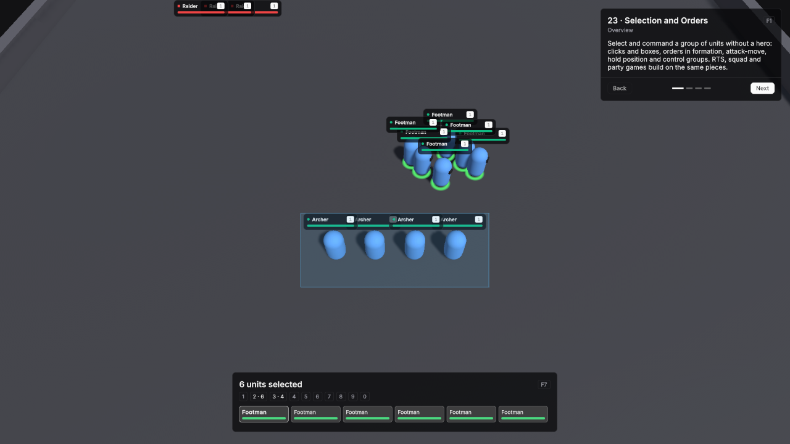

# 23 · Selection and Orders

Select and command a group of units without a hero: clicks and boxes, orders in formation, attack-move, hold position and control groups, against two enemy camps. RTS, squad and party games build on the same pieces.

Scene `Scenes/23_SelectionOrders`. Assets `Content/23_SelectionOrders` and `Content/Shared`.

## What it teaches

- A scene does not need a player unit. A commander object with selection, orders and control groups controls every unit of its side.
- **Takes Orders** on a unit definition is all a unit needs to be commanded.
- Group moves spread over a formation, attack-move fights on the way, and a held unit never chases.
- Control groups save and recall selections, and move the camera on a double tap.

## Assets

Every definition uses the demo defaults unless listed: one HP pool without regeneration, Physical damage in Channel Melee, Attack Range 2, Attack Interval 1, Move Speed 5, and the shared BasicAttack.

| Asset | Settings |
|---|---|
| Footman | Id `unit.footman`, Faction Player, HP 180, Min / Max Damage 10 / 14, Aggro Range 7, Takes Orders on. |
| Archer | Id `unit.archer`, Faction Player, HP 110, Min / Max Damage 12 / 16, Damage Channel Ranged, Attack Range 8, Attack Interval 1.4, Projectile prefab ArcaneProjectile at Speed 20, Aggro Range 9, Takes Orders on. |
| Raider | Id `unit.raider`, Faction Enemy, HP 150, Min / Max Damage 8 / 12, Move Speed 4.5, Aggro Range 7, Use Hostile AI on. |
| Brute | Id `unit.brute`, Faction Enemy, HP 420, Min / Max Damage 18 / 24, Attack Interval 1.6, Move Speed 3.5, Aggro Range 6, Use Hostile AI on. |

## Scene

Ground 56 × 56.

| Object | Setup |
|---|---|
| Main Camera | VtTopDownCamera with Enable Edge Scroll on, Default Height 18, Max Height 30 and Initial Target Base. |
| Base | Empty object at (0, 0, -14). The camera starts here, and Space returns to it. |
| Commander | Empty object at (0, 0, 0) with **VtUnitSelection**, **VtSelectionIndicator** with Style set to the SoftRing preset, **VtOrderInput** and **VtControlGroups**, otherwise at their defaults. |
| Army | Six Unit prefabs with Footman at x -5, -3, -1, 1, 3 and 5 on z -12, and four with Archer at x -3, -1, 1 and 3 on z -16. VtDemoReviveAfterDeath 10 seconds, Return To Start on. |
| West camp | Five Unit prefabs with Raider at (-16, 0, 10), (-13.8, 0, 10), (-11.6, 0, 10), (-16, 0, 12.2) and (-13.8, 0, 12.2). |
| East camp | Three Unit prefabs with Raider at (12, 0, 14), (14.2, 0, 14) and (16.4, 0, 14), and two with Brute at (13, 0, 17) and (15.2, 0, 17), scaled 1.35. |
| Demo UI | Lesson card and **VtSelectionPanel** with Selection and Control Groups set to the Commander components and Region Bottom Center. |

Every camp unit has VtDemoReviveAfterDeath 20 seconds, Return To Start on.

## Build it yourself

1. Build the Unit prefab and ArcaneProjectile as in [Build the prefabs](index.md#build-the-prefabs). This scene does not use the Player prefab.
2. Create the four unit definitions with **Create → Vantage → Units → Unit Definition** and the values above.
3. Build the scene as in [Build the shared layout](index.md#build-the-shared-layout) with a 56 × 56 Level.
4. **GameObject → Create Empty**, name it **Base**, at (0, 0, -14). On the Main Camera, set VtTopDownCamera **Initial Target** to Base and turn on **Enable Edge Scroll**.
5. **GameObject → Create Empty**, name it **Commander**. **Add Component → Vantage → Selection →** **VtUnitSelection**, **VtSelectionIndicator** and **VtControlGroups**, then **Add Component → Vantage → Orders → VtOrderInput**. Drag the SoftRing preset from `Packages/Vantage/Runtime/Core/Selection/Presets` into the indicator's **Style**.
6. Drag Unit prefabs in at the positions above and set each one's **Definition**.
7. Press Play, drag a box around the army and right-click the ground.

## Try

- Drag a box around your army and right-click the ground: the units move in formation.
- Right-click an enemy to attack it. Press A and left-click the ground to attack-move into a camp.
- Press S to stop and H to hold position: held units only fight what is in reach.
- Ctrl+1 saves the selection as group 1. Press 1 to select it again, twice to move the camera there. Shift+2 adds to group 2.
- Double-click an Archer to select every Archer on screen.
- Move the mouse to the screen edge to scroll, press Space to return to the base.

## In your own game

- Set **Viewer Faction** on the selection to the side the local player commands.
- Widen **Formation Spacing** on VtOrderInput for larger unit models.
- See [Orders and control groups](../modules/orders.md) for the order rules and the runtime calls.
