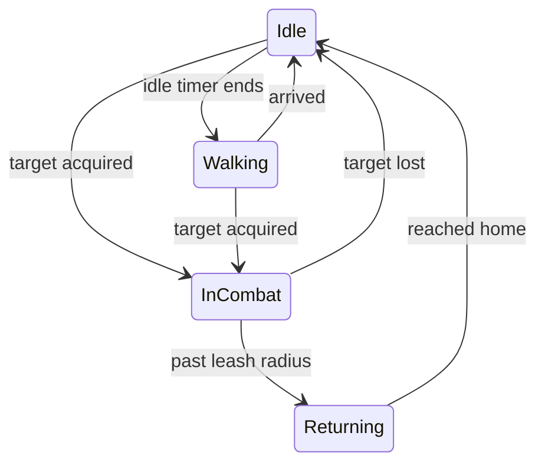

# AI roaming

Monsters that wander or patrol, attack on sight, fight back, chase, and run home invulnerable when pulled too far. Two components do this, and both come from checkboxes on the unit definition.

See it running: the [07 · AI and Threat](../demos/07-ai-threat.md) demo scene. See [Demos](../demos/index.md) to import the scenes.

Every field, its default and every member you can call: [AI roaming reference](../reference/ai-roaming.md).

## Setup

On the monster's unit definition:

| Field | Meaning |
|---|---|
| Use Hostile AI | Attack hostile units that come inside **Aggro Range**, and fight back when something targets this unit through threat or a taunt. Attaches `VtHostileAi`. |
| Takes Orders | Players command the unit with group orders, and it attacks hostile units inside **Aggro Range** while idle. Attaches `VtUnitOrders`; see [Orders and control groups](orders.md). Use it instead of Use Hostile AI. |
| Aggro Range | Notice radius in world units. 0 never engages on sight. |
| Roam Radius | Wander this far from home between idle pauses. 0 stands still. Attaches `VtRoaming`. |
| Leash Radius | Distance from home at which the unit drops the fight and runs home. 0 disables the leash. |
| Roam Idle Min / Max Seconds | Pause between walks. |
| Roam Speed Multiplier | Wander speed relative to move speed. |
| Return Speed Multiplier | Sprint speed while returning. |

Leave both boxes off for players, NPCs and anything passive.



While returning the unit is invulnerable, cannot be targeted, drops its threat table, and ignores everything until it is home. `OnStateChanged` fires on every transition, which is where an "evade" emote belongs.

## Walking around obstacles

Give the monster prefab the same two components the player has: **VtTopDownClickToMove** and **VtNavMeshPathProvider**. Wandering, chasing and returning then go through the mover and use the baked NavMesh. Without them the unit steps straight toward its destination, which is fine for open ground.

## Patrol routes

1. Create an empty GameObject, add **Vantage → AI → VtPatrolRoute**, and put an empty child object at each waypoint. Children are used in order; drag transforms into **Waypoints** to override. **Loop** walks the route in a circle, off walks it back and forth. The route draws in the Scene view.
2. Assign it to **Patrol Route** on the `VtMobSpawner` that spawns the monster, or set `roaming.PatrolRoute` from code.

The unit walks the waypoints with the usual idle pause between them. Set the pause to 0 for a continuous patrol. Home follows the route, so the leash is measured from the last waypoint reached rather than from the spawn point.

## Which units fight

Units of different factions attack each other unless either one is **Neutral**. Neutral units are never attacked on sight and never attack. The rule is `VtFactionRules.AreHostile` if you need it in your own code.

## Runtime

```csharp
var roaming = unit.GetComponent<VtRoaming>();
roaming.State;
roaming.Home;
roaming.SetHome(anchor);
roaming.PatrolRoute = route;
roaming.OnStateChanged += (from, to) => { };

var ai = unit.GetComponent<VtHostileAi>();
ai.scanInterval = 0.5f;
ai.lineOfSightMask = wallsLayer;      // empty = notices through walls
ai.OnTargetAcquired += target => { };
ai.FindNearestHostile();
```

Hostile AI scans only while it has no target. An engaged unit costs nothing per frame beyond keeping its basic attack armed.

## Abilities and boss fights

Hostile AI keeps the basic attack going. For monsters that cast, fill **Ability Rotation** on the definition; for scripted fights with phases, adds and resets, place an encounter. Both are on the [Encounters](encounters.md) page.

## Your own AI

Subclass `VtRoaming` and override `StepTowards` to change how a unit without a mover moves, or replace both components with your own and reuse the pieces they are built from: `VtCombatEngagement.SetTarget`, `VtUnitAbilities.SetAutoCast`, `VtUnit.SetInvulnerable` and `VtThreatTable.Reset`.
