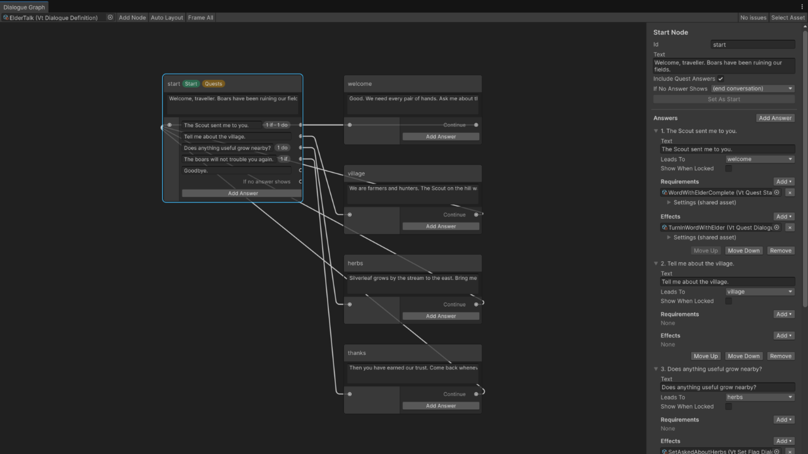

# Dialogue

Conversations with NPCs: lines, answers, conditions on answers, effects when an answer is picked, and quest offers woven in. The library runs the conversation and tells your UI what to show; it does not draw anything.

See it running: the [09 · Quests and Dialogue](../demos/09-quests-dialogue.md) demo scene. See [Demos](../demos/index.md) to import the scenes.

Every field, its default and every member you can call: [Dialogue reference](../reference/dialogue.md).

## Authoring

1. **Create → Vantage → Dialogue → Dialogue Definition.** Add nodes. Each node has an id, the speaker's text, and answers. The first node is where the conversation starts.
2. On each answer set the text, the node id to jump to (empty ends the conversation), any requirements, and any effects.
3. **Create → Vantage → Dialogue → Effects → Quest / Reward / Set Flag** for things that happen when an answer is picked. Drag them into the answer's effects list.
4. **Create → Vantage → Quests → Requirements → Dialogue Flag / Quest State** (or any other requirement) to gate answers. Drag them into the answer's requirements list.
5. On the NPC's unit definition check **Use Quest Giver** and set **Dialogue**. Leave Dialogue empty and fill **Greeting** for an NPC that only offers quests.
6. On the player's unit definition check **Use Dialogue**.

Right-clicking the NPC walks the player over and starts the conversation on the player's `VtUnitDialogue`.

## Dialogue Graph



Double-click a dialogue asset, or click **Open Dialogue Graph** in its inspector, to edit it as a graph. **Vantage → Dialogue Graph** opens the window empty.

- Each node shows its id, the speaker's text and a row per answer; type into them directly. The first node has a **Start** chip. Right-click another node and pick **Set As Start** to move the start.
- Drag from an answer's port, or from **Continue**, onto a node to link it. Drop into empty space to create the next node, already linked. Drag a link away from its port to remove it.
- Right-click the canvas to add a node. Delete removes nodes and links. Copy, paste and duplicate work inside a dialogue and between dialogues.
- The side panel edits the selected node. Renaming its id updates every link to it. Each answer's **Requirements** and **Effects** have an **Add** menu that creates the asset inside the dialogue asset, including your own subclasses; pick **Empty Slot** to drag in an asset you share between dialogues. Removing an entry deletes an inner asset nothing else in the dialogue uses.
- Problems show as orange (warning) or red (error) node borders, with the reason as a tooltip and in the side panel: missing or duplicate ids, links to nodes that do not exist, nodes the conversation never reaches, empty text and empty slots.
- In Play Mode the node a running conversation shows is outlined in blue.

Node positions are stored in the asset. A dialogue that was never opened in the graph is laid out automatically; **Auto Layout** redoes it.

`VtDialogueValidation.Validate(dialogue)` returns the same issues, for a build script or a test.

## Nodes and answers

| Node field | Meaning |
|---|---|
| Id | Name that answers jump to. Unique within the asset. |
| Text | What the speaker says. |
| Answers | What the listener can say back. Empty makes the node a plain line; the UI calls `Continue`. |
| Next Node Id | Where `Continue` goes from a plain line. Empty ends the conversation. |
| Include Quest Answers | Append the NPC's offered quests as answers here. |

| Answer field | Meaning |
|---|---|
| Text | Button label. |
| Next Node Id | Node to jump to when picked. Empty ends the conversation. |
| Requirements | All must pass on the listener. Any requirement asset works, including item, currency, stat, tag, faction, quest state, dialogue flag and time of day. |
| Show When Locked | List the answer greyed out when requirements fail instead of hiding it. |
| Effects | Applied in order when picked, before the jump. |

## Quests in conversations

Check **Include Quest Answers** on a node and the NPC's offered quests appear after the authored answers: one accept answer for each quest the player can take and one turn-in answer for each quest they have completed. Picking one applies it and refreshes the node. When nothing is left to offer the node continues to its next node or ends.

An NPC with no dialogue asset gets exactly that on a single node with its **Greeting** as the text. An NPC with nothing to say and nothing to offer opens no conversation.

For hand-written quest lines, put a Quest effect on the answer and a Quest State requirement next to it so the answer only shows when the action can succeed.

## Flags

A Set Flag effect writes a named flag on the player's `VtUnitDialogue`. A Dialogue Flag requirement reads it. Use them for "first time we meet" branches and remembered choices. Flags save and load with the unit.

## Runtime

```csharp
var dialogue = player.GetComponent<VtUnitDialogue>();

dialogue.OnConversationStarted += c => ShowWindow(c);
dialogue.OnNodeChanged        += c => Redraw(c);
dialogue.OnConversationEnded  += c => HideWindow();

void Redraw(VtDialogueConversation c)
{
    speakerLabel.text = c.Speaker.Definition.displayName;
    lineLabel.text = c.Text;
    foreach (var choice in c.Choices)
    {
        var label = choice.Kind switch
        {
            VtDialogueChoiceKind.AcceptQuest => "Accept: " + choice.Text,
            VtDialogueChoiceKind.TurnInQuest => "Turn in: " + choice.Text,
            _ => choice.Text,
        };
        AddButton(label, enabled: choice.IsAvailable, onClick: () => dialogue.Choose(choice.Index));
    }
    continueButton.visible = !c.HasChoices;
}

continueButton.onClick += () => dialogue.Continue();
escapeKey.onPress      += () => dialogue.End();

dialogue.HasFlag("met.elder");
dialogue.SetFlag("met.elder");
dialogue.ClearFlag("met.elder");
```

`Choose` refuses locked answers and out-of-range indices. `Continue` refuses while answers are pending. Starting a conversation while one is running ends the first.

## Custom effects

Subclass `VtDialogueEffect` and override `Apply`.

```csharp
[CreateAssetMenu(menuName = "MyGame/Dialogue/Effects/Open Shop")]
public sealed class OpenShopEffect : VtDialogueEffect
{
    public override void Apply(VtUnit listener, VtUnit speaker)
        => ShopWindow.Open(listener, speaker);
}
```

Custom conditions are `VtQuestRequirement` subclasses; see the quests page.
