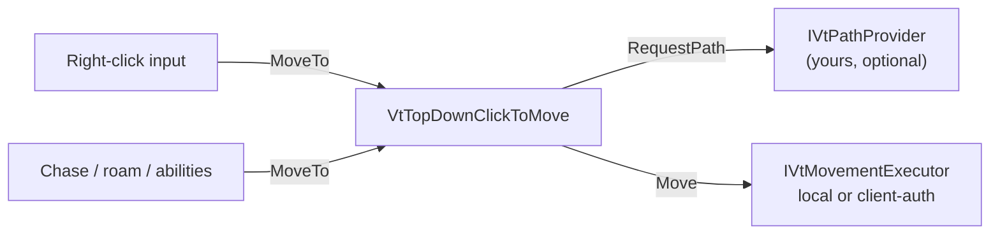

# Movement and input

Units move by intent: something calls `MoveTo(destination)`, the unit asks a path provider for waypoints, follows them, and writes its position through a movement executor. Nothing else in the package touches `transform.position`.

See it running: the [01 · Hello Unit](../demos/01-hello-unit.md) demo scene. See [Demos](../demos/index.md) to import the scenes.



## Setup

Add these to the unit prefab:

| Component | Role |
|---|---|
| `VtTopDownClickToMove` | Path following, acceleration, rotation, gravity. Adds a local executor and a `CharacterController` at runtime if none exist. The added controller is centred on the pivot, so a model whose pivot is at its feet floats; add the controller yourself and set its Center Y to half its Height. |
| `VtNavMeshPathProvider` | Pathfinding on a baked NavMesh. Optional but recommended. |
| `VtTopDownClickInput` | Player only. Right-click on ground moves, on a hostile attacks, on an item or NPC walks over and interacts. Left-click selection is `VtUnitSelection`, see [Selection](selection.md). |
| `VtAbilityHotkeys` | Player only. Casts abilities from input actions, see below. |
| `VtTopDownAnimatorBinding` | Optional. Writes the measured speed to an Animator float parameter. |

Monsters use the same mover and provider; roaming and chasing go through them, see [AI roaming](ai-roaming.md). To command many units instead of one hero, see [Orders and control groups](orders.md).

`VtTopDownClickInput` needs the click raycast layers set and a `Ground Layer` for the fallback move surface. Turn on **Spawn Move Marker** for a click marker.

Speed comes from the unit definition's **Move Speed**, scaled by the move-speed stat, so slows and hastes are ordinary buffs.

## Runtime

```csharp
var move = unit.GetComponent<VtTopDownClickToMove>();
move.MoveTo(point, onArrived: () => Interact());
move.MoveTo(point, acceptPartialPath: true);
move.Stop();
move.Teleport(point);

move.IsMoving;
move.CurrentPath;
move.OnArrived += () => { };
```

A new move order interrupts a cast in progress.

## Pathfinding

Add **Vantage → Movement → VtNavMeshPathProvider** next to `VtTopDownClickToMove` and bake a NavMesh with Unity's AI Navigation package: put a `NavMeshSurface` component on your level and press **Bake**. That is the whole setup. The provider snaps the start and the destination onto the mesh and follows the corners.

| Setting | Meaning |
|---|---|
| Sample Radius | How far off the mesh a start or destination may be and still snap onto it. |
| Area Mask | Which NavMesh areas this unit may walk. |
| Fallback To Straight Line | When the unit is on no mesh at all, walk straight and warn once, so an unbaked scene still plays. |

Without any provider, units walk in a straight line, which is fine for prototypes and flat arenas.

Other backends plug in through the `IVtPathProvider` interface: one method that calls back exactly once with the waypoints, or with `null` when there is no path. Put the component next to `VtTopDownClickToMove` and it is picked up automatically.

## Executors

The mover writes position through one `IVtMovementExecutor` on the unit. Three ship:

| Executor | Use |
|---|---|
| `VtLocalMovementExecutor` | Single-player. Added automatically when none is present. |
| `VtClientAuthMovementExecutor` | Networked, the owning client moves and the position replicates out. Simple, and a modified client can teleport. |
| `VtPredictedMovementExecutor` | Networked, the server moves. The owning client walks immediately and snaps to the server's position when the two drift apart by more than **Movement Reconcile Threshold** on the tuning asset. Other clients follow the server's position smoothly at **Replica Follow Speed**. |

With the predicted executor, `VtTopDownClickInput` sends every walk, attack and stop order to the server as a command, and the server runs the same path following on its copy. Your transport feeds the server's position into `ApplyAuthoritativePose` on each client; the co-op sample's movement sync does this from a network variable. See [Multiplayer](../multiplayer.md).

```csharp
var executor = unit.GetComponent<VtPredictedMovementExecutor>();
executor.ApplyAuthoritativePose(serverPosition, serverRotation);
executor.OnReconciled += error => { };
```

A* Pathfinding Project (needs a `Seeker` on the unit):

```csharp
using System;
using System.Collections.Generic;
using Pathfinding;
using UnityEngine;

[RequireComponent(typeof(Seeker))]
public sealed class AstarPathProvider : MonoBehaviour, IVtPathProvider
{
    private Seeker seeker;
    private void Awake() => seeker = GetComponent<Seeker>();

    public void RequestPath(Vector3 from, Vector3 to, Action<List<Vector3>> onComplete)
    {
        seeker.StartPath(from, to, p => onComplete(p == null || p.error ? null : p.vectorPath));
    }
}
```

## Casting from keys

Add **Vantage → Movement → VtAbilityHotkeys** to the player prefab and drop abilities into the slots. Slot 1 casts on the Ability 1 action, key 1 or the gamepad West button, slot 2 on Ability 2, and so on up to 10; drag an action into a slot's **Action** field to use another, see [Input](input.md). A press casts at once, at whatever the ability's targeting mode implies:

| Targeting mode | Cast at |
|---|---|
| Self | The caster. |
| Single target | The unit under the cursor, otherwise the selected unit, otherwise the current target. |
| Ground point | The point under the cursor on the ground layers. |

```csharp
var hotkeys = player.GetComponent<VtAbilityHotkeys>();
hotkeys.Assign(0, fireball);
hotkeys.Bind(0, myActionReference);
hotkeys.GetAction(0);                                // for the key label
hotkeys.Press(0);                                    // UI button
hotkeys.OnCastFailed += (ability, reason) => Toast(reason);
hotkeys.Slots;                                       // for drawing a hotbar
```

Cooldowns for the hotbar come from `VtUnitAbilities.GetCooldownFraction`. Replace `CursorRay` for a gamepad cursor.

### Aiming ground abilities

Set **Ground Targeting** on `VtAbilityHotkeys` to choose how ground-point abilities cast:

| Ground Targeting | Behaviour |
|---|---|
| Cast At Cursor | The press casts at the ground under the cursor. The default. |
| Aim And Confirm | The press starts aiming. A left-click or a second press of the key casts where the cursor is; right-click or the Cancel action, Esc or the gamepad East button, stops aiming. Set **Cancel Aim Action** to use another. |

Add **Vantage → Visuals → VtGroundTargetIndicator** next to the hotkeys to draw a ring while aiming. The ring has the ability's area radius, or **Reticle Radius** for an ability without an area, and changes colour when the point is out of range. While aiming, right-clicks do not walk.

```csharp
hotkeys.GroundTargeting = VtGroundTargeting.AimAndConfirm;
hotkeys.IsAiming;
hotkeys.AimPoint;
hotkeys.AimRadius;
hotkeys.IsAimInRange;
hotkeys.ConfirmAim();
hotkeys.CancelAim();
hotkeys.OnAimStarted += ability => { };
hotkeys.OnAimEnded += (ability, wasCast) => { };
```

For a different preview, such as a decal, write a component that reads these properties instead of the indicator.

## Movement feel

Acceleration, turn rate, waypoint reach distance, stuck recovery and gravity are global values on the [tuning asset](tuning.md).

## Executors

`VtLocalMovementExecutor` moves the `CharacterController` directly and is what single-player uses. `VtClientAuthMovementExecutor` does the same but only when this instance owns the unit, which is what a co-op host build needs. Swap the component on the prefab; nothing that calls `MoveTo` changes. See [Multiplayer](../multiplayer.md).

## Targeting and chasing

`VtCombatEngagement` holds the current target, chases into range and faces it. Abilities and the auto-attack use it, and your AI can too:

```csharp
var engagement = unit.GetComponent<VtCombatEngagement>();
engagement.SetTarget(enemy);
engagement.HasLiveTarget;
engagement.IsInRange(5f);
engagement.ClearTarget();
engagement.OnTargetChanged += target => { };
```

## Interacting with the world

Right-clicking anything that implements `IVtPickable` walks the unit over and calls it. World items, quest givers and crafting stations implement it. Implement it yourself for levers, doors and shops.
