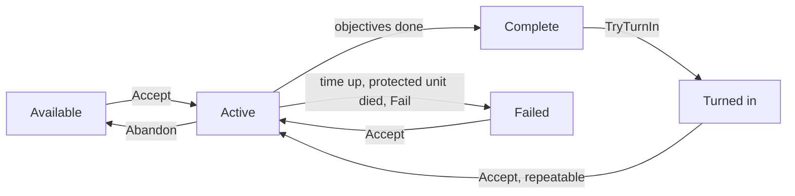
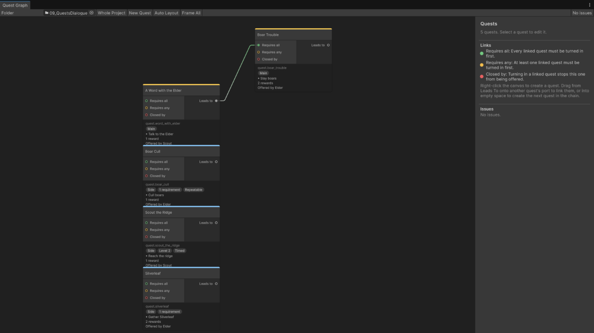

# Quests

Quests are assets with objectives and rewards. A quest log on the player tracks progress by listening to the game: kills, inventory changes, talks and locations.

See it running: the [09 · Quests and Dialogue](../demos/09-quests-dialogue.md) demo scene. See [Demos](../demos/index.md) to import the scenes.

## Authoring

1. **Create → Vantage → Quests → Quest Category** once per category: Main, Side, Daily. Sort weight and colour are for your UI.
2. **Create → Vantage → Quests → Objectives → Kill / Collect / Talk / Reach Location.** Set the required count and the filter: unit tag for kills, item for collects, the quest giver for talks, a marker id for locations.
3. **Create → Vantage → Quests → Rewards → Item / Currency / XP.**
4. **Create → Vantage → Quests → Quest Definition.** Drag in the category, objectives and rewards.
5. Check **Use Quest Log** on the player's unit definition.
6. Check **Use Quest Giver** on an NPC's definition and fill **Offered Quests**. Right-clicking the NPC walks the player over and starts a conversation on the player's `VtUnitDialogue` with the quests as accept and turn-in answers; see the dialogue page. `OnQuestOffered` also fires with the full offered list for UI that filters with `IsAvailable` itself.

For reach-location objectives, place a `VtQuestLocationMarker` in the scene and give it the id the objective expects.

## Lifecycle



Available is computed: level, prerequisites, exclusions, requirements and cooldowns are checked against the holder every time you ask.

## Chains and branches

| Field | Meaning |
|---|---|
| Required Level | Minimum holder level. |
| Required Completed Quests | All of these must have been turned in. |
| Required Any Of Quests | At least one of these must have been turned in. Combine with the previous field for "A and (B or C)". |
| Excluded By Quests | Once any of these has been turned in, this quest is never offered. Put the guards' quest here on the thieves' quest and vice versa. |
| Requirements | Requirement assets that must all pass. See below. |

## Quest Graph



Double-click a quest asset, or click **Open Quest Graph** in its inspector, to see the quests in its folder as a graph. **Vantage → Quest Graph** shows every quest in the project; set **Folder** to narrow it down.

- Each quest is a node with its category colour, id, level, objectives, rewards, and who offers it: unit definitions that list it in **Offered Quests**, and dialogues with a Quest effect that accepts it.
- Links are the prerequisite lists. Drag from **Leads to** onto another quest's **Requires all** (Required Completed Quests, green), **Requires any** (Required Any Of Quests, yellow) or **Closed by** (Excluded By Quests, red). Linking a quest to Requires all takes it out of Requires any, and the other way round. Drag a link away from its port to remove it.
- Drop a link into empty space to create the next quest, already linked, or right-click the canvas for **New Quest**. New quests go into the folder shown, or next to the quest you dragged from. Rename the id they get.
- Quests from other folders that link to the shown ones appear dimmed, so every link has both ends on the canvas.
- The side panel edits the selected quest. **Objectives**, **Rewards** and **Requirements** have an **Add** menu that creates the asset inside the quest asset, including your own subclasses; pick **Empty Slot** to drag in a shared asset.
- Delete moves the selected quests to the trash after asking, and removes them from other quests' lists.
- Problems show as orange or red node borders and in the side panel: missing or shared ids, no objectives, empty slots, quests that list themselves, a required quest that also closes the quest, required quests that close each other, prerequisite loops, and a repeat cooldown on a quest that is not repeatable.

Quest positions are stored in the quest assets; **Auto Layout** arranges the shown quests by chain. `VtQuestValidation.Validate(quests, allQuests)` returns the same issues, for a build script or a test.

## Requirements

**Create → Vantage → Quests → Requirements** and drag the asset into the quest's **Requirements** list. Every entry must pass before the quest is offered. Nothing is consumed; a requirement only checks.

| Requirement | Passes when |
|---|---|
| Item | The holder carries at least the count of the item in its inventory. |
| Currency | The holder's wallet holds at least the amount. |
| Stat | The holder's resolved stat is at least the minimum. Use a custom stat for reputation or renown. |
| Unit Tag | The holder's unit definition carries the tag. Check **Invert** to require its absence. |
| Faction | The holder's faction is one of the listed ones. |
| Quest State | Another quest is in the given state on the holder's log: available, active, complete, turned in or failed. |
| Dialogue Flag | A flag set by a dialogue is present, or absent with **Must Be Absent**. |
| Time Of Day | The scene clock is in one of the listed day phases and has reached the minimum day. Never passes without a clock. See [World time](world-time.md). |

A holder without the component a requirement reads from, for example no wallet for a currency requirement, does not pass. Requirements are re-evaluated on every `IsAvailable` call, so a quest becomes available the moment the condition holds.

Custom conditions are one subclass:

```csharp
[CreateAssetMenu(menuName = "MyGame/Quests/Requirements/Guild Rank")]
public sealed class GuildRankRequirement : VtQuestRequirement
{
    public int minimumRank;
    public override bool IsMet(VtUnit holder)
        => holder.GetComponent<GuildMember>()?.Rank >= minimumRank;
}
```

## Repeatable quests

Check **Repeatable** and set **Repeat Cooldown Seconds**. After turn-in the quest is offered again once the cooldown has passed, with fresh progress. The turn-in count is kept, so a repeatable quest keeps unlocking its chain even while it is active again.

The cooldown counts in game time. For a daily or weekly reset, leave the cooldown long and call `log.ResetRepeat(quest)` from your own reset at midnight.

## Failing

| Field | Meaning |
|---|---|
| Time Limit Seconds | Seconds to finish the objectives after accepting. The timer stops once the quest is complete. |
| Fail When Tagged Unit Dies | The quest fails when any unit with this tag dies while the quest is active. Tag the escortee or the caravan. |

Anything else is `log.Fail(quest)` from your own code. A failed quest stays in the log under `Failed` until the player accepts it again or abandons it.

## Runtime

```csharp
var log = player.GetComponent<VtUnitQuestLog>();
log.IsAvailable(quest);
log.Accept(quest);
log.Abandon(quest);
log.TryTurnIn(quest);
log.Fail(quest);
log.ResetRepeat(quest);
log.Active; log.Completed; log.TurnedIn; log.Failed;
log.GetProgress(quest, objective);
log.GetSecondsRemaining(quest);
log.GetRepeatCooldownRemaining(quest);
log.HasEverTurnedIn(quest);

log.OnQuestAccepted            += q => { };
log.OnObjectiveProgressChanged += (q, objective, current, required) => { };
log.OnQuestComplete            += q => { };
log.OnQuestTurnedIn            += q => { };
log.OnQuestFailed              += q => { };
```

Rewards skip silently when the recipient lacks the matching component, for example an XP reward on a unit without a level. Handle overflow in `OnQuestTurnedIn` if your inventory can be full.

## Custom objectives and rewards

Subclass `VtQuestObjective` and override only the hooks you need. The log calls them for every active quest.

```csharp
[CreateAssetMenu(menuName = "MyGame/Quests/Objectives/Escort")]
public sealed class EscortObjective : VtQuestObjective
{
    public VtQuestLocationMarker destination;

    public override int OnLocationTick(VtUnit holder, int currentProgress)
    {
        var escortee = FindEscortee(holder);
        if (escortee == null || destination == null) return currentProgress;
        var close = Vector3.Distance(escortee.position, destination.transform.position) < 2f;
        return close ? requiredCount : currentProgress;
    }
}
```

```csharp
[CreateAssetMenu(menuName = "MyGame/Quests/Rewards/Buff")]
public sealed class BuffReward : VtQuestReward
{
    public VtBuffDefinition buff;
    public override void Grant(VtUnit recipient)
        => recipient.GetComponent<VtUnitBuffs>()?.ApplyBuff(buff, 0f, recipient.Id);
}
```

## Talk targets without quests

An NPC with **Use Quest Giver** and an empty **Offered Quests** list is a plain talk target. Talk objectives complete when the player interacts with it.
