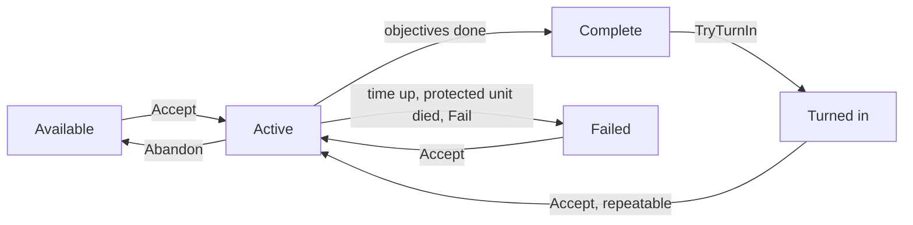

# Quests

Quests are assets with objectives and rewards. A quest log on the player tracks progress by listening to the game: kills, inventory changes, talks and locations.

## Authoring

1. **Create → Vantage → Quests → Quest Category** once per category: Main, Side, Daily. Sort weight and colour are for your UI.
2. **Create → Vantage → Quests → Objectives → Kill / Collect / Talk / Reach Location.** Set the required count and the filter: unit tag for kills, item for collects, the quest giver for talks, a marker id for locations.
3. **Create → Vantage → Quests → Rewards → Item / Currency / XP.**
4. **Create → Vantage → Quests → Quest Definition.** Drag in the category, objectives and rewards.
5. Check **Use Quest Log** on the player's unit definition.
6. Check **Use Quest Giver** on an NPC's definition and fill **Offered Quests**. Right-clicking the NPC walks the player over and fires `OnQuestOffered` with the quests that are available; your dialog UI calls `Accept`.

For reach-location objectives, place a `VtQuestLocationMarker` in the scene and give it the id the objective expects.

## Lifecycle



Available is computed: level, prerequisites, exclusions and cooldowns are checked against the holder every time you ask.

## Chains and branches

| Field | Meaning |
|---|---|
| Required Level | Minimum holder level. |
| Required Completed Quests | All of these must have been turned in. |
| Required Any Of Quests | At least one of these must have been turned in. Combine with the previous field for "A and (B or C)". |
| Excluded By Quests | Once any of these has been turned in, this quest is never offered. Put the guards' quest here on the thieves' quest and vice versa. |

## Repeatable quests

Check **Repeatable** and set **Repeat Cooldown Seconds**. After turn-in the quest is offered again once the cooldown has passed, with fresh progress. The turn-in count is kept, so a repeatable quest keeps unlocking its chain even while it is active again.

The cooldown counts in game time. For a daily or weekly reset, leave the cooldown long and call `log.ResetRepeat(quest)` from your own reset at midnight.

## Failing

| Field | Meaning |
|---|---|
| Time Limit Seconds | Seconds to finish the objectives after accepting. The timer stops once the quest is complete. |
| Fail When Tagged Unit Dies | The quest fails when any unit with this tag dies while the quest is active. Tag the escortee or the caravan. |

Anything else is `log.Fail(quest)` from your own code. A failed quest stays in the log under `Failed` until the player accepts it again or abandons it.

## Runtime

```csharp
var log = player.GetComponent<VtUnitQuestLog>();
log.IsAvailable(quest);
log.Accept(quest);
log.Abandon(quest);
log.TryTurnIn(quest);
log.Fail(quest);
log.ResetRepeat(quest);
log.Active; log.Completed; log.TurnedIn; log.Failed;
log.GetProgress(quest, objective);
log.GetSecondsRemaining(quest);
log.GetRepeatCooldownRemaining(quest);
log.HasEverTurnedIn(quest);

log.OnQuestAccepted            += q => { };
log.OnObjectiveProgressChanged += (q, objective, current, required) => { };
log.OnQuestComplete            += q => { };
log.OnQuestTurnedIn            += q => { };
log.OnQuestFailed              += q => { };
```

Rewards skip silently when the recipient lacks the matching component, for example an XP reward on a unit without a level. Handle overflow in `OnQuestTurnedIn` if your inventory can be full.

## Custom objectives and rewards

Subclass `VtQuestObjective` and override only the hooks you need. The log calls them for every active quest.

```csharp
[CreateAssetMenu(menuName = "MyGame/Quests/Objectives/Escort")]
public sealed class EscortObjective : VtQuestObjective
{
    public VtQuestLocationMarker destination;

    public override int OnLocationTick(VtUnit holder, int currentProgress)
    {
        var escortee = FindEscortee(holder);
        if (escortee == null || destination == null) return currentProgress;
        var close = Vector3.Distance(escortee.position, destination.transform.position) < 2f;
        return close ? requiredCount : currentProgress;
    }
}
```

```csharp
[CreateAssetMenu(menuName = "MyGame/Quests/Rewards/Buff")]
public sealed class BuffReward : VtQuestReward
{
    public VtBuffDefinition buff;
    public override void Grant(VtUnit recipient)
        => recipient.GetComponent<VtUnitBuffs>()?.ApplyBuff(buff, 0f, recipient.Id);
}
```

## Talk targets without quests

An NPC with **Use Quest Giver** and an empty **Offered Quests** list is a plain talk target. Talk objectives complete when the player interacts with it.
