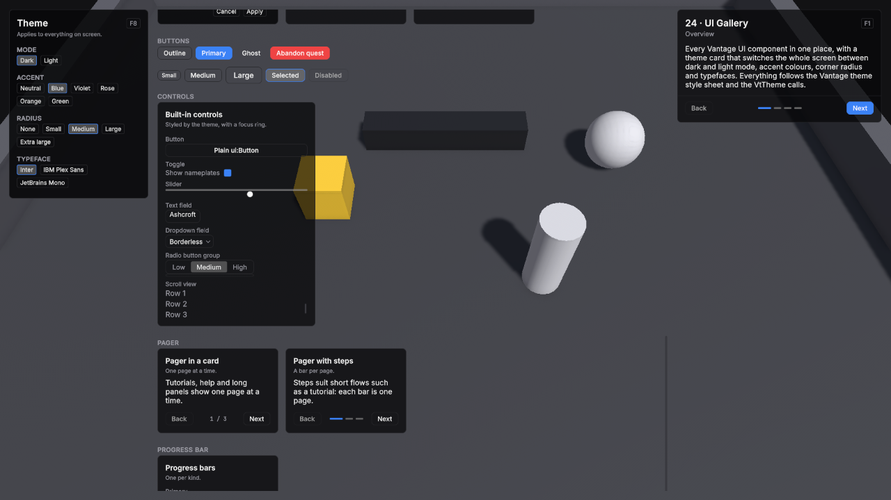

# UI

Vantage's interface is built on UI Toolkit. The package ships a theme and components; your panels and screens are made from them.

Every field, its default and every member you can call: [UI reference](../reference/ui.md).



## Setup

1. **Create → UI Toolkit → Panel Settings Asset**, and set its **Theme Style Sheet** to **VtDefaultTheme** from `Packages/Vantage/Runtime/UI/Themes`.
2. Add a **UI Document** to the scene and set its **Panel Settings** to that asset.

The theme sets the colours, the fonts (Inter, and JetBrains Mono for numbers) and the base styles. It does not include Unity's default control theme; Vantage components and Unity's built-in controls are styled by the theme itself. Labels stay on one line; add the `vt-text-wrap` class to text that should wrap. Card titles and descriptions wrap on their own.

## Layers

**VtUiRoot** keeps a screen in order. Add it next to the UI Document and it puts six layers on the document, back to front: World, Hud, Windows, Menus, Overlays and Tooltip. Nameplates stay under the HUD, windows open over it, the game menu covers windows, dialogs and toasts sit over the menu and the tooltip is always in front, whichever order your components add themselves in. Every layer fills the screen and ignores the pointer, so a click between panels reaches the game.

1. Select the object with the UI Document and **Add Component → Vantage → UI → VtUiRoot**.
2. Ask it for a layer, or for a corner or edge of the HUD:

```csharp
var root = GetComponent<VtUiRoot>();
root.Layer(VtUiLayer.Windows).Add(inventoryWindow);
root.Region(VtUiRegion.TopLeft).Add(playerFrame);
root.Region(VtUiRegion.BottomCenter).Add(actionBar);
root.RootRebuilt += AddPanelsAgain;
```

Regions are created when first asked for. Top regions stack their children downwards, bottom regions upwards, and the centre ones centre them. Vantage's own controllers find the root on their object and use the right layer on their own: nameplates go to the World layer. The UI Document rebuilds its root on a live reload; the layers are rebuilt with it and `RootRebuilt` fires so you can add your panels again.

| Part | Class |
|---|---|
| Layers | `vt-layers`, holding one `vt-layer` per layer with `vt-layer--world`, `--hud`, `--windows`, `--menus`, `--overlays` or `--tooltip` |
| Regions | `vt-region`, with `vt-region--top-left`, `--top-center`, `--top-right`, `--bottom-left`, `--bottom-center` or `--bottom-right` |

## Navigation

**VtUiNavigation** is the stack of open screens. Push a window or a dialog and it opens on top; the Cancel input, Esc or the gamepad's east button, pops the top one, so every screen closes the same way. While anything is open the player's gameplay input is held: hotkeys, orders, selection, control groups and click-to-move do nothing, so the key that opens a bag does not also cast. A window closed by its own button leaves the stack; a blocking dialog ignores Cancel.

1. **Add Component → Vantage → UI → VtUiNavigation** next to the UI root.
2. Open windows through it:

```csharp
var navigation = VtUiNavigation.Current;
navigation.Open(bagsWindow);
navigation.Toggle(questWindow);
navigation.Push(dialog);
navigation.Pop();
navigation.Clear();
```

`Open` puts a window on a layer of the root when it is not on screen yet, then pushes it. The window controllers below open through the stack on their own when the scene has one. Turn **Block Gameplay While Open** off for a HUD that stays interactive under a window, and **Hide Cursor On Gamepad** on for a game that hides the mouse cursor while a gamepad drives the menus. From your own code, `VtInput.BlockGameplay(owner)` and `UnblockGameplay(owner)` hold the same input for a cutscene or a minigame.

## Your own look

Make your own theme style sheet that imports the Vantage theme and adds your rules, and use it on your Panel Settings instead:

```css
@import url("project://database/Packages/com.smartargs.vantage/Runtime/UI/Themes/VtDefaultTheme.tss");

:root {
    --vt-primary: rgb(59, 130, 246);
    --vt-radius: 12px;
}

.vt-card__title {
    font-size: 18px;
}
```

| Variable | Used for |
|---|---|
| `--vt-background` | The base surface colour. |
| `--vt-foreground` | Text and icons. |
| `--vt-muted-foreground` | Secondary text. |
| `--vt-card-hud`, `--vt-card-window` | Card surfaces over the game and in windows. |
| `--vt-border`, `--vt-ring` | Hairline borders, and borders on hover. Focus uses `--vt-primary`. |
| `--vt-primary`, `--vt-primary-foreground` | The accent, and text on it. |
| `--vt-destructive`, `--vt-destructive-foreground` | Deleting and abandoning, and text on it. |
| `--vt-info`, `--vt-success`, `--vt-warning` | Info, success and warning colours, such as the toast icons. Errors use `--vt-destructive`. |
| `--vt-success-foreground`, `--vt-warning-foreground` | Text on a success or warning fill. |
| `--vt-hover`, `--vt-track` | Hover highlights, and the empty part of bars. |
| `--vt-health`, `--vt-mana`, `--vt-stamina`, `--vt-experience` | Resource colours. |
| `--vt-cast` | The fill of a cast bar. |
| `--vt-hostile`, `--vt-friendly`, `--vt-neutral` | Nameplate bars of hostile, friendly and neutral units. |
| `--vt-radius` | Corner radius. |
| `--vt-text-xs` … `--vt-text-xl` | The type scale: 10, 12, 14, 16 and 20 px. |
| `--vt-space-1` … `--vt-space-4` | The spacing scale: 4, 8, 12 and 16 px, used for padding and margins. |
| `--vt-font-regular`, `--vt-font-medium`, `--vt-font-semibold`, `--vt-font-bold` | The text typeface in each weight. |
| `--vt-font-mono`, `--vt-font-mono-medium` | The typeface for numbers, and its heavier weight for badges and counts. |

Every size in the theme comes from those two scales, so changing `--vt-text-base` or `--vt-space-3` in your own sheet moves the whole interface at once:

```css
:root {
    --vt-text-base: 16px;
    --vt-space-3: 14px;
}
```

## State classes

Two classes mark state on anything — a chip, a row, a list entry or a button — so one rule covers them all:

| Class | What it does |
|---|---|
| `vt-is-selected` | Fills with `--vt-hover` and draws a `--vt-primary` border, so a chosen element reads as chosen even with the neutral accent. |
| `vt-is-disabled` | Fades to 40% without disabling the element, for something that looks unavailable but still explains itself when clicked. Call `SetEnabled(false)` to actually turn it off. |

```csharp
VtUiStates.SetSelected(chip, index == selected);
VtUiStates.SetDisabledLook(row, !canAfford);
```

If your own sheet styles the same properties on the same element (a chip class that sets its own border colour, say), give the state rule the extra class — `.my-chip.vt-is-selected` — so it wins.

## Text

`VtText` is a label whose text is a localization key, or the final text when no table is installed. Everything the package shows a player is one of these, so a language change reaches the screen without the panel rebuilding itself: while the text is on a panel it re-resolves on its own.

```xml
<VtText key="quest.title" muted="true" wrap="true" />
```

```csharp
var line = new VtText("quest.title");
var gold = new VtText();
gold.Set("loot.gold", reward);
card.Add(line);
```

`Set` keeps its arguments, so `{0} gold` is filled in again in the next language. `Key` always reads back the key, not what is shown. A text that is not on a panel yet does not follow the language; call `Refresh()` on it after switching.

| Property | What it does |
|---|---|
| Key | The localization key, or the text itself. Setting it drops the arguments of an earlier `Set`. |
| Muted | Draws the text in the secondary colour (`vt-text-muted`). |
| Wrap | Lets the text run over several lines (`vt-text-wrap`). |

| Part | Class |
|---|---|
| Text | `vt-text`, with `vt-text-muted` and `vt-text-wrap` |

See [Localization](localization.md) for tables and keys. Reasons a call refused, such as a cast out of range, become text with `VtFailureText.Describe`, described on the same page.

## Icons

`VtIcon` draws a glyph from the icon set, or any sprite, in a theme colour. The package ships over three hundred [Lucide](https://lucide.dev) glyphs, referred to by their Lucide name: `chevron-down`, `search`, `lock`, `swords`, `coins`, `map-pin` and so on. Vector icons take the text colour, so the same glyph works in dark and light mode.

```xml
<VtIcon icon="chevron-down" size="Small" tint="Muted" />
```

```csharp
row.Leading.Add(new VtIcon("scroll") { Size = VtIconSize.Large });
var itemIcon = new VtIcon();
itemIcon.SetImage(item.icon);
```

| Size | Pixels |
|---|---|
| Small | 12 |
| Medium | 16, the default |
| Large | 20 |
| ExtraLarge | 24 |

**Tint** is Foreground, the default, Muted, Primary or Destructive. `SetImage` takes a sprite, a vector image or a texture for a definition's own icon; sprites are tinted the same way, so keep them white.

**Your own icons.** Put SVG files in your project, select them and use **Assets → Vantage → Prepare SVG As UI Icon**: it makes them tintable and imports them as vector images. Then **Create → Vantage → UI → Icon Set**, press **Add Icons From This Folder** on it, and install the set at startup:

```csharp
VtIcons.Install(myIcons);
```

Ids your set has win, ids it lacks still come from the shipped set, so replacing one glyph or adding a hundred needs no copy of the rest. Icons on screen redraw when a set is installed.

| Part | Class |
|---|---|
| Icon | `vt-icon`, with `vt-icon--sm`, `--md`, `--lg` or `--xl`, `vt-icon--muted`, `--primary` or `--destructive`, and `vt-icon--empty` when there is nothing to draw |

## Built-in controls

`Button`, `Toggle`, `Slider`, `TextField`, `DropdownField`, `RadioButtonGroup` and `ScrollView` are styled by the theme, so a plain `<ui:Button>` matches the Vantage components with no work:

```xml
<ui:Button text="Save" />
<ui:Toggle label="Show nameplates" />
<ui:Slider low-value="0" high-value="1" value="0.6" />
```

Controls are 28 px tall with a hairline border on a transparent surface. Everything focusable draws its border in `--vt-primary` while it has focus, so a gamepad or Tab shows where it is without anything moving, and a disabled control fades to 40%. A radio button group is drawn as a segmented control, and its checked button takes the `--vt-hover` fill.

The popup menu a `DropdownField` opens is styled too: a window surface with a hairline border, rows that highlight under the pointer and a check in front of the chosen one. One limit comes from UI Toolkit itself: the slider thumb stays inside the track instead of overhanging its ends.

## Button

`VtButton` is a built-in `Button` with a variant and a size, so a panel picks the weight of an action instead of restyling it.

```xml
<VtButton text="Abandon quest" variant="Danger" size="Large" />
```

```csharp
var accept = new VtButton("Accept", OnAccept) { Variant = VtButtonVariant.Primary };
card.Footer.Add(accept);
```

| Variant | Use |
|---|---|
| Outline | A hairline border on a transparent surface. The default. |
| Primary | Filled with `--vt-primary`, for the one action a panel wants you to take. |
| Ghost | No border until the pointer is over it, for dense rows and toolbars. |
| Danger | Filled with `--vt-destructive`, for actions that cannot be undone. |

| Size | Height |
|---|---|
| Small | 22 px |
| Medium | 28 px, the default |
| Large | 36 px |

| Part | Class |
|---|---|
| Button | `vt-button`, with `vt-button--outline`, `--primary`, `--ghost` or `--danger`, and `vt-button--small`, `--medium` or `--large` |

## Badge

A small pill for a count, a state or a tag: "Elite", "3", "New". Put one in a card's header action, at the end of a list row, or next to a name.

```xml
<VtBadge key="item.rarity.elite" variant="Danger" />
```

```csharp
var count = new VtBadge(bag.Count.ToString(), VtBadgeVariant.Primary);
row.Trailing.Add(count);
count.Key = bag.Count.ToString();
```

A badge is a `VtText`, so its key passes through the current language and it follows a language change on its own.

| Variant | Use |
|---|---|
| Outline | A hairline border on a transparent surface. The default, for counts and tags. |
| Primary | Filled with `--vt-primary`, for a state worth noticing, such as "New". |
| Danger | `--vt-destructive` text in a matching border, for a warning, such as "Broken". |

| Part | Class |
|---|---|
| Badge | `vt-badge`, with `vt-badge--outline`, `--primary` or `--danger`, on a `vt-text` |

## Key cap

`VtKbd` shows a key. Give it an action and it shows the key or button bound to that action, follows rebinding, and switches between the keyboard and the gamepad as the player changes device. Give it text and it shows the text.

```xml
<VtKbd action-name="Gameplay/Ability 1" />
<VtKbd text="Tab" size="Large" />
```

```csharp
var cap = new VtKbd { ActionName = VtInputActionNames.Cancel };
var padOnly = new VtKbd(hotkeys.GetAction(0)) { Scheme = VtKbdScheme.Gamepad };
```

**Scheme** is Active, the default, which follows the device the player used last, or KeyboardMouse or Gamepad for a fixed one. `VtInput.ActiveScheme` is that device, and `VtInput.SetActiveScheme` overrides it from your own device handling. **Size** is Small, 16 pixels for hints next to text, or Large, 24 pixels for settings rows and prompts. An action with no binding in the scheme shown gets an empty, filled cap.

| Part | Class |
|---|---|
| Key cap | `vt-kbd`, with `vt-kbd--small` or `--large`, and `vt-kbd--unbound` when the action has no binding in that scheme |

## Switching at runtime

Dark and light mode, the accent, the corner radius and the typeface switch while the game runs. Pass the UI Document's root so every panel on it follows, including popup menus, which UI Toolkit draws outside the document:

```csharp
var root = document.rootVisualElement;
VtTheme.SetMode(root, VtThemeMode.Light);
VtTheme.SetAccent(root, VtThemeAccent.Blue);
VtTheme.SetRadius(root, VtThemeRadius.Large);
VtTheme.SetTypeface(root, "vt-typeface-plex");
```

| Option | Values |
|---|---|
| Mode | Dark, the default, and Light. Light mode draws text in the Medium weight and HUD cards at 80% opacity, so both read like dark mode over a game scene. |
| Accent | Neutral, the default and the text colour, then Blue, Violet, Rose, Orange and Green. |
| Radius | None, Small (4 px), Medium (8 px, the default), Large (12 px) and Extra Large (16 px). |
| Typeface | Inter, the default, or any typeface class your theme defines. |

A typeface is a class starting with `vt-typeface-` that sets the font variables. Add it to your theme style sheet with your own font files:

```css
.vt-typeface-plex {
    --vt-font-regular: url("../Fonts/IBMPlexSans-Regular.ttf");
    --vt-font-medium: url("../Fonts/IBMPlexSans-Medium.ttf");
    --vt-font-semibold: url("../Fonts/IBMPlexSans-SemiBold.ttf");
    --vt-font-bold: url("../Fonts/IBMPlexSans-Bold.ttf");
}
```

See it running: the [24 · UI Gallery](../demos/24-ui-gallery.md) demo scene.

## Card

The surface every panel and window sits on. Children go into its content. The header appears when you give it a title, a description or a header action, and the footer when you use it. Reading `Header`, `TitleLabel`, `DescriptionLabel`, `HeaderAction` or `Footer` creates that part, so an unused part costs nothing but touching one is enough to add it. `HasHeader` and `HasFooter` answer without creating anything.

```xml
<VtCard title="Quests" description="3 active" surface="Window">
    <ui:Label text="The Sunken Causeway" />
</VtCard>
```

```csharp
var card = new VtCard { Title = "Threat", Surface = VtCardSurface.Hud };
card.HeaderAction.Add(new Label("F8"));
card.Add(row);
card.Footer.Add(closeButton);
card.TitleLabel.text = "Threat · Ogre";
if (card.HasFooter) card.Footer.Clear();
```

| Surface | Use |
|---|---|
| Hud | Slightly see-through, for panels over the game. The default. |
| Window | Nearly opaque, for windows and menus. |

| Part | Class |
|---|---|
| Card | `vt-card`, with `vt-card--hud` or `vt-card--window` |
| Header | `vt-card__header`, holding `vt-card__title-row` and `vt-card__description` |
| Title | `vt-card__title` |
| Header action | `vt-card__action`, at the end of the title row |
| Content | `vt-card__content` |
| Footer | `vt-card__footer` |

Card text is shown as given. For localized text, put a `VtText` in the card, or pass the title through `VtLocalization.Resolve` first, see [Localization](localization.md).

## List row

The row every list in a menu or a window is built from: a title, an optional detail line under it, and two slots for everything else — `Leading` in front for an icon, `Trailing` at the end for a key cap, a badge or a value. A caret shows while the row has focus or is selected, so a player moving through the list with a gamepad always sees where they are.

```xml
<VtListRow title="The Sunken Causeway" detail="Talk to the ferryman" />
```

```csharp
var row = new VtListRow(quest.DisplayName, quest.Summary, () => Open(quest));
row.Leading.Add(new VtIcon("scroll") { Size = VtIconSize.Large });
row.Trailing.Add(new VtBadge("New", VtBadgeVariant.Primary));
row.TitleLabel.Set("quest.progress", done, total);
VtUiStates.SetSelected(row, quest == chosen);
VtUiStates.SetDisabledLook(row, !quest.CanAccept);
list.Add(row);
```

It is a `Button`, so `clicked`, focus and navigation work as usual, and everything inside it lets the click through to the row. The slots are created on first use, like the parts of a card: reading `Leading` or `Trailing` adds that slot, and `HasLeading` and `HasTrailing` ask without adding anything. `Title` and `Detail` are localization keys or the text itself, and `TitleLabel` and `DetailLabel` hand over the labels for a value that changes every frame. An empty detail line takes no space.

Mark the chosen row with `VtUiStates.SetSelected`, and a row that should look unavailable but still answer a click with `VtUiStates.SetDisabledLook`; `SetEnabled(false)` turns it off for real and fades it to 40%.

| Part | Class |
|---|---|
| Row | `vt-list-row`, with `vt-is-selected` or `vt-is-disabled` |
| Caret | `vt-list-row__caret`, shown on focus and while selected |
| Leading slot | `vt-list-row__leading` |
| Body | `vt-list-row__body` |
| Title | `vt-list-row__title`, a `vt-text` |
| Detail | `vt-list-row__detail`, with `vt-list-row__detail--hidden` when empty |
| Trailing slot | `vt-list-row__trailing` |

## Window

The frame an in-game window sits in: inventory, quest log, character sheet, crafting. It is a card on the window surface with a close button in its header, an open and a closed state, and an optional drag handle, so every window in your game opens, closes and moves the same way.

```xml
<VtWindow name="bags" title="window.bags" draggable="true" starts-open="false">
    <ui:ScrollView />
</VtWindow>
```

```csharp
var window = new VtWindow("window.bags") { Draggable = true };
window.Add(grid);
window.Footer.Add(new VtButton("Sort", Sort));
window.Opened += RefreshBags;
window.Closed += SaveLayout;
root.Layer(VtUiLayer.Windows).Add(window);
window.Toggle();
```

A window starts closed. `Open`, `Close` and `Toggle` switch it and `IsOpen` reads it back; opening a window that is already open, or closing one already closed, does nothing. Opening moves focus to the first control inside, skipping the close button, so a gamepad lands somewhere useful; a window with nothing to press takes focus itself. **Starts Open** is for a panel that is up from the start.

**Closable**, the default, puts the close button in the header and lets Escape close the window. Turn it off for a window your own code owns, such as the one inside a dialog. **Draggable** lets the player pull the window around by its header; it stops at the edges of its parent so the header can always be grabbed again, and `ResetPosition` puts it back.

`Title` is a localization key or the text itself and follows a language change while the window is on screen. Everything else, description, header action and footer, is the card's, see [Card](#card).

| Part | Class |
|---|---|
| Window | `vt-window`, on top of `vt-card` and `vt-card--window`, with `vt-window--open` or `vt-window--closed` |
| Close button | `vt-window__close`, a ghost `VtButton` in the card's header action |
| Draggable header | `vt-card__header` with `vt-window__header--draggable` |

## Tabs

A row of tabs across the top of a window: bags, character, quests. `VtTabBar` is the strip on its own, for a panel that swaps its content itself; `VtTabView` is the strip with a page under it, which is the whole of a tabbed window.

```xml
<VtTabBar name="tabs" selected-index="0" previous-key-text="Q" next-key-text="E" />
```

```csharp
var view = new VtTabView();
view.AddTab("window.bags", bagsPage);
view.AddTab("window.character", characterPage);
view.SelectionChanged += index => Refresh(index);
window.Add(view);
```

Tabs are `VtButton`s, so click, focus and navigation work as usual, and their labels are localization keys or the text itself. `SelectedIndex` is clamped to the tabs that exist and is -1 while there are none; an index set before the tabs are added is honoured once they are, so UXML can pick the opening tab. `SelectionChanged` fires once per real change. `Previous` and `Next` wrap around.

The bar binds no keys of its own: set **Previous Key Text** and **Next Key Text** for fixed caps such as `Q` and `E`, or give `PreviousKeyCap` and `NextKeyCap` an input action so they follow rebinding, and call `Previous` and `Next` from your own input handling. Pages of a `VtTabView` come through `AddTab`; children added in UXML or with `Add` are not pages.

| Part | Class |
|---|---|
| Bar | `vt-tab-bar`, holding `vt-tab-bar__tabs` |
| Tab | `vt-tab-bar__tab`, the selected one also `vt-tab-bar__tab--selected` and `vt-is-selected` |
| Key caps | `vt-tab-bar__key` with `--previous` or `--next`, and `vt-tab-bar__key--hidden` when empty |
| View | `vt-tab-view`, holding `vt-tab-view__pages` |
| Page | `vt-tab-view__page`, hidden ones also `vt-tab-view__page--hidden` |

## Dialog

The question a game stops to ask: "Abandon this quest?", "Destroy Runed Blade?", "Ready?". A scrim darkens the screen and eats every click behind it, and a window in the middle carries a title, a message and one or two buttons. One dialog serves a whole game; call `Show` again for the next question.

```csharp
var dialog = new VtDialog { Danger = true };
root.Layer(VtUiLayer.Overlays).Add(dialog);
dialog.Show("quest.abandon.title", "quest.abandon.body", "Abandon", "Keep", () => quests.Abandon(quest));
dialog.Closed += confirmed => { };
```

`Show` puts the question up and moves focus to the confirm button. Every text is a localization key or the text itself. An empty cancel text leaves a single button, for a notice with nothing to decide. **Danger** makes the confirm button red, for what cannot be undone. `Confirm` and `Cancel` take the dialog down, run the action you passed and raise `Closed` with true or false; `Hide` takes it down without answering. Escape and a click on the scrim cancel, unless **Blocking** is on, for a question that has to be answered with a button.

`Countdown(seconds)` adds a timer under the message for a ready check or a queue pop. Call `Tick` once a frame with the frame time; the line counts down in whole seconds and the dialog cancels itself when it runs out. Add a row for `vantage.dialog.countdown` to your table to word the line differently.

| Part | Class |
|---|---|
| Dialog | `vt-dialog`, with `vt-dialog--shown` or `vt-dialog--hidden` |
| Scrim | `vt-dialog__scrim` |
| Window | `vt-dialog__window`, a `VtWindow` |
| Message | `vt-dialog__message` |
| Countdown | `vt-dialog__countdown`, with `vt-dialog__countdown--hidden` when nothing is counting |
| Buttons | `vt-dialog__cancel` (hidden with `vt-dialog__cancel--hidden`) and `vt-dialog__confirm` |

## Pager

Shows one page at a time with Back and Next and a page count, for tutorials, help and panels with more to say than fits at once. Children are its pages. Back and Next stop at the first and last page, and the controls hide when there is only one page.

```xml
<VtPager page-index="0" previous-text="Back" next-text="Next">
    <ui:Label text="First page" />
    <ui:Label text="Second page" />
</VtPager>
```

```csharp
var pager = new VtPager();
pager.AddPage(overview);
pager.AddPage(details);
card.Add(pager);
card.Footer.Add(pager.Controls);
pager.NextButton.Variant = VtButtonVariant.Primary;
pager.Next();
pager.PageChanged += index => { };
```

Back and Next are `VtButton`s: `PreviousButton` and `NextButton` hand them over, so the last step of a tutorial can carry a primary Next without a style sheet of your own. Move `Controls` into a card footer to keep them at the bottom on every page. The button texts pass through `VtLocalization.Resolve`, so they can be localization keys. After adding pages with `Add` to a pager that is already on screen, call `Refresh`; `AddPage` does that for you.

Set **Indicator Style** (`indicator-style="Steps"` in UXML) to show a bar per page instead of the count. The bar of the page shown is wider and uses the primary color, bars of earlier pages stay lit, and clicking a bar opens its page. Steps suit short flows such as a tutorial.

| Part | Class |
|---|---|
| Pager | `vt-pager` |
| Pages | `vt-pager__pages`; each page `vt-pager__page`, hidden ones also `vt-pager__page--hidden` |
| Controls | `vt-pager__controls`, with `vt-pager__controls--hidden` when there is one page and `vt-pager__controls--steps` for steps |
| Back, Next | `vt-pager__button`, with `vt-pager__previous` or `vt-pager__next`, on a `VtButton` |
| Page count | `vt-pager__indicator` |
| Steps | `vt-pager__steps`; each step `vt-pager__step` with `--active` or `--done`, holding a `vt-pager__step-bar` |

## Progress bar

A bar filled from the left, for health, mana, experience, cast times and any amount out of a maximum. The fill slides to a new value.

```xml
<VtProgressBar value="0.6" kind="Health" />
```

```csharp
var bar = new VtProgressBar { Kind = VtProgressKind.Mana };
bar.Set(stats.GetPool(VtResourceKind.MP).Current, maxMana);
```

**Kind** is Primary (the accent, the default), Health, Mana, Stamina, Experience or Cast. **Value** runs from 0 to 1 and is clamped.

| Part | Class |
|---|---|
| Bar, the empty track | `vt-progress`, with `vt-progress--primary`, `--health`, `--mana`, `--stamina`, `--experience` or `--cast` |
| Filled part | `vt-progress__fill` |

## Slot

The square an ability, an item or a buff sits in: an icon, a key cap in the corner, a stack count, an optional caption and a cooldown sweep over everything. A hotbar, a bag grid and a buff bar are all built from it.

```xml
<VtSlot label="Fireball" key-text="1" count="3" caption="12 mana" size="Large" />
```

```csharp
var slot = new VtSlot { Size = VtSlotSize.Large };
slot.SetImage(ability.icon);
slot.KeyCap.ActionName = "Gameplay/Ability 1";
slot.Caption = "12 mana";
slot.Clicked += () => Cast(ability);
slot.SetCooldown(remaining / cooldown, remaining);
slot.Unaffordable = !CanPay(ability);
slot.Active = aiming == ability;
bar.Add(slot);
```

Give it an icon id with `Icon`, or a definition's own art with `SetImage`. With neither, `Label` is written across the square instead, so a slot reads before the art exists; the label hides again as soon as an image is set. `Caption` and `Label` are localization keys or the text itself, and `Count` is shown as given. Empty parts take no space.

The key cap is a `VtKbd`: `KeyText` writes a fixed key, and `KeyCap.ActionName` or `KeyCap.Action` follows the player's bindings and device. `SetCooldown(fraction, seconds)` drives `Sweep`, the cooldown sweep over the icon, and marks the slot `vt-slot--cooling` while it covers anything. The slot is focusable and clickable, so `Clicked`, focus and gamepad navigation work as usual, and everything inside it lets the click through.

| Size | Square |
|---|---|
| Small | 32 px, for buff bars and dense grids. Hides the caption and the key cap. |
| Medium | 48 px, the default, for bags and hotbars. |
| Large | 64 px, for an action bar or a vendor window. |

| State | Look |
|---|---|
| Empty | A fainter border on no fill, for a slot holding nothing. |
| Unaffordable | Icon and label in `--vt-destructive`, for a cost the player cannot pay. |
| Active | A `--vt-primary` border, for a slot being cast or aimed. |

| Part | Class |
|---|---|
| Slot | `vt-slot`, with `vt-slot--sm`, `--md` or `--lg`, and `vt-slot--empty`, `--unaffordable`, `--active` or `--cooling` |
| Icon | `vt-slot__icon`, a `vt-icon` |
| Label | `vt-slot__label`, with `vt-slot__label--hidden` behind art or while empty |
| Key cap | `vt-slot__key`, a `vt-kbd`, with `vt-slot__key--hidden` while it shows no key |
| Count | `vt-slot__count`, with `vt-slot__count--hidden` while empty |
| Caption | `vt-slot__caption`, with `vt-slot__caption--hidden` while empty |
| Cooldown sweep | `vt-slot__sweep` |

## Cooldown sweep

The dark cover over the part of a slot that is still cooling down, drawn straight onto the element, so it costs nothing to animate. A `VtSlot` already has one as `Sweep`.

```xml
<VtCooldownSweep mode="Radial" show-seconds="true" />
```

```csharp
slot.Sweep.Mode = VtSweepMode.Linear;
slot.Sweep.ShowSeconds = false;
sweep.Set(remaining / cooldown, remaining);
```

`Fraction` runs from 1 at the start of the cooldown down to 0 when it is ready. Radial draws a wedge growing clockwise from 12 o'clock, the way an ability cooldown reads; Linear fills from the bottom up. `Seconds` is written over the cover with one decimal under ten seconds and none above, and nothing at zero. An element of your own only needs `overflow: hidden`, since the wedge is drawn past the corners on purpose. The cover takes its colour from the `color` of `vt-cooldown-sweep`, so a theme can lighten or tint it.

| Part | Class |
|---|---|
| Sweep | `vt-cooldown-sweep`, with `vt-cooldown-sweep--radial` or `--linear` |
| Seconds | `vt-cooldown-sweep__seconds`, with `vt-cooldown-sweep__seconds--hidden` while there is nothing to say |

## Tooltip

The window that explains what the pointer or the focus is on: a title, a muted subtitle, label and value rows such as "Cooldown  8 s", and free lines for a description or a requirement the player has not met. One tooltip serves the whole screen: put it on the tooltip layer, hand it to `VtTooltips.Host`, and every panel goes through the same element.

```csharp
var tooltip = new VtTooltip();
root.Layer(VtUiLayer.Tooltip).Add(tooltip);
VtTooltips.Host = tooltip;

VtTooltips.Attach(slot, () => VtItemTooltip.Build(item, player, content));
VtTooltips.Attach(healthBar, () => BarContent(), VtTooltipPlacement.Pointer);
VtTooltips.Detach(slot);
VtTooltips.ShowNow(slot, content);
VtTooltips.ShowAtPointer(evt.position, content);
VtTooltips.Hide();
```

**Placement** decides where the tooltip goes. Element, the default, puts it under the element. Pointer puts it under the cursor and moves it along while the pointer moves over the element, which suits wide or thin elements such as bars; focus from a gamepad or the keyboard has no pointer, so it falls back to the element.

`Attach` puts the tooltip up after `VtTooltips.DelayMs`, 400 ms by default, whenever the pointer or the focus reaches the element, and takes it down when they leave, so a player on a gamepad reads the same text as a player on a mouse. The content source is asked each time the tooltip goes up, so it can read live numbers; handing back null or an empty content shows nothing. `ShowNow` skips the delay. Without a host every call does nothing, so a panel still works on a screen that has no tooltip.

What it draws is a `VtTooltipContent`, plain data with no UI types. `VtItemTooltip.Build(item, viewer, content)` fills one for an item: rarity and slot, every bonus, the set with the pieces worn, requirements marked when the viewer does not meet them, what using it does, value and description. `VtAbilityTooltip.Build(ability, content)` does the same for an ability: targeting, cost, cast, cooldown, range, area, what its effects do and description. Damage effects add "Damage 40 – 55 Fire", heal effects "Heal 70" and buff effects "Applies Burning". `VtBuffTooltip.Build(buffState, content)` builds a buff's: the stacks, the time left, every stat and attribute it changes with penalties marked bad, what it deals or heals each tick, and the description. An ability effect of your own describes itself once you register it:

```csharp
VtAbilityTooltip.RegisterEffect<MyKnockbackEffect>((effect, tip) => tip.Row("Knockback", effect.distance + " m"));
```

 The words they print, "Cooldown", "Requires level 5" and so on, are localization keys on `VtUiText.Keys`. Their English is built in, so they read as words without a table, and a table row replaces them; see [Localization](localization.md#built-in-text).

```csharp
var content = new VtTooltipContent { Title = "item.blade", Subtitle = "Epic" };
content.Row("Damage", "12 – 18");
content.Line("Requires level 20", VtTooltipLineKind.Bad);
```

**Kind** colours a value or a line: Normal in the text colour, Muted in the secondary colour, Good in `--vt-friendly` and Bad in `--vt-destructive`. Titles, subtitles, row labels and lines are localization keys or the text itself; row values are shown as given in the monospaced face, so numbers line up. `ShowAt(anchor, content)` places the tooltip yourself: under the anchor, flipping above when there is no room and sliding left at the right edge. Nothing in it takes the pointer.

| Part | Class |
|---|---|
| Tooltip | `vt-tooltip`, with `vt-tooltip--shown` while up and `vt-tooltip--measuring` for the frame before it is placed |
| Sections | `vt-tooltip__header` holding the title and subtitle, then the rows, then the lines, each with `vt-tooltip__section--empty` while it has nothing to show; the rows and the lines draw a divider above them, which `vt-tooltip__section--first` drops when nothing is shown above |
| Title, subtitle | `vt-tooltip__title`, `vt-tooltip__subtitle`, each with `--hidden` while empty |
| Rows | `vt-tooltip__rows`; each row `vt-tooltip__row`, holding `vt-tooltip__row-label` and `vt-tooltip__row-value` with `vt-tooltip__value--good`, `--bad` or `--muted` |
| Lines | `vt-tooltip__lines`; each line `vt-tooltip__line`, with `vt-tooltip__line--good`, `--bad` or `--muted` |

## Drag and drop

Moving what a slot holds into another slot: an item out of a bag onto the action bar, two abilities swapped, or a bar slot cleared by dropping it on nothing. Both ways in are covered, a drag with the pointer or a pick-up and place with a gamepad or the keyboard, and both end the same way, so a panel only listens to `Dropped` and `DraggedOut`.

```xml
<VtSlot drag-source="true" drop-target="true" />
```

```csharp
bagSlot.Payload = item;
bagSlot.DragSource = true;

barSlot.DropTarget = true;
barSlot.Dropped += (from, payload) => Assign(barSlot, payload);
barSlot.DraggedOut += slot => Clear(slot);
```

`Payload` is whatever your panel understands, an item or an ability definition, and arrives on the target as the second argument of `Dropped` together with the slot it came from, so a swap has everything it needs. A slot that holds nothing cannot be dragged. `DraggedOut` fires on the source when the drag ended over no target at all.

With the pointer, a press that moves more than 4 px turns into a drag: a ghost of the icon follows the pointer and the slot under it lights up. The press that became a drag is not a click. With a gamepad or the keyboard, Submit on a source picks its payload up, Submit on a target places it, and Submit on the picked-up slot again puts it back. `VtDragDrop.PickUp`, `Place` and `CancelPickUp` do the same from code.

| State | Class |
|---|---|
| The slot a drag started from | `vt-slot--dragging`, faded |
| The slot the ghost is over | `vt-slot--drop-hover`, a `--vt-primary` border |
| The slot picked up with a gamepad | `vt-slot--picked`, a `--vt-primary` border |
| The ghost following the pointer | `vt-drag-ghost`, on the panel root |

## Toasts

A stack of short messages that time out: "Not enough gold", "Quest complete". `VtToastHost` is the stack; the sample's `VtToasts` panel puts one on the screen and ticks it for you.

```xml
<VtToastHost max-visible="4" />
```

```csharp
var toasts = new VtToastHost { MaxVisible = 4 };
overlays.Add(toasts);
toasts.Show("Not enough gold", VtToastSeverity.Error);
toasts.Show("quest.complete", "The Sunken Causeway", VtToastSeverity.Success, 5f);
void Update() => toasts.Tick(Time.unscaledDeltaTime);
```

The newest message is at the bottom. Each toast fades out when its seconds are up; showing one more than `MaxVisible` drops the oldest at once. `Count` says how many are up and `Clear` takes them all down. Nothing in the stack takes the pointer.

A toast is a card with the severity's icon in the severity's colour, a title and, under it, an optional detail line in the secondary colour: "Quest complete" over "The Sunken Causeway". Title and detail are `VtText`, so each is a localization key or the text itself and follows a language change while the toast is up. Leave the detail empty for a one-line toast.

| Severity | Icon | Icon colour |
|---|---|---|
| Info | info | `--vt-info`. The default. |
| Success | circle-check | `--vt-success`. |
| Warning | triangle-alert | `--vt-warning`. |
| Error | circle-x | `--vt-destructive`. |

| Part | Class |
|---|---|
| Stack | `vt-toasts` |
| Toast | `vt-toast`, with `vt-toast--info`, `--success`, `--warning` or `--error`, and `vt-toast--leaving` while it fades and drops |
| Icon | `vt-toast__icon`, a `vt-icon` |
| Title and detail | `vt-toast__content` holding `vt-toast__title` and `vt-toast__detail`, which takes `--hidden` while empty; both are `vt-text` |


## Building a HUD

Vantage ships what a HUD is built from, not a finished HUD: the layers and navigation above, the components and theme, two base classes and a presenter per system. Every game draws its own panels. The Demos sample has a complete set to start from, see [Sample HUD panels](../demos/panels.md).

**`VtHudPanel`** is the base for a panel on the HUD. Derive from it, make its element in `Build` and draw in `Refresh`, which runs every frame while it is shown. It gives every panel a **Region** (a corner or edge of the HUD) and an **Order** within it, `PlaceIn(element)` to put it inside an element of your own layout instead, `Hidden` and `Toggle()`, and a **Layout** field: the panel clones a UXML file and finds its parts by name, so a designer rearranges it in UI Builder. With **Layout** empty it loads the file named by `DefaultLayout` from any `Resources/VtLayouts` folder through `VtUiLayouts`. `RefreshNow()` draws it at once instead of on the next frame.

**`VtWindowPanel`** is the base for a window the player opens. Derive from it, fill the window in `BuildContent` and draw in `Refresh`. It sits in a `VtWindow` on the Windows layer, opens and closes through the navigation stack (`Open`, `Close`, `Toggle`), so Esc closes it and game input waits while it is up, and has **Title**, **Layer**, **Draggable** and **Starts Open**.

**Presenters** read a unit into plain state objects with no UI types, so your panel only draws. Each one has a page with the system it reads.

| Presenter | Reads |
|---|---|
| `VtUnitFramePresenter`, `VtResourceBarPresenter`, `VtXpPresenter` | Name, level, relation, pools, experience, the cast in progress. |
| `VtActionBarPresenter` | The slots of `VtAbilityHotkeys` with cooldowns and cost. A bar that also holds items and buildables reads a [hotbar](hotbar.md). |
| `VtStatListPresenter` | Stat and attribute rows, formatted. |
| `VtInventoryPresenter`, `VtEquipmentPresenter` | The bag, the gear, durability and set bonuses. |
| `VtQuestLogPresenter`, `VtDialoguePresenter` | Quests with objectives; the conversation and its answers. |
| `VtCraftingPresenter`, `VtTalentPresenter`, `VtBuildPresenter` | Recipes, talents and buildables with why each cannot be used and what they cost. See [Building](building.md) for the build menu. |
| `VtSelectionPresenter`, `VtThreatPresenter`, `VtInteractionPresenter` | The selection, a threat table, what the player can interact with. |
| `VtMinimapPresenter` | The map area, unit dots and quest pins; `VtMapArea` and `VtMapMarker` author them. |

The words the panels print are localization keys with English defaults, on `VtHudText.Keys`, `VtInventoryText.Keys`, `VtQuestUiText.Keys`, `VtCraftingText.Keys`, `VtBuildText.Keys`, `VtTalentText.Keys` and `VtSelectionThreatText.Keys`, and refusal reasons come from `VtFailureText`. Tooltips come from `VtAbilityTooltip`, `VtItemTooltip` and `VtBuffTooltip`.
