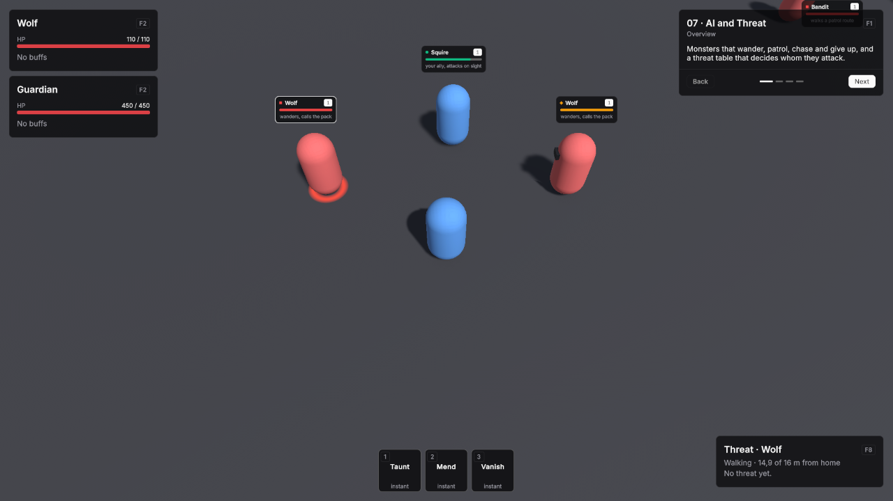

# UI

Vantage's interface is built on UI Toolkit. The package ships a theme and components; your panels and screens are made from them.


## Setup

1. **Create → UI Toolkit → Panel Settings Asset**, and set its **Theme Style Sheet** to **VtDefaultTheme** from `Packages/Vantage/Runtime/UI/Themes`.
2. Add a **UI Document** to the scene and set its **Panel Settings** to that asset.

The theme sets the colours, the fonts (Inter, and JetBrains Mono for numbers) and the base styles. It does not include Unity's default control theme; Vantage components and Unity's built-in controls are styled by the theme itself. Labels stay on one line; add the `vt-text-wrap` class to text that should wrap. Card titles and descriptions wrap on their own.

## Your own look

Make your own theme style sheet that imports the Vantage theme and adds your rules, and use it on your Panel Settings instead:

```css
@import url("project://database/Packages/com.smartargs.vantage/Runtime/UI/Themes/VtDefaultTheme.tss");

:root {
    --vt-primary: rgb(59, 130, 246);
    --vt-radius: 12px;
}

.vt-card__title {
    font-size: 18px;
}
```

| Variable | Used for |
|---|---|
| `--vt-background` | The base surface colour. |
| `--vt-foreground` | Text and icons. |
| `--vt-muted-foreground` | Secondary text. |
| `--vt-card-hud`, `--vt-card-window` | Card surfaces over the game and in windows. |
| `--vt-border`, `--vt-ring` | Hairline borders, and borders on hover. Focus uses `--vt-primary`. |
| `--vt-primary`, `--vt-primary-foreground` | The accent, and text on it. |
| `--vt-destructive`, `--vt-destructive-foreground` | Deleting and abandoning, and text on it. |
| `--vt-hover`, `--vt-track` | Hover highlights, and the empty part of bars. |
| `--vt-health`, `--vt-mana`, `--vt-stamina`, `--vt-experience` | Resource colours. |
| `--vt-hostile`, `--vt-friendly`, `--vt-neutral` | Nameplate bars of hostile, friendly and neutral units. |
| `--vt-radius` | Corner radius. |
| `--vt-text-xs` … `--vt-text-xl` | The type scale: 10, 12, 14, 16 and 20 px. |
| `--vt-space-1` … `--vt-space-4` | The spacing scale: 4, 8, 12 and 16 px, used for padding and margins. |
| `--vt-font-regular`, `--vt-font-medium`, `--vt-font-semibold`, `--vt-font-bold` | The text typeface in each weight. |
| `--vt-font-mono`, `--vt-font-mono-medium` | The typeface for numbers, and its heavier weight for badges and counts. |

Every size in the theme comes from those two scales, so changing `--vt-text-base` or `--vt-space-3` in your own sheet moves the whole interface at once:

```css
:root {
    --vt-text-base: 16px;
    --vt-space-3: 14px;
}
```

## State classes

Two classes mark state on anything — a chip, a row, a list entry or a button — so one rule covers them all:

| Class | What it does |
|---|---|
| `vt-is-selected` | Fills with `--vt-hover` and draws a `--vt-primary` border, so a chosen element reads as chosen even with the neutral accent. |
| `vt-is-disabled` | Fades to 40% without disabling the element, for something that looks unavailable but still explains itself when clicked. Call `SetEnabled(false)` to actually turn it off. |

```csharp
VtUiStates.SetSelected(chip, index == selected);
VtUiStates.SetDisabledLook(row, !canAfford);
```

If your own sheet styles the same properties on the same element (a chip class that sets its own border colour, say), give the state rule the extra class — `.my-chip.vt-is-selected` — so it wins.

## Built-in controls

`Button`, `Toggle`, `Slider`, `TextField`, `DropdownField`, `RadioButtonGroup` and `ScrollView` are styled by the theme, so a plain `<ui:Button>` matches the Vantage components with no work:

```xml
<ui:Button text="Save" />
<ui:Toggle label="Show nameplates" />
<ui:Slider low-value="0" high-value="1" value="0.6" />
```

Controls are 28 px tall with a hairline border on a transparent surface. Everything focusable draws its border in `--vt-primary` while it has focus, so a gamepad or Tab shows where it is without anything moving, and a disabled control fades to 40%. A radio button group is drawn as a segmented control, and its checked button takes the `--vt-hover` fill.

Two limits come from UI Toolkit itself: the slider thumb stays inside the track instead of overhanging its ends, and the popup menu a `DropdownField` opens is drawn by the player, not by USS, so it cannot be themed. Where the menu's look matters, build the choice from `RadioButtonGroup` or `VtButton`s instead.

## Button

`VtButton` is a built-in `Button` with a variant and a size, so a panel picks the weight of an action instead of restyling it.

```xml
<VtButton text="Abandon quest" variant="Danger" size="Large" />
```

```csharp
var accept = new VtButton("Accept", OnAccept) { Variant = VtButtonVariant.Primary };
card.Footer.Add(accept);
```

| Variant | Use |
|---|---|
| Outline | A hairline border on a transparent surface. The default. |
| Primary | Filled with `--vt-primary`, for the one action a panel wants you to take. |
| Ghost | No border until the pointer is over it, for dense rows and toolbars. |
| Danger | Filled with `--vt-destructive`, for actions that cannot be undone. |

| Size | Height |
|---|---|
| Small | 22 px |
| Medium | 28 px, the default |
| Large | 36 px |

| Part | Class |
|---|---|
| Button | `vt-button`, with `vt-button--outline`, `--primary`, `--ghost` or `--danger`, and `vt-button--small`, `--medium` or `--large` |

## Switching at runtime

Dark and light mode, the accent, the corner radius and the typeface switch while the game runs. Pass the UI Document's root so every panel on it follows:

```csharp
var root = document.rootVisualElement;
VtTheme.SetMode(root, VtThemeMode.Light);
VtTheme.SetAccent(root, VtThemeAccent.Blue);
VtTheme.SetRadius(root, VtThemeRadius.Large);
VtTheme.SetTypeface(root, "vt-typeface-plex");
```

| Option | Values |
|---|---|
| Mode | Dark, the default, and Light. Light mode draws text in the Medium weight and HUD cards at 80% opacity, so both read like dark mode over a game scene. |
| Accent | Neutral, the default and the text colour, then Blue, Violet, Rose, Orange and Green. |
| Radius | None, Small (4 px), Medium (8 px, the default), Large (12 px) and Extra Large (16 px). |
| Typeface | Inter, the default, or any typeface class your theme defines. |

A typeface is a class starting with `vt-typeface-` that sets the font variables. Add it to your theme style sheet with your own font files:

```css
.vt-typeface-plex {
    --vt-font-regular: url("../Fonts/IBMPlexSans-Regular.ttf");
    --vt-font-medium: url("../Fonts/IBMPlexSans-Medium.ttf");
    --vt-font-semibold: url("../Fonts/IBMPlexSans-SemiBold.ttf");
    --vt-font-bold: url("../Fonts/IBMPlexSans-Bold.ttf");
}
```

See it running: the [24 · UI Gallery](../demos/24-ui-gallery.md) demo scene.

## Card

The surface every panel and window sits on. Children go into its content. The header appears when you give it a title, a description or a header action, and the footer when you use it. Reading `Header`, `TitleLabel`, `DescriptionLabel`, `HeaderAction` or `Footer` creates that part, so an unused part costs nothing but touching one is enough to add it. `HasHeader` and `HasFooter` answer without creating anything.

```xml
<VtCard title="Quests" description="3 active" surface="Window">
    <ui:Label text="The Sunken Causeway" />
</VtCard>
```

```csharp
var card = new VtCard { Title = "Threat", Surface = VtCardSurface.Hud };
card.HeaderAction.Add(new Label("F8"));
card.Add(row);
card.Footer.Add(closeButton);
card.TitleLabel.text = "Threat · Ogre";
if (card.HasFooter) card.Footer.Clear();
```

| Surface | Use |
|---|---|
| Hud | Slightly see-through, for panels over the game. The default. |
| Window | Nearly opaque, for windows and menus. |

| Part | Class |
|---|---|
| Card | `vt-card`, with `vt-card--hud` or `vt-card--window` |
| Header | `vt-card__header`, holding `vt-card__title-row` and `vt-card__description` |
| Title | `vt-card__title` |
| Header action | `vt-card__action`, at the end of the title row |
| Content | `vt-card__content` |
| Footer | `vt-card__footer` |

Card text is shown as given. For localized text, pass it through `VtLocalization.Resolve` first, see [Localization](localization.md).

## Pager

Shows one page at a time with Back and Next and a page count, for tutorials, help and panels with more to say than fits at once. Children are its pages. Back and Next stop at the first and last page, and the controls hide when there is only one page.

```xml
<VtPager page-index="0" previous-text="Back" next-text="Next">
    <ui:Label text="First page" />
    <ui:Label text="Second page" />
</VtPager>
```

```csharp
var pager = new VtPager();
pager.AddPage(overview);
pager.AddPage(details);
card.Add(pager);
card.Footer.Add(pager.Controls);
pager.NextButton.Variant = VtButtonVariant.Primary;
pager.Next();
pager.PageChanged += index => { };
```

Back and Next are `VtButton`s: `PreviousButton` and `NextButton` hand them over, so the last step of a tutorial can carry a primary Next without a style sheet of your own. Move `Controls` into a card footer to keep them at the bottom on every page. The button texts pass through `VtLocalization.Resolve`, so they can be localization keys. After adding pages with `Add` to a pager that is already on screen, call `Refresh`; `AddPage` does that for you.

Set **Indicator Style** (`indicator-style="Steps"` in UXML) to show a bar per page instead of the count. The bar of the page shown is wider and uses the primary color, bars of earlier pages stay lit, and clicking a bar opens its page. Steps suit short flows such as a tutorial.

| Part | Class |
|---|---|
| Pager | `vt-pager` |
| Pages | `vt-pager__pages`; each page `vt-pager__page`, hidden ones also `vt-pager__page--hidden` |
| Controls | `vt-pager__controls`, with `vt-pager__controls--hidden` when there is one page and `vt-pager__controls--steps` for steps |
| Back, Next | `vt-pager__button`, with `vt-pager__previous` or `vt-pager__next`, on a `VtButton` |
| Page count | `vt-pager__indicator` |
| Steps | `vt-pager__steps`; each step `vt-pager__step` with `--active` or `--done`, holding a `vt-pager__step-bar` |

## Progress bar

A bar filled from the left, for health, mana, experience, cast times and any amount out of a maximum. The fill slides to a new value.

```xml
<VtProgressBar value="0.6" kind="Health" />
```

```csharp
var bar = new VtProgressBar { Kind = VtProgressKind.Mana };
bar.Set(stats.GetPool(VtResourceKind.MP).Current, maxMana);
```

**Kind** is Primary (the accent, the default), Health, Mana, Stamina or Experience. **Value** runs from 0 to 1 and is clamped.

| Part | Class |
|---|---|
| Bar, the empty track | `vt-progress`, with `vt-progress--primary`, `--health`, `--mana`, `--stamina` or `--experience` |
| Filled part | `vt-progress__fill` |

## Nameplates



**VtNameplates** draws a plate over the head of every unit with health: its name, level, a health bar and an optional subtitle. The bar is red for hostile units, green for friendly ones, amber for neutral ones and the accent colour for the viewer. A small marker in front of the name repeats the relation as a shape — a square for hostile, a circle for friendly, a diamond for neutral, and none for the viewer — so players who do not separate those colours still read the plate at a glance. Plates hide while a unit is dead, off screen or too far away, stay whole at the screen edge, and get an accent border on the viewer's selection or target.

1. Select the object with your HUD's UI Document and **Add Component → Vantage → UI → VtNameplates**.
2. Set **Viewer** to the player's unit.

The plates sit under everything else on that document and ignore the pointer, so clicks still reach the units. Units that spawn later get a plate within a quarter of a second.

| Field | Default | What it does |
|---|---|---|
| Viewer | None | The unit the plates are seen from. It decides hostile, friendly and neutral, and its selection or target is highlighted. Empty: seen by the Player faction. |
| View Camera | None | The camera the plates follow. Empty: the main camera. |
| Filter | Hostile and Friendly on | Which units get a plate: **Hostile**, **Friendly**, **Neutral** and **Self**, the viewer itself. **Visibility** is Always, or When Damaged Or Targeted for plates only on hurt units and the viewer's target. |
| Show Level | On | The level badge next to the name. |
| Height Offset | 0.5 | Metres between the top of the unit's collider and the bottom of its plate. |
| Max Distance | 60 | Units farther from the camera get no plate. 0 means no limit. |
| Rescan Seconds | 0.25 | How often new and removed units are picked up and subtitles refreshed. |

Add **VtNameplateInfo** to a unit to give its plate a **Subtitle**, such as a title or a hint, or to switch **Hidden** on for no plate. The subtitle can be a localization key. For subtitles built from game state, such as a quest marker or active effects, set a provider; it runs for each plate on screen at every rescan:

```csharp
nameplates.SubtitleProvider = unit =>
{
    string subtitle = VtNameplates.DefaultSubtitle(unit);
    return unit.IsInvulnerable ? subtitle + " · invulnerable" : subtitle;
};
```

The plate itself is **VtNameplate**, which you can also place on its own:

```xml
<VtNameplate unit-name="Bandit" level="7" health="0.6" relation="Hostile" subtitle="Camp leader" />
```

| Part | Class |
|---|---|
| Plate | `vt-nameplate`, with `vt-nameplate--hostile`, `--friendly`, `--neutral` or `--self`, and `vt-nameplate--targeted` |
| Name and level row | `vt-nameplate__header` |
| Relation marker | `vt-nameplate__mark`, shaped and coloured by the relation class on the plate |
| Name | `vt-nameplate__name` |
| Level badge | `vt-nameplate__level`, with `vt-nameplate__level--hidden` without a level |
| Health bar | `vt-nameplate__bar`, a progress bar |
| Subtitle | `vt-nameplate__subtitle`, with `vt-nameplate__subtitle--hidden` when empty |
| Layer holding the plates | `vt-nameplates`; each plate hangs from a `vt-nameplates__anchor` |
