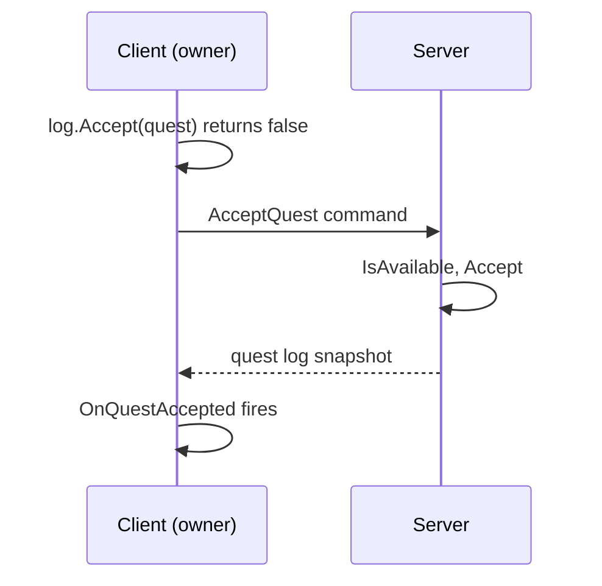
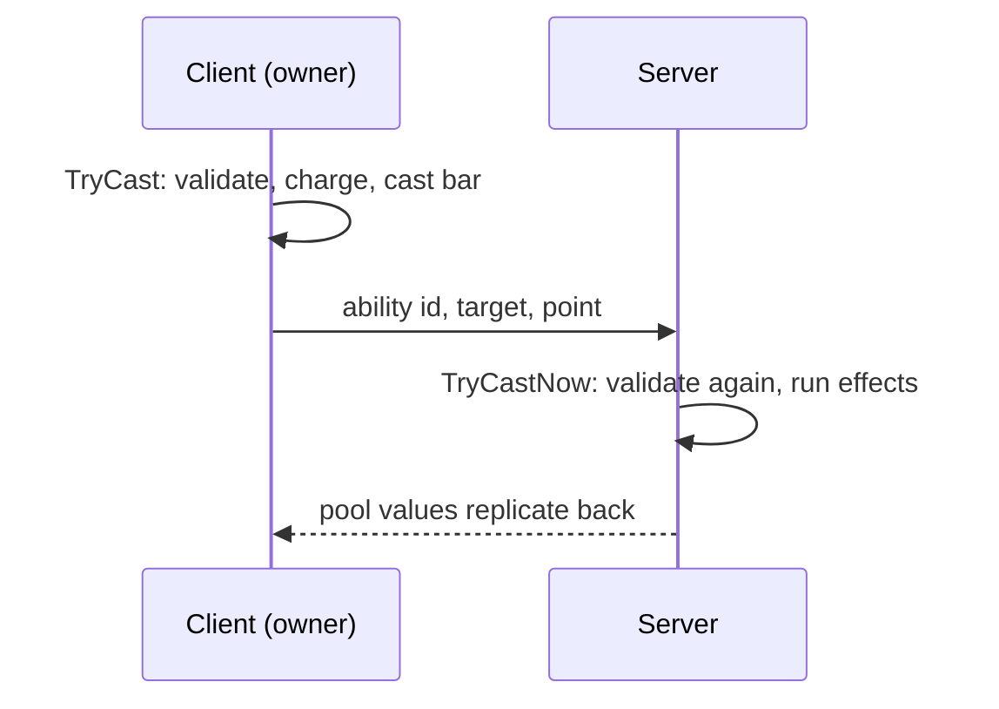

# Multiplayer

Vantage runs single-player out of the box. The same code runs networked with a small amount of wiring, and a sample for Netcode for GameObjects ships with the package. This page is honest about what is ready and what you still write. The [Multiplayer reference](reference/multiplayer.md) lists the authority, command and executor types with every member.

| Topology | Status |
|---|---|
| Single-player | Ready. Nothing to configure. |
| One player hosts, others join | Ready with the co-op sample. The host runs every cast, hit and request. |
| Dedicated server | The same sample runs on a Dedicated Server build. With the predicted movement executor the server owns movement too. |

Vantage does not depend on any networking framework. The sample uses Netcode for GameObjects; Mirror and FishNet fit the same seams.

## The one rule

Every state change in the package first asks `VtAuthority` how much this process may change the unit. There are three answers:

| Level | Who | May do |
|---|---|---|
| Authoritative | Single-player, the co-op host, a dedicated server | Everything. |
| Predicting | A client, for the unit it owns | Move, start casts, run cooldowns, charge resource costs. Everything else is forwarded. |
| Replica | A client, for every other unit | Nothing. Replication writes the state. |

Networked, install the rule once at bootstrap:

```csharp
VtAuthority.ResolveFn = c =>
{
    var netObject = c.GetComponentInParent<NetworkObject>(true);
    if (netObject == null) return VtAuthorityLevel.Authoritative;
    if (NetworkManager.Singleton.IsServer) return VtAuthorityLevel.Authoritative;
    return netObject.IsOwner ? VtAuthorityLevel.Predicting : VtAuthorityLevel.Replica;
};
```

Objects without a network component stay authoritative everywhere, so props and UI keep working. The older yes-or-no `IsLocalFn` still works and maps true to authoritative, false to replica.

## How a request travels

A client calls the same methods as single-player code: `log.Accept(quest)`, `inventory.TryUseItem(potion)`, `builder.TryPlace()`. On a predicting client the method does not change anything. It packs a command, hands it to the `IVtCommandRelay` component on the unit, and returns false. The server receives the command, re-validates it against its own copy of the unit, applies it, and the result replicates back. The same events fire on the client as they would in single-player, so UI code does not know which topology it runs in.



The commands that exist: walk to a point, attack a target, stop, interact, use item, equip, unequip, accept, abandon and turn in a quest, dialogue choose, continue and end, craft, cancel craft, build, demolish, buy, sell, respawn, learn talent, spend attribute point, reset progression, the party calls: invite, accept, decline, leave, kick, promote and loot rule, the summon calls: dismiss, dismiss all and stance, the chat calls: send, ignore and unignore, and the guild calls: create, invite, accept, decline, leave, kick, promote, demote, transfer, message of the day and disband, the friend calls: request, accept, decline, cancel and remove, the mail calls: send, take attachments, mark read, delete and return, wear from the bag and put back into the bag, buy an unlock, and deposit items, currency or everything into a shared stash. Anything that is not a player intent, such as adding loot to a bag or granting XP, has no command and simply refuses on a client.

## How movement travels

With `VtPredictedMovementExecutor` on the unit, a right-click does two things on the owning client: the mover starts walking at once, and the same order goes to the server as a command. The server walks its copy along the same path and replicates its position. The client compares on every update and snaps when the planar error exceeds **Movement Reconcile Threshold** on the tuning asset. Observers follow the server's position with smoothing. A client cannot move faster than the server lets it, because only the server's position counts.

With `VtClientAuthMovementExecutor` the owning client's position is the truth. Keep that mode for play among friends.

## Who sees whom

Fog of war on a client is only a picture; the client still holds every unit's position unless the server withholds it. `VtInterest.IsVisibleTo` answers whether a point lies within a set of vision sources plus `Interest Margin` on the tuning asset. The sample's interest manager runs it on the server every `Interest Update Interval` seconds for every client and every unit, and shows or hides the unit through Netcode's per-client visibility. A unit outside a client's vision is never sent to that client. Tag bosses or objectives with the manager's **Always Visible Tag** to exempt them.

On a client, watch the events, not the return values. A false return means "not applied here"; the outcome arrives by replication.

### What the server checks

The server runs the same validation the client would have: availability, requirements, costs, cooldowns, placement rules. On top of that:

- An interact command is refused when the player is farther from the target than its interact radius plus `Interact Range Tolerance` on the tuning asset. Crafting at a station and placing a building use the same tolerance on top of the station's interact radius and the buildable's **Placement Range**.
- Each unit gets a command budget: `Max Commands Per Second` on average with `Command Burst` allowed at once. Commands past the budget are dropped and `VtCommandRelay.OnRateLimited` fires, so you can count strikes and kick a flooder. Zero disables the limit.
- Ids resolve through the Definition Catalog; an unknown id is refused.

## How a cast travels



A client-side `IVtAbilityExecutor` packs the resolved cast with `VtAbilityRelay.Pack` and sends it. The server resolves the id through the **Definition Catalog** and calls `VtAbilityRelay.Apply`, which runs `TryCastNow`: full validation without a second cast bar. Damage only ever happens on the server.

## The co-op sample

Import **Co-op (Netcode for GameObjects)** from the package's Samples tab after installing `com.unity.netcode.gameobjects`. It contains:

| Script | Role |
|---|---|
| `VtNetcodeAuthority` | Installs the rule above. Put it on the NetworkManager object. |
| `VtNetcodeUnitSync` | Replicates pools, hits, heals, deaths, revives, casts, buffs and resource node state from the server to everyone. On every networked unit prefab. |
| `VtNetcodeStateSync` | Replicates inventory, wallet, equipment, level, quests, skills, recipes, unlocks and dialogue flags from the server to the owning client. On player prefabs. |
| `VtNetcodeCommandRelay` | Sends a client's commands to the server and applies them there. On player prefabs. |
| `VtNetcodeMovementSync` | Server-authoritative position for units with `VtPredictedMovementExecutor`. Replaces `NetworkTransform`. |
| `VtNetcodeInterestManager` | Sends each client only the units its vision covers. On the NetworkManager object. |
| `VtNetcodePartySync` | Sends each player its party and pending invite from the server. On player prefabs with `Use Party`. |
| `VtNetcodeSpawnHooks` | Spawns and despawns loot, placed buildings, projectiles, summons and spawner mobs as network objects on the server. On the NetworkManager object. |
| `VtNetcodeSummonSync` | Sends a summon's owner link to clients so faction and credit match. On summon prefabs. |
| `VtNetcodeChatSync` | Delivers chat lines routed to a player on to its client. On player prefabs with `Use Chat`. |
| `VtNetcodeGuildSync` | Sends a player's guild and invites to its client. On player prefabs with `Use Guild`. |
| `VtNetcodeFriendsSync` | Sends a player's friends, requests and friend presence to its client. On player prefabs with `Use Friends`. |
| `VtNetcodeMailSync` | Sends a player's mailbox and new-mail notices to its client. On player prefabs with `Use Mail`. |
| `VtNetcodePlayerIdentitySync` | Replicates player ids and names. Assigns a placeholder id; replace it with your login. On player prefabs. |
| `VtNetcodeAbilityExecutor` | The client half and the server half of a cast, in one component. Replaces the local executor on networked prefabs. |
| `VtNetcodePlayerSpawner` | Spawns a player unit per connected client, owned by that client. |
| `VtNetcodeMobSpawner` | A mob spawner that runs only on the server. |
| `VtNetcodeWorldItemSync` | Sends a world item's item, count and reservation to everyone. On world item prefabs. |
| `VtNetcodeBuildableSync` | Sends a placed building's buildable, builder and construction progress to everyone. On buildable prefabs. |
| `VtNetcodeEncounterSync` | Mirrors a boss fight on every client: state, phase, events and boss lines. Next to a `VtEncounter` with a `NetworkObject`. |
| `VtNetcodeWorldClockSync` | Keeps every client's day and time on the host's. Next to the scene's `VtWorldClock` with a `NetworkObject`. |
| `VtNetcodeStashSync` | Keeps every client's copy of a shared stash (items, currency, unlocks) on the host's. Next to the `VtSharedStash` with a `NetworkObject`. |

The sample's README walks through the prefab setup.

## Another framework

Two components per player prefab: one that implements `IVtCommandRelay` by sending the command's fields to the server and calling `VtCommandRelay.Apply` on arrival, and one that implements `IVtAbilityExecutor` the same way with `VtAbilityRelay`. For state coming back, `VtUnitSaver.Capture` gives a per-unit snapshot and `VtUnitSaver.Restore` with `includeTransform: false` applies it on the client, or use the finer `Apply...FromNet` methods on each component.

Point `VtSpawning.InstantiateFn` and `VtSpawning.DespawnFn` at your framework's spawn calls so loot, buildings, projectiles, summons and mobs reach clients. Replay what happened on the server with `ApplyHitFromNet`, `ApplyHealFromNet`, `ApplyDeathFromNet` and `ApplyReviveFromNet` on stats, the `Apply...FromNet` cast methods on abilities, `ApplyBuffFromNet` on buffs, and the mirrors on encounters, build sites and resource nodes. They raise the usual events on the client and change nothing the server owns.

## Dedicated server

Use the Dedicated Server build target with the same scene and the same sample components. The combat text presenter does not start in server builds. `VtTickManager.Tick(dt)` can drive the whole simulation from your own loop if you do not want Unity's `Update`, see [Ticking](modules/ticking.md).

## What is not solved

- **Resource costs are predicted.** The client charges its own copy, the server charges again; the server's values replicate back and win.
- **Prediction of effects.** Clients see a hit when the server's pool value arrives, one round trip after the cast. Short cast times and snappy animations hide most of it.
- **Kicking a flooder.** The server drops commands over budget and tells you through `VtCommandRelay.OnRateLimited`; disconnecting the client is your call.

## Cheating

A host is trusted. With the predicted movement executor and the interest manager, a modified client can lie about nothing that matters and see nothing it should not: position, damage, loot, quests, inventory, crafting, building and dialogue effects all come from the server after its own checks, distance is verified on the server, request floods are dropped, and units outside the client's vision are never sent. For public play, run a dedicated server with the server-authoritative movement pair and the interest manager.
