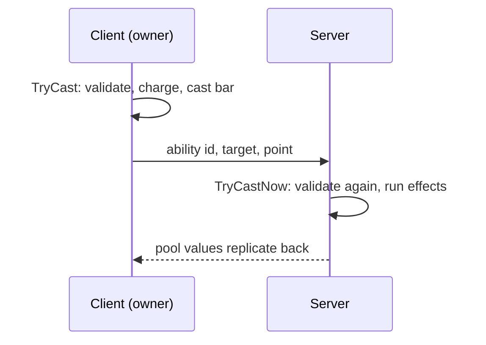

# Multiplayer

Vantage runs single-player out of the box. The same code runs networked with a small amount of wiring, and a sample for Netcode for GameObjects ships with the package. This page is honest about what is ready and what you still write.

| Topology | Status |
|---|---|
| Single-player | Ready. Nothing to configure. |
| One player hosts, others join | Ready with the co-op sample. The host runs every cast and hit. |
| Dedicated server | The same sample runs on a Dedicated Server build. Movement is still client-authoritative. |

Vantage does not depend on any networking framework. The sample uses Netcode for GameObjects; Mirror and FishNet fit the same seams.

## The one rule

Every state change in the package first asks `VtAuthority.IsLocal(component)`. In single-player the answer is always yes. Networked, the answer is "the server, or the owner of this unit":

```csharp
VtAuthority.IsLocalFn = c =>
{
    var netObject = c.GetComponentInParent<NetworkObject>();
    if (netObject == null) return true;
    return NetworkManager.Singleton.IsServer || netObject.IsOwner;
};
```

The server therefore runs everything. A client runs only its own unit: its cast bars, cooldowns and movement start locally, which is what keeps the game responsive. Objects without a network component stay local everywhere, so props and UI keep working.

## How a cast travels



A client-side `IVtAbilityExecutor` packs the resolved cast with `VtAbilityRelay.Pack` and sends it. The server resolves the id through the **Definition Catalog** and calls `VtAbilityRelay.Apply`, which runs `TryCastNow`: full validation without a second cast bar. Damage only ever happens on the server. The client's copy of the monster refuses damage because it does not own it.

## The co-op sample

Import **Co-op (Netcode for GameObjects)** from the package's Samples tab after installing `com.unity.netcode.gameobjects`. It contains:

| Script | Role |
|---|---|
| `VtNetcodeAuthority` | Sets the rule above. Put it on the NetworkManager object. |
| `VtNetcodeUnitSync` | Replicates every resource pool from the server to clients. On every networked unit prefab. |
| `VtNetcodeAbilityExecutor` | The client half and the server half of a cast, in one component. Replaces the local executor on networked prefabs. |
| `VtNetcodePlayerSpawner` | Spawns a player unit per connected client, owned by that client. |
| `VtNetcodeMobSpawner` | A mob spawner that runs only on the server and registers what it spawns. |

The sample's README walks through the prefab setup. The short version: add `NetworkObject`, `NetworkTransform`, the sync and the executor to each unit prefab, swap the movement executor for `VtClientAuthMovementExecutor`, and create a Definition Catalog under `Assets/Resources`.

## What to replicate yourself

The sample replicates position and pools. Everything else has an `Apply...FromNet` method on its component that updates state and fires the same events a local change would, so HUDs and combat text work on observers.

| State | Send | Receive with |
|---|---|---|
| Buffs | Definition id, duration, applier on add and remove | `VtUnitBuffs.ApplyBuff` / `RemoveBuff` |
| Equipment | Slot and item id | `ApplyEquippedFromNet`, `ApplyUnequippedFromNet` |
| Inventory, wallet, level, threat, quests, crafting, skills, recipe book | A snapshot after each change | `ApplyInventoryFromNet`, `ApplyWalletFromNet`, `ApplyLevelFromNet`, `ApplyThreatTableFromNet`, `ApplyQuestLogFromNet`, `ApplyCraftStateFromNet`, `ApplySkillsFromNet`, `ApplyRecipeBookFromNet` |
| Casts on observers | Ability id and remaining time, for cast bars | Your UI |

Resolve ids back to assets with the same Definition Catalog.

## Dedicated server

Use the Dedicated Server build target with the same scene and the same sample components. The combat text presenter does not start in server builds. `VtTickManager.Tick(dt)` can drive the whole simulation from your own loop if you do not want Unity's `Update`, see [Ticking](modules/ticking.md).

## What is not solved

- **Movement is client-authoritative.** A modified client can teleport. Server-authoritative movement with prediction and reconciliation is yours to write behind `IVtMovementExecutor`.
- **Resource costs are predicted.** The client charges its own copy, the server charges again; the server's values replicate back and win.
- **Prediction of effects.** Clients see a hit when the server's pool value arrives, one round trip after the cast. Short cast times and snappy animations hide most of it.

## Cheating

A host is trusted. A modified client can lie about its own position, never about damage, loot or quests. For public play, run a dedicated server and treat movement as the remaining gap.
